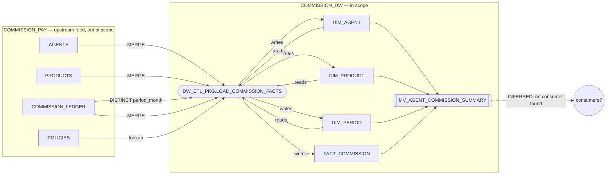

# Estate inventory — Commission Pay `COMMISSION_DW` (Oracle)

Census date 2026-09-01, instance `cdw` (`FREEPDB1`), read-only as `commission_dw`. Evidence: `ALL_OBJECTS`, `ALL_TAB_COLUMNS`, `ALL_INDEXES`/`ALL_IND_COLUMNS`, `ALL_DEPENDENCIES`, `ALL_MVIEWS`, `ALL_SEQUENCES`, `ALL_SOURCE`, `ALL_TAB_PRIVS`, `ALL_POLICIES`; repo sources `services/industry-solutions/insurance/db/olap/01_star_schema.sql` (41 lines), `02_etl_pkg.sql` (114 lines). Every edge below is **FACT** unless marked INFERRED.

## 1. Census (21 objects in `COMMISSION_DW`, `ALL_OBJECTS`, all VALID)
| # | Object | Type | Size / complexity | Notes |
|---|---|---|---|---|
| 1 | `DIM_AGENT` | TABLE | 5 cols; identity `AGENT_KEY` (`ISEQ$$_73154`) | 0 rows in this instance |
| 2 | `DIM_PRODUCT` | TABLE | 4 cols; identity `PRODUCT_KEY` (`ISEQ$$_73158`) | 0 rows |
| 3 | `DIM_PERIOD` | TABLE | 5 cols; identity `PERIOD_KEY` (`ISEQ$$_73162`); `PERIOD_MONTH VARCHAR2(7)` | 0 rows |
| 4 | `FACT_COMMISSION` | TABLE | 9 cols; identity `FACT_ID` (`ISEQ$$_73166`); 3 money/rate cols `NUMBER(12,2)`/`NUMBER(5,2)`; `LOADED_AT TIMESTAMP(6)` | 0 rows |
| 5 | `MV_AGENT_COMMISSION_SUMMARY` | TABLE (MV container) | 6 cols | — |
| 6 | `MV_AGENT_COMMISSION_SUMMARY` | MATERIALIZED VIEW | 4-way join + GROUP BY; DEMAND / COMPLETE / BUILD IMMEDIATE | FRESH |
| 7 | `DW_ETL_PKG` | PACKAGE | spec: 1 procedure | — |
| 8 | `DW_ETL_PKG` | PACKAGE BODY | `LOAD_COMMISSION_FACTS`: 4 MERGE/INSERT statements, commit / rollback+re-raise | no `WHEN OTHERS THEN NULL` |
| 9–12 | `ISEQ$$_73154/58/62/66` | SEQUENCE ×4 | identity sequences, `LAST_NUMBER=1` | not migrated as objects (keys preserved explicitly) |
| 13–21 | `SYS_C008722/23/28/29/35/36/46`, `UX_FACT_ROW`, `I_SNAP$_MV_AGENT_COMMISSION_SUMMARY` | INDEX ×9 (all UNIQUE) | 7 constraint-backed PK/UK, 1 business UK `(POLICY_ID, AGENT_KEY, PERIOD_KEY)`, 1 MV snapshot index | not translated; `UX_FACT_ROW` becomes MERGE/recon key |

Governance objects (see `08_governance_inventory.md`): 2 grant rows (both `PUBLIC … INHERIT PRIVILEGES`, default), 0 roles, 0 policies. Scheduler objects: 0. Views: 0. Triggers: 0.

External inputs (not census members; D3 feed): `COMMISSION_PAY.AGENTS` (4 rows), `PRODUCTS` (3), `POLICIES` (5), `COMMISSION_LEDGER` (0).

## 2. Lineage DAG

| Edge | Kind | Evidence |
|---|---|---|
| `COMMISSION_PAY.{AGENTS,PRODUCTS,POLICIES,COMMISSION_LEDGER}` → `DW_ETL_PKG` | read | `ALL_DEPENDENCIES` + package body |
| `DW_ETL_PKG` → `DIM_AGENT`, `DIM_PRODUCT`, `DIM_PERIOD`, `FACT_COMMISSION` | write (MERGE / INSERT) | package body |
| `DIM_*` → `DW_ETL_PKG` | read (key lookups for the fact MERGE) | package body |
| `DIM_*`, `FACT_COMMISSION` → `MV_AGENT_COMMISSION_SUMMARY` | read | `ALL_DEPENDENCIES`, MV query |
| scheduler → `DW_ETL_PKG` | none | no `DBMS_SCHEDULER` job, no cron in repo |
| `MV` / `FACT` → consumers | **INFERRED none** | no grants, no query history (D4-1); repo sweep hits only the schema's own DDL/tests |

Lineage depth: 3 (feed → ETL/dims+fact → MV). Fact MERGE depends on the three dimensions being loaded first (same procedure, sequential statements).

## 3. Dead weight (PROPOSED-unused)
None. Every object is on the single lineage path. The MV has no detected consumer, but "no consumer" here is an evidence gap (D4-1), not evidence of disuse — it is **not** proposed for exclusion.

## 4. Pipeline catalog
| Pipeline | Objects | Complexity | Depth | Upstream / downstream | Difficulty |
|---|---|---|---|---|---|
| **P1 — Commission DW** (the whole schema) | 4 tables, 1 MV, 1 package (+ 4 sequences, 9 indexes as sub-objects) | 155 source lines; 4 DML statements; 1 aggregate query; identity keys; no PL/SQL beyond MERGE + exception block | 3 | ← `COMMISSION_PAY` feed (D3-1); → unknown consumers (D4-1) | LOW (types: NUMBER→DECIMAL, VARCHAR2 period string, TIMESTAMP excluded; keys: identity preservation) |

One pipeline only; the estate is a single subject area with no fold structure.

## 5. Coverage arithmetic
N = 21 objects = **21 P1** + **0 shared** + **0 PROPOSED-unused** + **0 excluded**. Governance rows: 2 = 2 P1. Closes exactly.

Completeness triangulation:
| Cross-check | Result |
|---|---|
| `ALL_OBJECTS` (21) vs repo DDL (`01_star_schema.sql` defines 4 tables + 1 MV + 1 UK index; `02_etl_pkg.sql` defines 1 package + body; identity sequences and constraint indexes are implicit) | consistent — 4+1+1+2 explicit + 4 seq + 8 implicit idx = 21 |
| Scheduler job count vs census | 0 vs 0 — consistent |
| Query-history distinct-object sweep | UNVERIFIABLE (`V$SQL`/AWR not granted, D10-3) |
| Repo sweep for `COMMISSION_DW`, `MV_AGENT_COMMISSION_SUMMARY`, `DW_ETL_PKG` | 6 files, all the schema's own definition/setup/tests; no application code |

## 6. Shared-object map
No object is used by more than one pipeline. Within P1, the four dimensions are shared between the loader (writer) and the MV (reader): owner of each dimension's migration = its own unit; the MV unit consumes them (D1, intra-pipeline).

## 7. First-pass dependency sweep
Registered in `04_dependency_register.md`: D3-1 (feed), D4-1 (consumers, evidence gap), D5-1 (no scheduler), D8-1 (person data, no masking), D10-1/2/3. New from this census: none.

## 8. Parallelism profile (P1)
| Depth | Units | Concurrent width |
|---|---|---|
| 0 (shared) | catalog/schemas, bronze landing, dialect skill | serial |
| 1 | `dim_agent`, `dim_product`, `dim_period` | 3 |
| 2 | `fact_commission` (+ loader logic) | 1 |
| 3 | `mv_agent_commission_summary` | 1 |
Serial floor: wave 0 + 3 lineage levels. Upper bound on useful width: 3.

## 9. Recommendation for STOP B
Choose **P1 — Commission DW, whole schema** (the only pipeline). Boundary: the 21 census objects + the read-only `COMMISSION_PAY` feed as bronze snapshots; exclusions: `COMMISSION_PKG` and all other `COMMISSION_PAY` logic (already FACT, DEC-001). It exercises every workload surface present (SQL tables, a PL/SQL pipeline, an aggregate MV) — there is no smaller honest slice.
