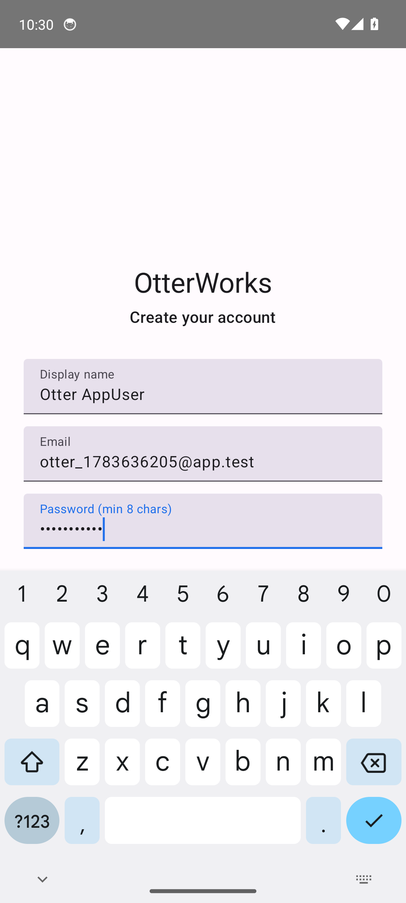
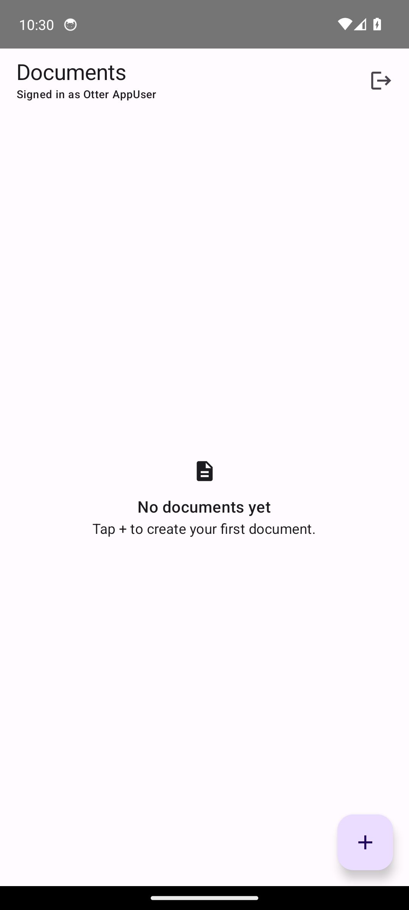
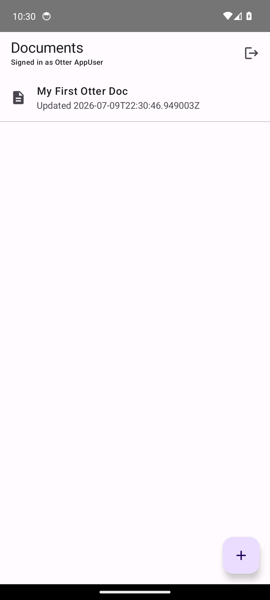
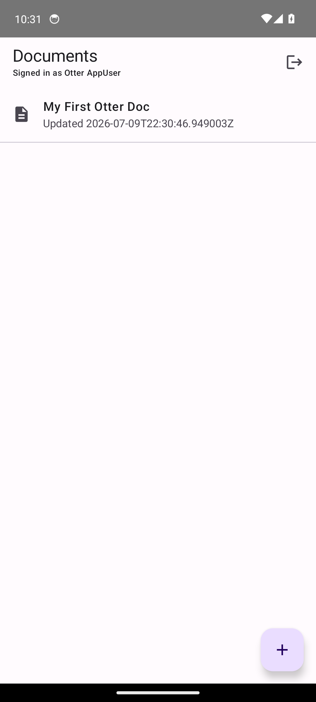
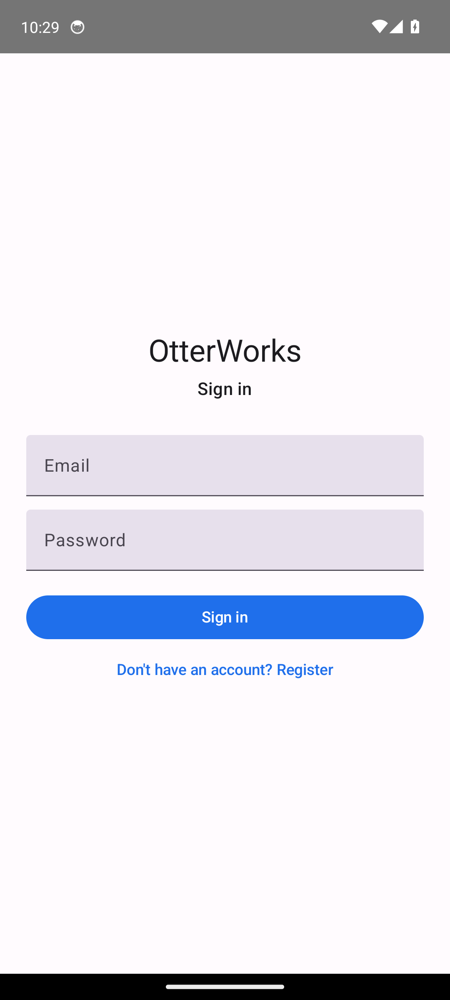

# OtterWorks Android client

A native Android client for the OtterWorks platform, written in **Kotlin** with
**Jetpack Compose** (MVVM). It talks to the OtterWorks REST API through the API
gateway using **Retrofit + OkHttp** and Kotlin coroutines.

It mirrors the core flow of the web client:

- **Register** — display name, email, password (`POST /auth/register`)
- **Login** — email, password (`POST /auth/login`), with a link to/from register
- **Documents list** — `GET /documents`, with an empty state when there are none
- **Create document** — a `+` action (`POST /documents`) that refreshes the list
- **Files list** — `GET /files` (wired in the data layer; see `ApiService`)
- **Logout** — clears the stored token and returns to the login screen

The JWT access token returned by the auth endpoints is held in memory and
persisted with `EncryptedSharedPreferences` (falling back to plain
`SharedPreferences` if the keystore-backed store is unavailable on a given
device/emulator image). An OkHttp interceptor attaches it as a
`Authorization: Bearer <token>` header to every authenticated request.

## Project layout

Single-module Gradle project:

```
clients/android/
├── app/
│   └── src/main/java/com/otterworks/android/
│       ├── MainActivity.kt                 # Compose entry point
│       ├── OtterWorksApplication.kt        # builds the repository singleton
│       ├── data/
│       │   ├── model/Models.kt             # auth (camelCase) + doc/file (snake_case) DTOs
│       │   ├── remote/ApiService.kt        # Retrofit interface
│       │   ├── remote/ApiClient.kt         # OkHttp + auth interceptor + Retrofit
│       │   ├── TokenStore.kt               # EncryptedSharedPreferences token storage
│       │   └── OtterWorksRepository.kt     # single data entry point
│       └── ui/
│           ├── OtterWorksApp.kt            # Navigation graph
│           ├── AppViewModelFactory.kt
│           ├── auth/                       # Login + Register screens/ViewModel
│           ├── documents/                  # Documents list + create dialog/ViewModel
│           └── theme/
└── docs/screenshots/                       # emulator verification screenshots
```

## Prerequisites

- JDK 17 (the Gradle build targets Java 17)
- Android SDK with:
  - `platform-tools`, `platforms;android-34`, `build-tools;34.0.0`
  - `emulator` and a system image, e.g. `system-images;android-34;google_apis;x86_64`
- Point Gradle at your SDK via `local.properties` (git-ignored):

  ```properties
  sdk.dir=/absolute/path/to/Android/sdk
  ```

  or set the `ANDROID_HOME` environment variable.

## Pointing the app at the backend

The base URL is a Gradle `buildConfigField` named `API_BASE_URL` (see
`app/build.gradle.kts`). The default is:

```
http://10.0.2.2:8080/api/v1/
```

`10.0.2.2` is the special alias the **Android emulator** uses to reach the host
machine's `localhost`, so this default works out of the box when the OtterWorks
backend is running on the same machine as the emulator. Because it is plaintext
HTTP, cleartext traffic to `10.0.2.2` (and `localhost`) is permitted via
`res/xml/network_security_config.xml` and `android:usesCleartextTraffic="true"`.

To target a different backend, change the `API_BASE_URL` value in
`app/build.gradle.kts` (keep the trailing slash).

### Running the backend locally

From the repo root (see the top-level `README.md`/`Makefile`):

```bash
make infra-up   # Postgres, Redis, LocalStack, MeiliSearch, observability
make up         # builds + starts all services + frontends (~5-10 min)
# or bring up just what this app needs:
docker compose -f docker-compose.infra.yml -f docker-compose.yml up -d --build \
  api-gateway auth-service document-service file-service
curl localhost:8080/health   # {"status":"healthy",...}
```

## Build

```bash
cd clients/android
./gradlew assembleDebug        # produces app/build/outputs/apk/debug/app-debug.apk
./gradlew lintDebug            # Android lint
```

## Run in an emulator

```bash
# 1. Create an AVD (once)
avdmanager create avd -n otter -k "system-images;android-34;google_apis;x86_64" -d pixel_6

# 2. Start it (headless example)
emulator -avd otter -no-window -no-audio -no-boot-anim -gpu swiftshader_indirect &
adb wait-for-device
# wait until: adb shell getprop sys.boot_completed  == 1

# 3. Install + launch
adb install -r app/build/outputs/apk/debug/app-debug.apk
adb shell am start -n com.otterworks.android/.MainActivity
```

Make sure the backend is up first (`curl localhost:8080/health`). Then register a
new user, create a document, log out, and log back in — the document is served
from the real backend, so it persists across sessions.

## Verified end-to-end flow

The screenshots below were captured in an `android-34` emulator running against a
live OtterWorks backend (Docker Compose) on this machine. The document created in
the app was confirmed via `GET /documents` with the same user's token, proving it
hit the real backend rather than local state.

| Register | Documents (empty) | Document created | After re-login |
| --- | --- | --- | --- |
|  |  |  |  |

Login screen: 
