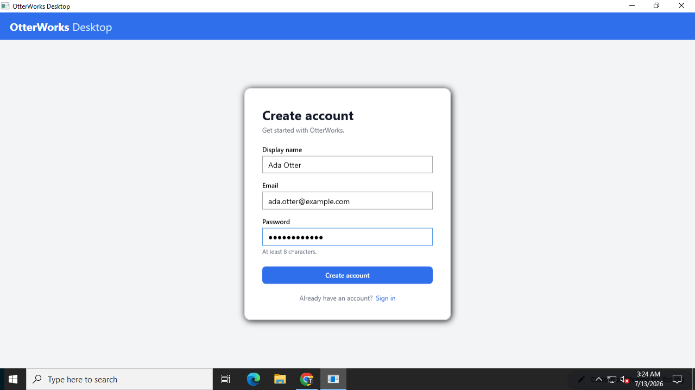
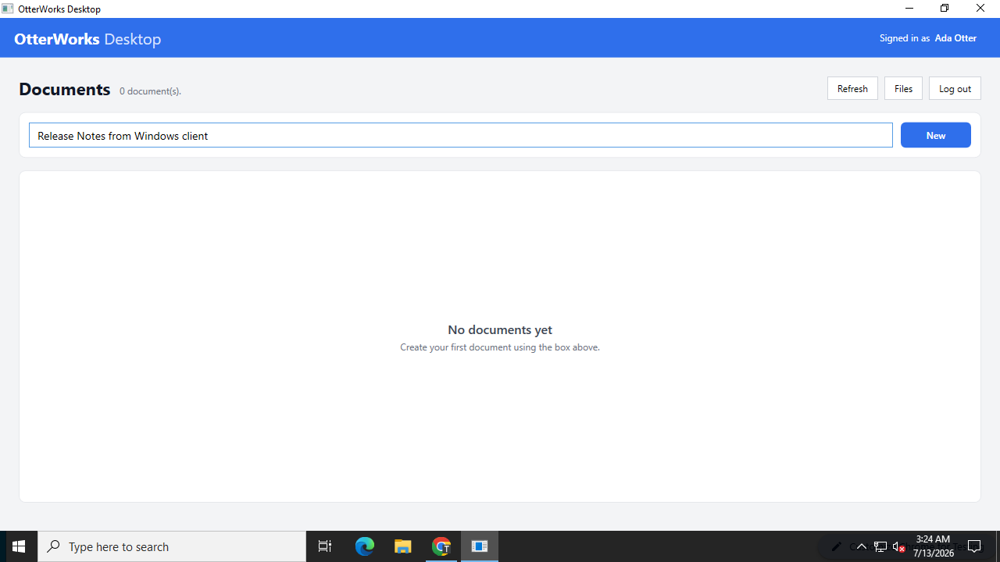
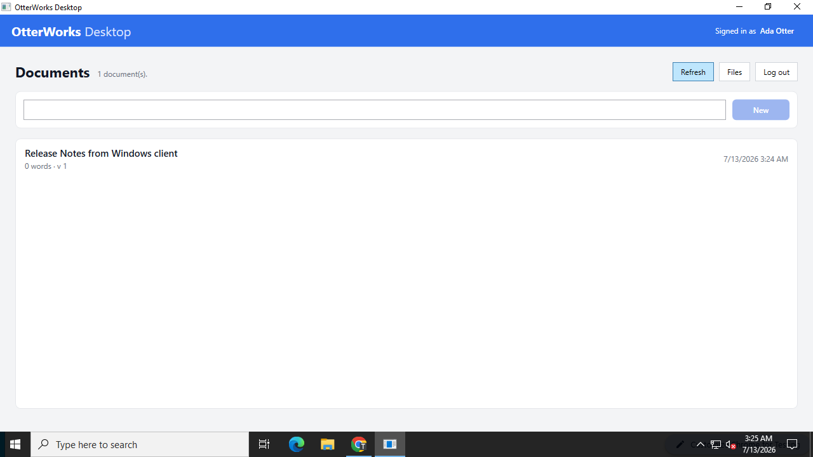
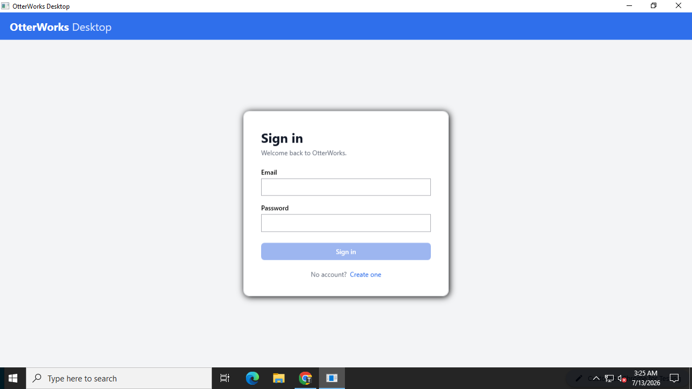
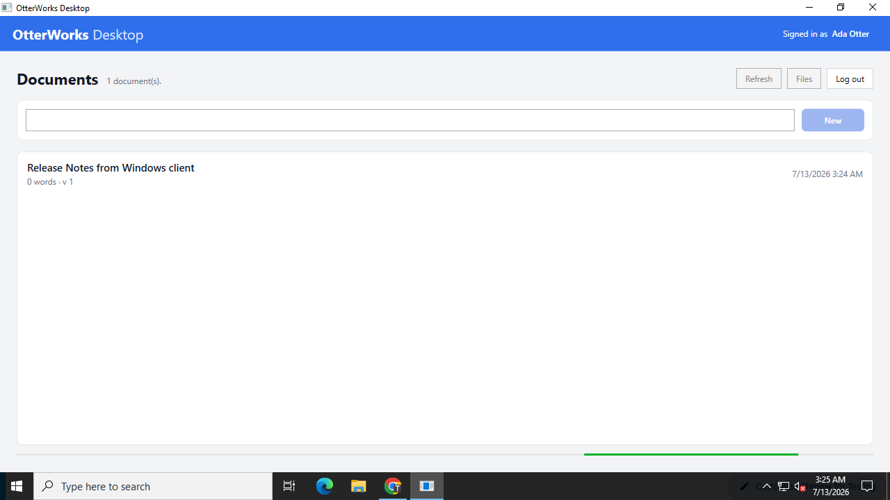

# OtterWorks Desktop (Windows)

A native **Windows desktop client** for the OtterWorks platform, built with **C# on .NET
Framework 4.8** using **WPF** and the **MVVM** pattern. It talks to the OtterWorks REST API
through the API gateway using `HttpClient`.

> **Why .NET Framework 4.8?** This client is intentionally built on the *legacy* .NET
> Framework (classic `.csproj` + `packages.config` + `Newtonsoft.Json`) so it can serve as a
> realistic **framework-upgrade target** (net48 → .NET 8 / WinUI) alongside OtterWorks' other
> upgrade candidates (e.g. the Java 8 `report-service`). It mirrors the core flow of the
> `frontend/web-app` React client.

## Features

- **Register** — display name, email, password → `POST /auth/register`
- **Login** — email, password → `POST /auth/login`, with a link between the two screens
- **Documents list** — `GET /documents` (Bearer token), with a friendly empty state
- **Create document** — a *New* box → `POST /documents { title }` → list refreshes
- **Files list** — `GET /files` (nice-to-have)
- **Logout** — clears the token and returns to the login screen

The JWT access token is held **in memory**. Optionally it can be persisted between runs,
encrypted with the Windows Data Protection API (**DPAPI**, per-user scope) — see
[Configuration](#configuration). Tokens are never written to disk in plaintext.

## Project layout

```
clients/windows-desktop/
├── OtterWorks.Desktop.sln
├── README.md
├── docs/screenshots/                 # verification screenshots (embedded below)
└── OtterWorks.Desktop/
    ├── OtterWorks.Desktop.csproj      # classic .NET Framework 4.8 WPF project
    ├── packages.config                # Newtonsoft.Json 13.0.3
    ├── app.config
    ├── appsettings.json               # configurable backend base URL
    ├── App.xaml(.cs)                  # DI-free composition root + navigation templates
    ├── Models/                        # Auth (camelCase) + Document/File (snake_case) DTOs
    ├── Mvvm/                          # ObservableObject, RelayCommand, converters
    ├── Services/                      # AppSettings, SessionState (DPAPI), API client
    ├── ViewModels/                    # Login / Register / Documents / Main (shell)
    └── Views/                         # WPF views for each view model
```

## Prerequisites

- **Windows 10/11 or Windows Server 2019/2022**
- **.NET Framework 4.8 runtime** (preinstalled on current Windows) and the
  **.NET Framework 4.8 Developer Pack** (targeting pack / reference assemblies), required to
  *build* the project.
- One of the following to build:
  - **Visual Studio 2022** with the **.NET desktop development** workload, **or**
  - **Visual Studio Build Tools 2022** with the **.NET desktop build tools** workload
    (`Microsoft.VisualStudio.Workload.ManagedDesktopBuildTools`), which provides MSBuild,
    the WPF build targets, and the 4.8 targeting pack.
- **NuGet** (bundled with Visual Studio / `nuget.exe`) to restore `Newtonsoft.Json`.

> **Note on `dotnet build` / `dotnet format`:** those SDK commands target modern
> `Microsoft.NET.Sdk` projects. This is a classic (legacy) `.csproj`, so it is built with
> **MSBuild** as shown below. That is expected for a .NET Framework 4.8 app and is part of
> what makes this a genuine upgrade exercise.

## Configuration

The backend base URL is read from `OtterWorks.Desktop/appsettings.json` (copied next to the
executable on build):

```json
{
  "apiBaseUrl": "http://localhost:8080/api/v1",
  "persistTokens": false
}
```

- `apiBaseUrl` — the OtterWorks API gateway base. Default `http://localhost:8080/api/v1`
  (the app runs on the same host as the Docker Compose backend). Point this at any reachable
  gateway if the backend runs elsewhere.
- `persistTokens` — when `true`, the session is saved to
  `%APPDATA%\OtterWorks\session.dat`, DPAPI-encrypted for the current user, and restored on
  next launch.

## Running the backend

From the repository root (LocalStack emulates AWS — no cloud needed):

```bash
make infra-up && make up
# or, without make:
docker compose -f docker-compose.infra.yml -f docker-compose.yml up -d --build
```

Verify it is healthy:

```bash
curl http://localhost:8080/health      # -> {"status":"healthy",...}
```

## Build

Restore packages and build in Release with MSBuild:

```powershell
# From clients/windows-desktop
nuget restore OtterWorks.Desktop.sln
msbuild OtterWorks.Desktop.sln /p:Configuration=Release
```

Or simply open `OtterWorks.Desktop.sln` in Visual Studio 2022 and build (packages restore
automatically).

> **Note on `dotnet build` / `dotnet format`:** this is a *classic* (non-SDK-style)
> .NET Framework 4.8 WPF project, chosen deliberately as an upgrade/modernization
> baseline. The .NET SDK's `dotnet build` cannot compile classic WPF projects — it does
> not run the XAML markup-compiler, so `InitializeComponent` is never generated and the
> build fails with `CS0103`. **Full MSBuild** (from Visual Studio or Build Tools 2022) is
> the authoritative build for this project and produces a clean Release build. This is
> exactly the kind of friction a future migration to an SDK-style / modern .NET project
> would remove.

## Run

```powershell
.\OtterWorks.Desktop\bin\Release\OtterWorks.Desktop.exe
```

Or press **F5** in Visual Studio.

## End-to-end flow

1. **Register** a new user (display name, email, password ≥ 8 chars).
2. You land on the **Documents** list — empty for a new account.
3. Type a title and click **New** — the document appears in the list.
4. Click **Log out**, then **Sign in** with the same credentials — the document is still
   there, proving it was persisted by the real backend.

## Verification screenshots

Captured on Windows against the OtterWorks backend (auth-service, document-service and
api-gateway) running locally, base URL `http://localhost:8080/api/v1`.

### 1. Register a new user


### 2. Documents list — empty for a new account


### 3. Create a document — it appears in the list


### 4. Log out


### 5. Log back in — the document persists


## API contract used

Base URL: `http://localhost:8080/api/v1`. All non-auth calls send `Authorization: Bearer
<accessToken>`.

| Method & path        | Request                                             | Response (shape)                                        |
|----------------------|-----------------------------------------------------|---------------------------------------------------------|
| `POST /auth/register`| `{ displayName, email, password }`                  | `{ accessToken, refreshToken, tokenType, expiresIn, user }` (camelCase) |
| `POST /auth/login`   | `{ email, password }`                               | same as register                                        |
| `GET /documents`     | query `page`, `size`                                | `{ items:[…], total, page, size, pages }` (snake_case)  |
| `POST /documents`    | `{ title }`                                         | created document object (snake_case)                    |
| `GET /files`         | query `page`, `page_size`                           | `{ files:[…], total, page, page_size }` (snake_case)    |

Auth payloads are camelCase while document/file payloads are snake_case; each model carries
explicit `[JsonProperty]` attributes so one serializer handles both.
