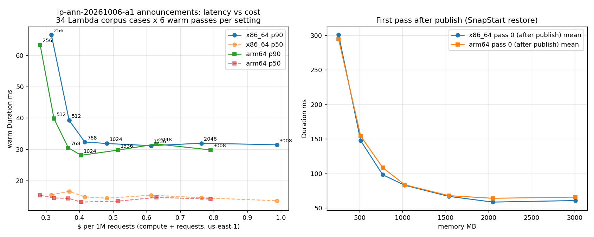

# Announcements Lambda power tuning (run `lp-ann-20261006-a1`)

2026-10-06. The question was which architecture and memory size `lp-ann-20261006-a1-announcements` should use. It was on 1024 MB x86_64 (the root's `lambda_memory_mb` default), not on Lambda's 128 MB default.

## Method

- **Copy, not the live function.** A temporary function, `lp-ann-a1-tune`, used the same zip, `java21`, SnapStart on published versions, the same Aurora Serverless v2 cluster and Data API, and the same environment. Two things differed: it wrote to its own `announcements_tune` schema and published to a bus with no rules. The live alias, the HTTP API, the `announcements` table, its events and `lp-20261006-oc` were not touched. The function, its versions, the schema and the bus were deleted afterwards.
- **Load.** The 34 cases in the parity corpus (`services/legacy-portal/parity/requests.json`) that the HTTP API routes to the Lambda (`/api/announcements` and `/api/announcements/{proxy+}`). Each case was sent as the API Gateway 2.0 event the HTTP API builds, invoked on the published version.
- **Per setting.** Set `$LATEST`, publish a version (SnapStart snapshot), then run 7 passes over the 34 cases. Before every pass the table was truncated, so ids restart at 1 and every response can be compared byte for byte with `java-reference.json`. Pass 0 is the first call after publish (SnapStart restore). Passes 1–6 (204 calls) give the warm statistics. Durations and billed durations come from the `REPORT` line of each invocation's log tail.
- **Price.** us-east-1 on-demand: $0.0000166667 per GB-s on x86_64, $0.0000133334 per GB-s on arm64, plus $0.20 per 1M requests. The cost per 1M requests uses the mean warm billed duration. It excludes the HTTP API ($1.00 per 1M) and Aurora, which are the same at every setting.

## Results

All 14 settings returned responses identical to the Java monolith for every call (238 of 238 = 34 cases × 7 passes).

| Arch | Memory MB | Parity | p50 ms | p90 ms | p99 ms | Mean billed ms | Max mem used MB | First call after publish ms (restore ms) | $ per 1M requests |
|---|---|---|---|---|---|---|---|---|---|
| arm64 | 256 | 238/238 | 15.3 | 63.4 | 103.2 | 24.8 | 174 | 7199 (516) | 0.283 |
| arm64 | 512 | 238/238 | 14.4 | 39.8 | 101.8 | 18.6 | 183 | 3792 (701) | 0.324 |
| arm64 | 768 | 238/238 | 14.3 | 30.5 | 88.6 | 16.7 | 178 | 2672 (648) | 0.367 |
| arm64 | 1024 | 238/238 | 13.1 | 28.1 | 70.9 | 15.4 | 180 | 1970 (464) | 0.405 |
| arm64 | 1536 | 238/238 | 13.4 | 29.7 | 76.1 | 15.7 | 183 | 1551 (462) | 0.514 |
| arm64 | 2048 | 238/238 | 14.6 | 31.7 | 74.9 | 16.1 | 181 | 1406 (696) | 0.629 |
| arm64 | 3008 | 238/238 | 14.1 | 29.8 | 75.3 | 15.1 | 189 | 1385 (636) | 0.791 |
| x86_64 | 256 | 238/238 | 15.4 | 66.5 | 125.3 | 27.9 | 175 | 7433 (836) | 0.316 |
| x86_64 | 512 | 238/238 | 16.6 | 39.3 | 103.6 | 20.3 | 176 | 3542 (838) | 0.369 |
| x86_64 | 768 | 238/238 | 14.8 | 32.3 | 80.8 | 17.2 | 175 | 2376 (670) | 0.416 |
| x86_64 | 1024 | 238/238 | 14.4 | 31.8 | 77.6 | 16.9 | 176 | 1898 (642) | 0.482 |
| x86_64 | 1536 | 238/238 | 15.3 | 31.1 | 76.4 | 16.5 | 178 | 1498 (729) | 0.613 |
| x86_64 | 2048 | 238/238 | 14.5 | 31.9 | 82.5 | 16.9 | 181 | 1226 (681) | 0.763 |
| x86_64 | 3008 | 238/238 | 13.5 | 31.4 | 72.6 | 16.1 | 185 | 1293 (743) | 0.988 |

Raw per-setting statistics: [`power-tuning/summary.json`](power-tuning/summary.json).

## Choice: arm64, 1024 MB

- **Memory.** The function is I/O-bound: each request is one or two Data API calls, and max memory used is 174–189 MB at every setting. Below 768 MB, the CPU share Lambda allocates with memory is the bottleneck. On both architectures, warm p90 roughly halves from 256 MB to 768 MB, then stays flat at 28–32 ms up to 3008 MB. SnapStart restore and first-call time keep improving up to 1024 MB (about 2 s for the first call after publish against 2.4–2.7 s at 768 MB) and level off above 1536 MB. Traffic is about 150 requests a day, so a large share of calls land on a freshly restored environment, and first-call latency matters as much as warm p90.
- **Architecture.** At equal memory, arm64 costs 20% less per GB-s. On this workload it was as fast or faster: at 1024 MB, warm p90 28.1 ms vs 31.8 ms, p99 70.9 ms vs 77.6 ms, restore 464 ms vs 642 ms.
- **Result.** arm64 at 1024 MB had the lowest warm p50, p90 and p99 of the 14 settings. It costs $0.405 per 1M requests against $0.482 for the current x86_64 at 1024 MB (16% less), and is cheaper than every x86_64 setting from 768 MB up. arm64 at 768 MB would save another $0.04 per 1M requests, but gives up 2.4 ms of warm p90, 18 ms of p99 and about 0.7 s on the first call after a restore.
- **What it saves.** At today's traffic, less than $0.01 a month. The change is about right-sizing the function, not about the bill. The application code is Java bytecode, and the shaded jar has no native libraries, so the same artifact runs on both architectures (the parity results above are from that jar).

In `infrastructure/terraform/legacy-portal-strangler`, the announcements module now defaults to `architecture = "arm64"` (`main.tf`), with `lambda_memory_mb` kept at 1024. Preferences and feedback stay on x86_64 until they are measured. Applying the change publishes a new version, and `make lp-mod-deploy RUN=lp-ann-20261006-a1` moves `live` to it through the CodeDeploy canary.
