# OtterWorks Flow Guide

This document maps the main system flows from simple to complex, and shows how services communicate in each path.

## 0) System Map

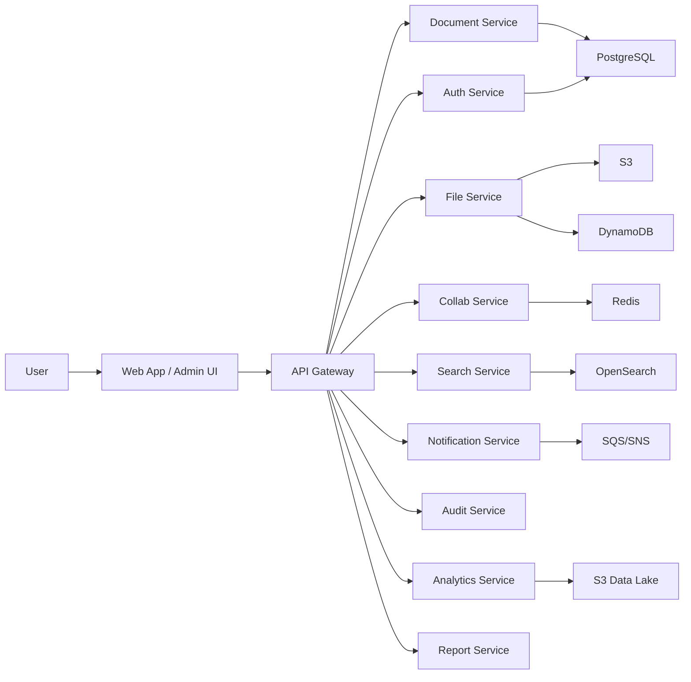

---

## 1) Login Flow (Auth Bootstrap)

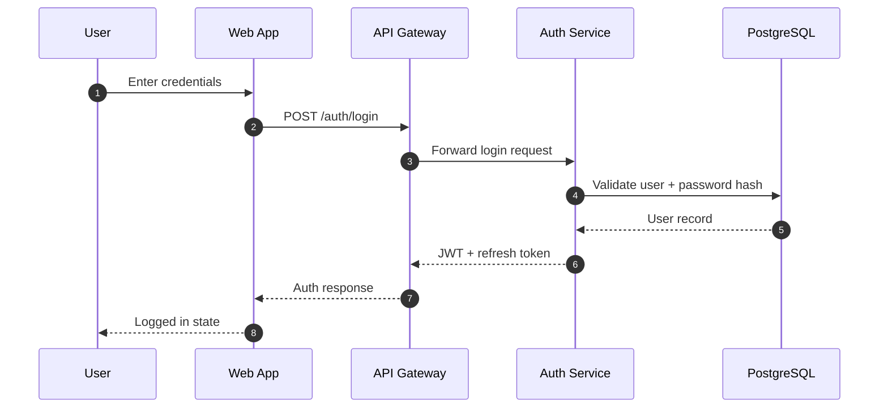

---

## 2) Authenticated Read Request

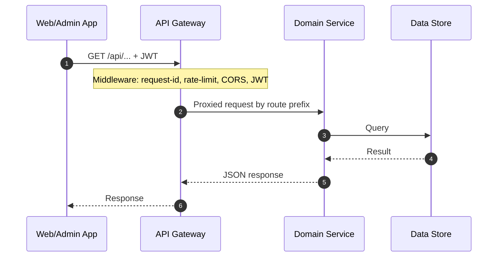

---

## 3) File CRUD - Create (Upload)

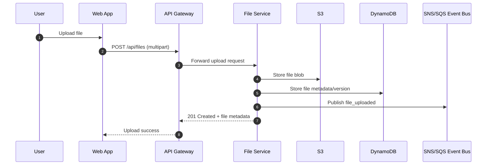

---

## 4) File CRUD - Read (Download/Open)

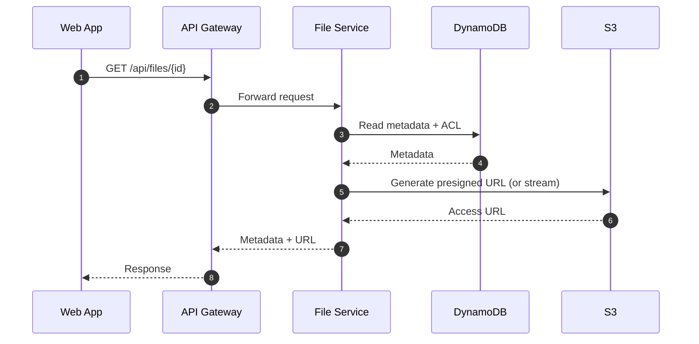

---

## 5) Document CRUD (Versioned)

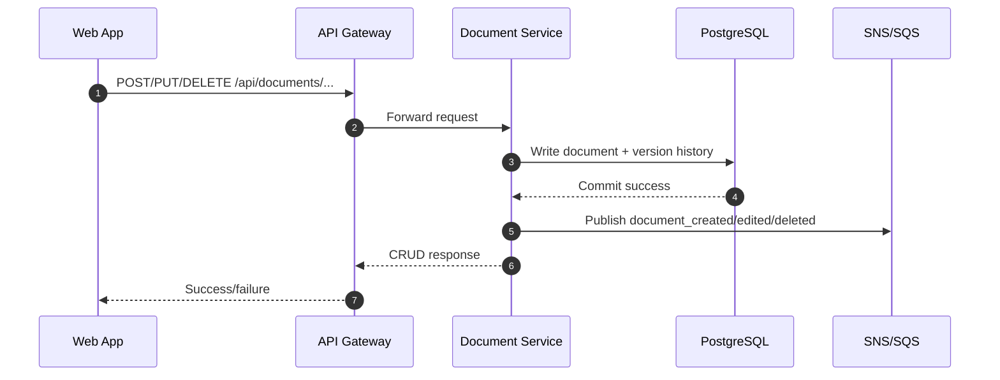

---

## 6) Post-CRUD Async Fanout

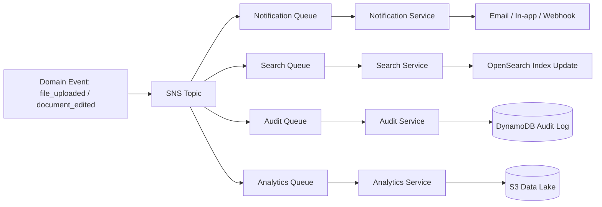

---

## 7) Search Flows

### 7.1 Query Path

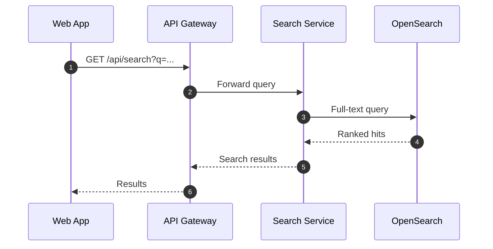

### 7.2 Indexing Path

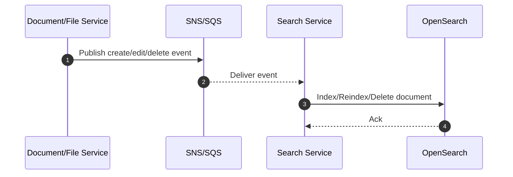

---

## 8) Collaboration Flow (Real-Time)

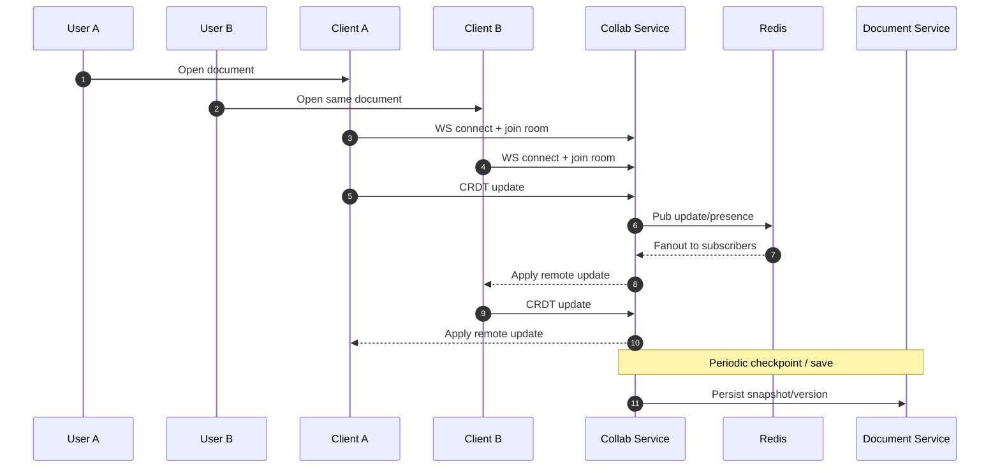

---

## 9) Notification Flow

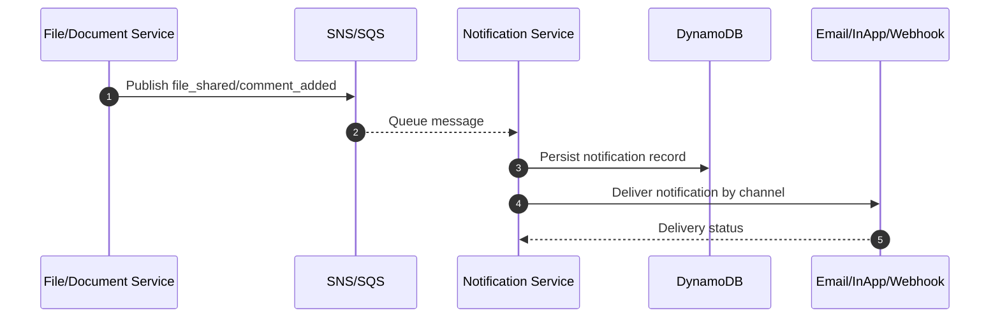

---

## 10) Audit Flow

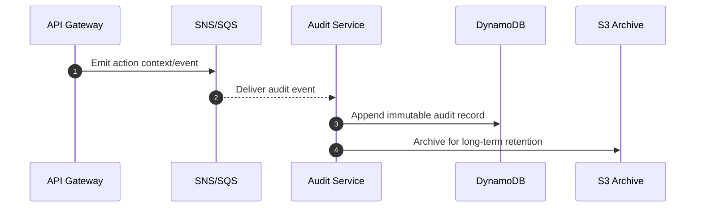

---

## 11) Analytics Flow

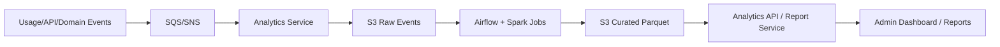

---

## 12) Full Complex End-to-End: Live Edit + Side Effects

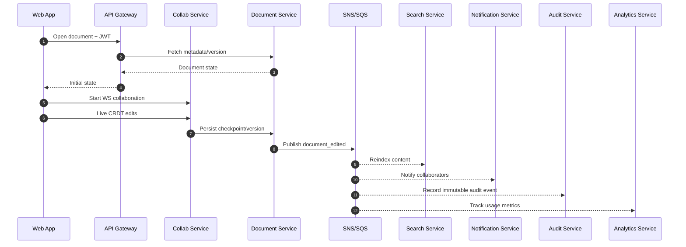

---

## Mental Model

- **CRUD path**: API Gateway -> domain service -> primary datastore (synchronous, user-facing)
- **After-CRUD path**: domain event -> SNS/SQS -> search/notification/audit/analytics (asynchronous)
- **Collaboration path**: WebSocket + CRDT in collab-service, with persisted versions in document-service
