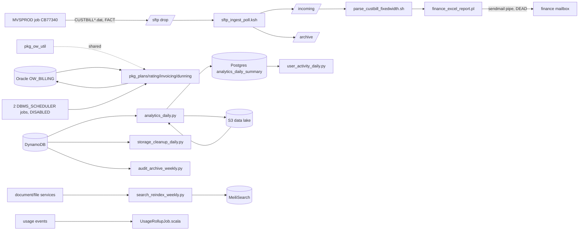

# OtterWorks estate inventory (STOP B artifact)

Estate: OtterWorks billing + finance-close + product-analytics.
Branch: `tp-run/databricks-20260915T045714Z`. Census date: 2026-09-15.

Provenance marks: **FACT(live)** = queried on the running Oracle box as `OW_BILLING_RO`;
**FACT(repo)** = read from the repository on this branch; **FACT(admin-probe)** = from the
earlier admin-credential probe recorded in `.migration/06_decisions.md` (D-001);
**INFERRED** = derived, with the risk named.

---

## 1. Census

### 1.1 Oracle `OW_BILLING` (pipeline 1 source)

Oracle AI Database 26ai Free 23.26.3.0.0, PDB `FREEPDB1`, host `52.201.36.9:1521`
(EC2 `ow-tp-oracle`, `i-0be201ad6412c5e5e`). FACT(live).

| Object type | Count | Provenance |
|---|---|---|
| Tables | 20 | FACT(live) `ALL_TABLES` |
| Indexes | 25 | FACT(live) `ALL_OBJECTS` |
| Packages (spec+body) | 5 | FACT(admin-probe), FACT(repo) `db/oracle/packages/*.sql` |
| Sequences | 5 | FACT(admin-probe) |
| Triggers | 7 | FACT(admin-probe) |
| DBMS_SCHEDULER jobs | 2 | FACT(admin-probe), both DISABLED |

`ALL_SOURCE`, `ALL_TRIGGERS`, `ALL_SCHEDULER_JOBS` return zero rows for the read-only
principal: it holds `SELECT` on tables only, not the dictionary views for code objects.
Those five counts are therefore FACT(admin-probe)+FACT(repo), not re-verified live.

Tables, with live row counts (FACT(live), `count(*)`, not stats):

| Table | Rows | Cols | Generation | Suppl. log |
|---|---:|---:|---|---|
| CUSTOMER_MASTER | 25,000 | 155 | legacy | ALL COLUMN |
| CUSTOMER_MASTER_HIST | 0 | 158 | legacy | ALL COLUMN |
| INVOICE_LINE | 150,000 | 20 | legacy | ALL COLUMN |
| INVOICE_HEADER | 18,750 | 9 | legacy | ALL COLUMN |
| ENTITY_ATTR_VALUE | 8,333 | 7 | legacy (EAV) | ALL COLUMN |
| USAGE_EVENTS | 814 | 5 | legacy | ALL COLUMN |
| CODES | 32 | 3 | legacy | ALL COLUMN |
| PLANS | 3 | 7 | legacy | ALL COLUMN |
| SUBSCRIPTIONS_HIST | 0 | 10 | legacy | ALL COLUMN |
| TENANTS | 69 | 4 | modern | ALL COLUMN |
| SUBSCRIPTIONS | 69 | 7 | modern | ALL COLUMN |
| RATING_PERIODS | 3 | 4 | modern | ALL COLUMN |
| RATING_RESULTS | 3 | 9 | modern | ALL COLUMN |
| INVOICES | 3 | 8 | modern | ALL COLUMN |
| INVOICE_LINES | 2 | 6 | modern | ALL COLUMN |
| CREDIT_NOTES | 5 | 5 | modern | ALL COLUMN |
| DUNNING_ATTEMPTS | 1 | 6 | modern | ALL COLUMN |
| NOTIFICATIONS | 1 | 4 | modern | ALL COLUMN |
| BILLING_AUDIT_LOG | 0 | 4 | modern | ALL COLUMN |
| FIXTURE_META | 1 | 1 | bookkeeping | none (excluded) |

Two generations coexist. The legacy set (`CUSTOMER_MASTER`, `INVOICE_HEADER`/`INVOICE_LINE`,
`PLANS`, `USAGE_EVENTS`, `CODES`, `ENTITY_ATTR_VALUE`, the `_HIST` twins) carries all the
volume, 193,932 of 193,989 rows. The modern set (`TENANTS`, `SUBSCRIPTIONS`, `RATING_*`,
`INVOICES`, `INVOICE_LINES`, `CREDIT_NOTES`, `DUNNING_ATTEMPTS`, `NOTIFICATIONS`,
`BILLING_AUDIT_LOG`) is the PL/SQL packages' own model and holds 156 rows, and its
`INVOICES`/`INVOICE_LINES` are *not* the same tables as the legacy `INVOICE_HEADER`/
`INVOICE_LINE`. Name collision by two characters. Every downstream artifact must name
which one it means; INFERRED risk: a converted unit silently reconciles the wrong pair.

Referential integrity exists only inside the modern set: 13 foreign keys, all rooted at
`TENANTS`/`INVOICES`/`RATING_PERIODS`/`SUBSCRIPTIONS`/`PLANS` (FACT(live)). The legacy set
has no declared FKs; `INVOICE_LINE -> INVOICE_HEADER` and `ENTITY_ATTR_VALUE ->
CUSTOMER_MASTER` are application-level only. INFERRED: orphan rows are expected and are
part of the declared anomaly set in `03_recon_tolerances.md`, not defects to clean.

Typing hazards the conversion must carry (FACT(live)):
- 37 date-like columns are `VARCHAR2(9)` (`DD-MON-YY`) or `VARCHAR2(20)`; 31 of them sit in
  `CUSTOMER_MASTER`/`CUSTOMER_MASTER_HIST`, including 10 `UDF_DT_*` slots.
- 38 money columns are `NUMBER(12,2)` or `NUMBER(14,2)` — exact-equality columns for recon.

PL/SQL code units (FACT(repo), line counts):
`pkg_ow_util` 83, `pkg_plans` 111, `pkg_rating` 223, `pkg_invoicing` 200, `pkg_dunning` 105.
Schema DDL: `01_tables.sql` 256, `02_horror.sql` 442, `03_seed_static.sql` 70,
`04_jobs.sql` 32, `setup/01_users.sql` 10.

### 1.2 CUSTBILL finance close (pipeline 2 source) — FACT(repo)

| Object | Lines | Role |
|---|---:|---|
| `etl/legacy-extra/jobs/sftp_ingest_poll.ksh` | 70 | polls SFTP drop for `CUSTBILL*.dat`, copies to `incoming/` + `archive/` |
| `etl/legacy-extra/jobs/parse_custbill_fixedwidth.sh` | 81 | bash/awk fixed-width parser |
| `etl/legacy-extra/jobs/finance_excel_report.pl` | 91 | writes CSV, renames `.xls`, mails via sendmail pipe |
| `etl/legacy-extra/run_all.sh` | 28 | "orchestration": two `sleep 600` calls between stages |
| `etl/legacy-extra/tools/gen_history_data.pl` | — | fixture data generator |
| `etl/legacy-extra/tools/gen_sample_data.pl` | — | fixture data generator |
| `etl/legacy-extra/docker-compose.sftp.yml` | — | local SFTP fixture |

### 1.3 Product analytics (pipeline 3 source) — FACT(repo)

| Object | Lines | Reads | Writes |
|---|---:|---|---|
| `etl/scripts/analytics_daily.py` | 452 | DynamoDB, SQS, S3 data lake | Postgres `analytics_daily_summary`, S3 |
| `etl/scripts/user_activity_daily.py` | 255 | S3 data lake, `analytics_daily_summary` | S3 |
| `etl/scripts/storage_cleanup_daily.py` | 217 | DynamoDB, 3 S3 buckets | S3 deletes |
| `etl/scripts/audit_archive_weekly.py` | 224 | DynamoDB | S3 archive bucket |
| `etl/scripts/search_reindex_weekly.py` | 319 | document-service, file-service | MeiliSearch index |
| `services/.../batch/UsageRollupJob.scala` | 96 | usage events | usage rollups |
| `services/.../batch/UsageRollupAggregator.scala` | 54 | — | — |
| `etl/run.sh` | 7 | wrapper | — |
| `etl/config.ini` | 25 | — | **plaintext AWS keys, Postgres password, MeiliSearch key** |

### 1.4 Schedulers — FACT(repo)

`etl/crontab` (5 entries) and `etl/legacy-extra/crontab` (9 entries, superset: it repeats
the five Python entries and adds the four CUSTBILL ones). Known collisions, documented in
the file's own comments: ingest `*/15` overlaps its own previous run, parse runs 5 minutes
behind ingest and can read a half-written file, `finance_excel_report.pl` at 02:10 overlaps
`analytics_daily.py` at 02:00 on the same box, and `run_all.sh` on Sunday 06:00 reruns
everything. Lock files are created and never removed.

---

## 2. Lineage DAG

Edge marks: every Oracle FK edge and every file-path edge above is FACT (read from the
live dictionary or the script source). `MVSPROD -> drop` is FACT(repo comment) but the
upstream job itself is outside the estate and unverifiable from here. The consumer edge
`finance_excel_report.pl -> finance mailbox` is FACT(repo) and **dead**: the sendmail pipe
stopped working years ago, so the current real consumer of the finance close is unknown.
That is D-007 below, and it is the one edge that can invalidate pipeline 2's acceptance
criteria.

---

## 3. Coverage arithmetic

N = 82 census objects = 63 (pipeline 1) + 4 (pipeline 2) + 9 (pipeline 3) + 3 (shared)
+ 2 (PROPOSED-unused) + 1 (excluded).

- **Pipeline 1 — 63**: 20 tables + 25 indexes + 5 sequences + 7 triggers + 4 packages
  (`pkg_plans`, `pkg_rating`, `pkg_invoicing`, `pkg_dunning`) + 2 scheduler jobs.
- **Pipeline 2 — 4**: the four CUSTBILL executables.
- **Pipeline 3 — 9**: 5 Python scripts + 2 Scala sources + `run.sh` + `config.ini`.
- **Shared (2+ pipelines) — 3**: `pkg_ow_util` (called by all four billing packages),
  `etl/crontab` and `etl/legacy-extra/crontab` (both carry pipeline 2 and pipeline 3
  entries).
- **PROPOSED-unused — 2**: `gen_history_data.pl`, `gen_sample_data.pl`. No schedule entry,
  no caller, fixture generators. Your call to drop — nothing is deleted on my say-so.
- **Excluded — 1**: `docker-compose.sftp.yml`, local fixture infrastructure, reason:
  not part of the production estate.

Documentation files (`README.md`, the two upgrade guides, `OPERATIONS_HANDBOOK.doc.txt`,
`RESTART_PROCEDURE.doc.txt`, `deploy_prod_FINAL_v2.sh.txt`) are evidence, not migration
objects, and are not counted.

### Export-completeness triangulation

| Cross-check | Result |
|---|---|
| Repo DDL tables vs live tables | 19 vs 20 — live adds `FIXTURE_META`. Repo is *not* the whole truth; live wins. FACT(live) |
| Repo crontab entries vs pipeline-2+3 executables | 9 entries cover 4 CUSTBILL + 5 Python. Scala rollup has **no** crontab entry. FACT(repo) |
| Oracle scheduler jobs vs repo `04_jobs.sql` | 2 vs 2, both disabled live. FACT(admin-probe) |
| Code-object counts re-verified as `OW_BILLING_RO` | **UNVERIFIABLE** at this privilege level; taken from the admin probe and the repo |
| Last-run evidence (scheduler logs, query history) | **UNVERIFIABLE** — no log retention on the box, no Oracle query-history access |

Two honest gaps: nothing here proves the Scala rollup is still scheduled anywhere, and
nothing proves any of these jobs ran recently. Both are scope-cutters the user may want to
act on, and neither is mine to decide.

---

## 4. Shared-object map

| Shared object | Used by | Proposed owner | Why |
|---|---|---|---|
| `pkg_ow_util` | P1 packages (all four) | **Pipeline 1, wave 0** | First to need it; every rating/invoicing/dunning unit depends on its helpers |
| `etl/crontab` + `etl/legacy-extra/crontab` | P2, P3 | **Pipeline 2, wave 0** | P2 converts cron to a Lakeflow Job first; P3 inherits the schedule model |
| Oracle `TENANTS`/`PLANS`/`SUBSCRIPTIONS` | P1 (write), P3 (read for rollups) | **Pipeline 1** | P3 reads the Delta output, never Oracle |
| `/Volumes/ow_tp/bronze/landing` | P1, P2, P3 | **Pipeline 1, wave 0** | One landing convention, per-pipeline subpaths |

No two pipelines write the same target under this map. Fan-out collision checks at wave
launch enforce it per batch.

---

## 5. Parallelism profile

| Pipeline | Units (est.) | Lineage depth | Max width | Serial floor |
|---|---:|---:|---:|---|
| 1 Oracle invoicing | ~26 (20 tables + 4 packages + 2 jobs) | 3 (tables -> packages -> jobs/CDC) | 5 | `pkg_ow_util` + landing conventions + the CDC leg (wave 0), then the 155-column `CUSTOMER_MASTER` chain |
| 2 CUSTBILL | ~5 (4 scripts + schedule) | 4 (ingest -> parse -> report -> schedule) | 2 | almost entirely serial: each stage consumes the previous stage's files |
| 3 Analytics | ~8 (5 Python + Scala rollup + schedule + secrets) | 2 | 5 | `config.ini` secret-by-name conversion must land before any job runs |

Pipeline 2 is the slowest per object despite being the smallest: its chain is serial by
construction. Pipeline 3 is the widest and cheapest.

---

## 6. First-pass dependency sweep (appended to `04_dependency_register.md` as UNDECIDED)

| ID | Class | Item |
|---|---|---|
| D10-01 | D10 access | Databricks serverless cannot reach Oracle 1521; federation (and therefore the recon harness's only supported path for this source) is blocked until `sg-0eaf11f4434260e1e` allows the serverless NAT range |
| D10-04 | D10 access | Migration principal confirmation (service principal vs PAT) |
| D3-01 | D3 external feed | `MVSPROD` job `CB77340` keeps dropping `CUSTBILL*.dat`; who repoints it, and does it stay on SFTP after cutover |
| D4-01 | D4 consumer | The finance `.xls` email consumer is dead. Who actually consumes the month-end close today, and what is the acceptance artifact |
| D5-01 | D5 scheduler | Two hand-maintained crontabs with known overlaps and orphan lock files; Lakeflow Jobs replace them, but the cron box must be decommissioned by a human |
| D6-01 | D6 shared object | `pkg_ow_util` owned by P1 but consumed by every billing unit |
| D7-01 | D7 secrets | `etl/config.ini` holds live-looking AWS keys, a Postgres password and a MeiliSearch key in plaintext on the branch. Rotation is the customer's, not mine |
| D8-01 | D8 data quality | Legacy set has no FKs; orphan `INVOICE_LINE` rows and malformed strings are in the declared anomaly set and must be reproduced, not cleaned |
| D9-01 | D9 naming | `INVOICES`/`INVOICE_LINES` (modern) vs `INVOICE_HEADER`/`INVOICE_LINE` (legacy) — every unit must declare which pair it migrates |

---

## 7. Recommendation for STOP B

The user has already fixed the pipeline order (1 Oracle invoicing, then 2 CUSTBILL, then
3 analytics), and this census does not argue against it: pipeline 1 is the only slice that
touches every workload surface — tables, PL/SQL, a scheduler, CDC, both target families
(Lakebase OLTP and Delta) — so the profiles and dialect skills get tuned there before any
wide fan-out. Boundary: all 63 pipeline-1 objects, `FIXTURE_META` excluded from migration
but included in recon's excluded-objects list so it cannot silently vanish.

Two boundary questions belong to the user, not to me:
1. Drop the two fixture generators from scope (PROPOSED-unused), or migrate them?
2. Does pipeline 1 include the modern-set tables (156 rows, the packages' own model), or
   only the legacy volume tables? I recommend including both — the packages write the
   modern set, so excluding it would leave the converted logic with nowhere to write.
