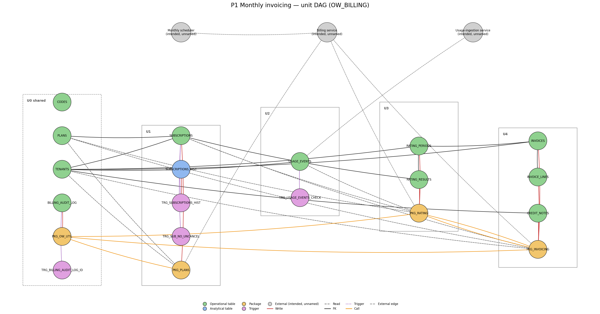

# P1 Monthly invoicing — pipeline analysis

Estate: Oracle `OW_BILLING` (Free 23ai, `FREEPDB1`). Pipeline chosen at STOP B (DEC-B).
Inputs: `docs/migration/OW_BILLING_inventory.md`, `.migration/evidence/census/*.tsv`, live `DBA_SOURCE` /
`DBA_DEPENDENCIES` (read-only, D10-8 closed: pins are `AS OF SCN`). Static sources cited below
(`services/legacy-billing/db/oracle/...`) were verified equal to live `DBA_SOURCE` at inventory time.
Target profiles read: CORE, LAKEBASE (operational track), SQL/Delta (analytical track), DATA/DEPENDENCY
(`docs/migration/ow_billing_target_state.md`). Analysis only: no plan, no code, no children.

## 1. Pinned scope

Entry feeds -> transformations -> terminal outputs, from source:

| Hop | Object | Cite |
|---|---|---|
| Entry feed | `USAGE_EVENTS` (814 rows; writer external, unnamed — D3-1) | `schema/01_tables.sql` L78-86; `TRG_USAGE_EVENTS_CHECK` |
| Entry feed | `SUBSCRIPTIONS` via `PKG_PLANS.SP_CHANGE_PLAN` | `packages/02_pkg_plans.sql` L77-110 |
| Reference reads | `TENANTS`, `PLANS`, `CODES`, `CREDIT_NOTES` (read + burned down) | pkg bodies |
| Transform | `PKG_RATING.COMPUTE_RATING` -> `SP_FINALIZE_RATING` writes `RATING_PERIODS`, `RATING_RESULTS` | `03_pkg_rating.sql` L30-118, L157-213 |
| Transform | `PKG_INVOICING.SP_ISSUE_INVOICE` (calls `SP_FINALIZE_RATING`, `FN_INVOICE_PREVIEW`) writes `INVOICES`, `INVOICE_LINES`, `CREDIT_NOTES` | `04_pkg_invoicing.sql` L112-197 |
| Side effects | `TRG_SUBSCRIPTIONS_HIST` -> `SUBSCRIPTIONS_HIST` (+`SEQ_SUBSCRIPTIONS_HIST`); `TRG_SUB_NO_UNCANCEL`; `PKG_OW_UTIL.LOG_MSG` -> `BILLING_AUDIT_LOG` (+`SEQ_BILLING_AUDIT_LOG`, `TRG_BILLING_AUDIT_LOG_ID`) | `01_tables.sql` L191-249; `01_pkg_util.sql` L73-86 |
| Terminal outputs | `INVOICES`, `INVOICE_LINES`, `RATING_RESULTS`, `CREDIT_NOTES.remaining_amount`, `SUBSCRIPTIONS_HIST`, `BILLING_AUDIT_LOG` | — |
| Read surfaces | `FN_LIST_PLANS`, `FN_ENTITLEMENT`, `FN_USAGE_RATING`, `FN_USAGE_SUMMARY`, `FN_INVOICE_PREVIEW`, `FN_INVOICE_LINES` (SYS_REFCURSOR) | pkg specs |

Exclusions (not widened): `PKG_DUNNING`, `DUNNING_ATTEMPTS`, `NOTIFICATIONS`, `JOB_NIGHTLY_DUNNING` (P2);
`CUSTOMER_MASTER*`, `ENTITY_ATTR_VALUE`, `INVOICE_HEADER`, `INVOICE_LINE`, their triggers/sequences (P3);
`JOB_PURGE_AUDIT_LOG` (shared, disabled, decided with the shared set at STOP C); `FIXTURE_META` (environment metadata).
P1 reaches `TENANTS`/`SUBSCRIPTIONS` that P2 also writes (D6-1, D6-2): P2 writers are out of scope here but the tables
are wave-0 / U1 property and P2 inherits them.

Absent / unreachable: nothing in the pinned scope is missing from the export; all 69 objects VALID. What is absent is the
**production caller**: no application in the repo calls the three packages (D4-5). Customer-stated intended model (DEC-B1, FACT):
billing service owns plan changes, rating, invoicing, credits, dunning; a monthly scheduler tells it when to close a period;
product services emit usage events; a usage-ingestion service validates/dedupes them into `USAGE_EVENTS`; reports only read.
Nothing below invents those services' names.

## 2. Unit inventory

Family rule: unit = table group + its constraints/triggers/sequences + every procedure that writes it. A procedure and the
tables it mutates are never split. `PKG_INVOICING` mutates `RATING_*` only through a call to `PKG_RATING.SP_FINALIZE_RATING`
(direct writer stays `PKG_RATING`), so rating and invoicing are separate units joined by a FACT call edge and package-state
edge; they are serialized in one batch, never parallel.

| Unit | Track / target | Objects | Reads | Writes | Shared? | Workload | Complexity | Dialect risk flags (oracle-plsql) |
|---|---|---|---|---|---|---|---|---|
| **U0 shared-core** | operational / Lakebase `ow_billing` schema (+ `CODES`, `PLANS`, `TENANTS` mirrored to Delta `ow_tp.silver` for reports, D2-2) | `CODES`, `PLANS`, `TENANTS`, `BILLING_AUDIT_LOG`, `SEQ_BILLING_AUDIT_LOG`, `TRG_BILLING_AUDIT_LOG_ID`, `PKG_OW_UTIL` (5 routines) | `CODES` | `BILLING_AUDIT_LOG` | **yes** (P1, P2, P3 inherit; D2-1) | SQL (OLTP) | M | `PRAGMA AUTONOMOUS_TRANSACTION` logger (trap 14); `WHEN OTHERS THEN ROLLBACK` swallow (trap 13); package globals `g_call_count/g_last_*` (trap 11); `EXECUTE IMMEDIATE` static lookup; `STANDARD_HASH MD5` -> `md5()` (deterministic ids: FACT, byte-identical for ASCII input); `TO_DATE(...,'DD-MON-YY')` `f_str2dt` swallows (trap 13); sequence + BEFORE INSERT trigger identity (trap 10) |
| **U1 plans-subscriptions** | operational / Lakebase; `SUBSCRIPTIONS_HIST` also to Delta via Lakehouse Sync (analytical copy) | `SUBSCRIPTIONS`, `SUBSCRIPTIONS_HIST`, `SEQ_SUBSCRIPTIONS_HIST`, `TRG_SUBSCRIPTIONS_HIST`, `TRG_SUB_NO_UNCANCEL`, `PKG_PLANS` (3 routines) | `TENANTS`, `PLANS`, `SUBSCRIPTIONS` | `SUBSCRIPTIONS` (INSERT/UPDATE), `SUBSCRIPTIONS_HIST` (trigger) | `SUBSCRIPTIONS` also written by P2 `PKG_DUNNING` (D6-2) | SQL (OLTP) | M | `FOR UPDATE` cursor + `WHERE CURRENT OF` loop; `EXECUTE IMMEDIATE` static INSERT; `(+)` outer joins, `ROWNUM = 1` without total order (trap 7, nondeterminism); `WHEN OTHERS THEN NULL` in `fn_entitlement` (trap 13); `GREATEST` NULL semantics (trap 23); `DECODE`; `TO_DATE('31-DEC-99','DD-MON-YY')` = 2099 (RR-less `YY`); SYS_REFCURSOR contracts (trap 12); package globals `g_last_*` (trap 11); hist timestamp is `VARCHAR2(20)` `'DD-MON-YY HH24:MI:SS'` (string date) |
| **U2 usage-events** | operational / Lakebase | `USAGE_EVENTS`, `TRG_USAGE_EVENTS_CHECK` | `CODES` | `USAGE_EVENTS` (external writer only) | no | SQL (OLTP) + D3 external feed | S | `RAISE_APPLICATION_ERROR -20001/-20002` -> `RAISE EXCEPTION USING ERRCODE` (code table in unit note); trigger lookup against `CODES` (D2-2); no writer in the estate (D3-1) |
| **U3 rating** | operational / Lakebase | `RATING_PERIODS`, `RATING_RESULTS`, `PKG_RATING` (5 routines) | `SUBSCRIPTIONS`, `PLANS`, `USAGE_EVENTS`, `RATING_RESULTS`, `RATING_PERIODS` | `RATING_PERIODS`, `RATING_RESULTS` | `COMPUTE_RATING` + `g_*` state consumed by U4 (FACT) | SQL (OLTP, money) | L | 10 package globals as the API (trap 11); `TO_CHAR(...,'YYYYMMDD')` string date compare (trap 3/20); row-by-row cursor sums; `LEAST/GREATEST` NULL propagation (trap 23) — explicitly relied on; `ROUND` half-away-from-zero on `NUMBER` (Postgres `round(numeric)` is also half-away: same); `ROWNUM <= 1` after `ORDER BY starts_on DESC` with ties (trap 7); INSERT-then-`DUP_VAL_ON_INDEX`-UPDATE upsert (-> `INSERT ... ON CONFLICT`, trap 8); `ADD_MONTHS`; `CAST(DATE AS TIMESTAMP)` |
| **U4 invoicing-credits** | operational / Lakebase | `INVOICES`, `INVOICE_LINES`, `CREDIT_NOTES`, `PKG_INVOICING` (4 routines) | `SUBSCRIPTIONS`, `PLANS`, `TENANTS`, `CREDIT_NOTES`, `INVOICE_LINES`, `PKG_RATING.g_overage_amount` | `INVOICES`, `INVOICE_LINES` (DELETE+INSERT), `CREDIT_NOTES` (UPDATE) | `CREDIT_NOTES` has no INSERT writer in the estate (seed only) | SQL (OLTP, money) | L | cross-package global read (`pkg_rating.g_overage_amount`, trap 11); hard-coded `TAX_RATE 0.0825`; `g_tax / 2` split lines unrounded (`NUMBER` full precision -> `NUMERIC(12,2)` column rounds on insert: FACT, recon on stored value); NULL tax propagation relied on; `EXECUTE IMMEDIATE` DELETE; cursor `FETCH` loop over own REF CURSOR; credit burn-down loop with the documented double-decrement quirk (preserve verbatim); `DUP_VAL_ON_INDEX` upsert; `ON DELETE CASCADE` FK |

Routines per unit: U0 5, U1 3, U3 5, U4 4 = 17 of the 19 estate routines; the other 2 are `PKG_DUNNING` (P2). Triggers 4 of 7,
sequences 2 of 5, tables 12 of 20. Lakebase Postgres cannot host `SYS_REFCURSOR`: the six read functions become
`RETURNS TABLE` functions with the projection pinned to the Oracle column names/order (trap 12).

### Intended application surface (Lakebase, PL/pgSQL) — interface contract, for the billing service in DEC-B1

Ports (like-for-like, recon-gated) and **new surface required by the intended model but absent from Oracle** (PROPOSED,
decided at STOP C, not recon-comparable to source):

| Surface | Kind | Unit | Signature (Postgres 17, schema `ow_billing`) | Transaction boundary |
|---|---|---|---|---|
| Plan change | port | U1 | `PROCEDURE plans.sp_change_plan(p_tenant_id text, p_plan_id text, p_effective_on date)` | caller's transaction; closes open subs then inserts; `TRG_SUB_NO_UNCANCEL` port enforces the cancelled rule |
| Entitlement / plan list | port | U1 | `FUNCTION plans.fn_entitlement(text, date) RETURNS TABLE(tenant_id text, plan_code text, tier text, monthly_fee numeric(12,2), included_units bigint, subscription_status text, effective_on date)`; `plans.fn_list_plans() RETURNS TABLE(...)` | read-only; `ORDER BY starts_on DESC, id` total order added (determinism rule) |
| Usage ingest | **new** | U2 | `PROCEDURE usage.ingest_usage_event(p_id text, p_tenant_id text, p_occurred_at timestamp, p_units bigint, p_kind_cd smallint)` = `INSERT ... ON CONFLICT (id) DO NOTHING` behind the ported check trigger | one row per call; dedupe key = `id` (the only key the estate defines; producers must supply a stable id — D3-1 contract) |
| Rating compute | port, interface change | U3 | `FUNCTION rating.compute_rating(text, date, date) RETURNS rating.rating_result_t` (composite replaces the 10 `g_*` globals) | pure read |
| Rating finalize | port | U3 | `PROCEDURE rating.sp_finalize_rating(text, date, date)`; `rating.fn_usage_rating`, `rating.fn_usage_summary` as `RETURNS TABLE` | caller's transaction; upserts via `ON CONFLICT` |
| Invoice issue | port | U4 | `PROCEDURE invoicing.sp_issue_invoice(text, date, date)` (calls `rating.sp_finalize_rating`, `invoicing.compute_preview` returning a composite instead of `g_*`) | caller's transaction; whole issue is atomic (Oracle had no COMMIT inside either) |
| Invoice preview / lines | port | U4 | `invoicing.fn_invoice_preview(text,date,date) RETURNS TABLE(line_no int, line_type text, description text, amount numeric, tax_amount numeric, credit_applied numeric, total numeric)`; `invoicing.fn_invoice_lines(text)` | read-only |
| Close billing period | **new** | U4 | `PROCEDURE invoicing.close_billing_period(p_period_start date, p_period_end date)` = for every tenant with a subscription covering the period, `CALL sp_issue_invoice` (per-tenant savepoint; failures collected into `billing_audit_log`, not swallowed) | what the monthly scheduler calls; Oracle has no equivalent (harness issued per tenant) |
| Credit issue | **new** | U4 | `PROCEDURE invoicing.issue_credit_note(p_id text, p_tenant_id text, p_issued_on date, p_amount numeric(12,2))` = INSERT with `remaining_amount = amount` | no Oracle writer exists; owner billing service |
| Invoice notification | **new / D7-2** | U4 or P2 | emit `NOTIFICATIONS(kind_cd = 1 'invoice')` at `sp_issue_invoice` end | Oracle P1 emits **no** notification (only `PKG_DUNNING` writes `NOTIFICATIONS`); the customer's demonstrated path ends in a notification, so this is a decision, not a port |
| Audit logger | port | U0 | `PROCEDURE util.log_msg(text, text)` in-transaction (no autonomous txn in Postgres) | rows roll back with the business txn — accepted deviation, tolerance row 14 |

Caller identity, connection pool, and scheduler are **not** designed here: they are the D4-5 / STOP E precondition.

## 3. Field / type dictionary (tables P1 writes; Lakebase column = Postgres 17; Delta column where the table also lands analytically)

Rules from `oracle-plsql` type map; FACT = from DDL/census, INFERRED = needs a data proof.

| Table.column | Oracle | Lakebase | Delta (if analytical copy) | Mark | Note |
|---|---|---|---|---|---|
| `*.id`, `*_id` (all VARCHAR2(36) keys) | `VARCHAR2(36)` | `varchar(36)` | `STRING` | FACT | md5-derived uuid strings; not `uuid` type (seed ids may not be RFC-4122: INFERRED, census check `id ~ '^[0-9a-f-]{36}$'`) |
| `SUBSCRIPTIONS.starts_on/ends_on/suspended_on`, `RATING_PERIODS.period_start/end`, `CREDIT_NOTES.issued_on` | `DATE` | `timestamp(0)` | `TIMESTAMP_NTZ` | INFERRED -> `date` only if `TRUNC(col)=col` on 100% of rows (Tier 3 proof) | trap 3; packages compare with `TO_CHAR 'YYYYMMDD'` so time-of-day is ignored by logic but stored |
| `USAGE_EVENTS.occurred_at`, `RATING_RESULTS.created_at`, `INVOICES.issued_at` | `TIMESTAMP(6)` | `timestamp(6)` | `TIMESTAMP_NTZ` | FACT | canonicalization `identity` (n > 3) |
| `*.status_cd`, `kind_cd`, `tier_cd`, `code_val` | `NUMBER(4)` | `smallint` | `SMALLINT` | FACT | CHECK against `CODES` not enforced in Oracle either; keep FK-less (like-for-like), row 14 |
| `PLANS.monthly_fee`, `RATING_RESULTS.overage_amount`, `INVOICES.subtotal/tax/total`, `INVOICE_LINES.amount`, `CREDIT_NOTES.amount/remaining_amount` | `NUMBER(12,2)` | `numeric(12,2)` | `DECIMAL(12,2)` | FACT | money, zero tolerance |
| `PLANS.overage_rate` | `NUMBER(12,6)` | `numeric(12,6)` | `DECIMAL(12,6)` | FACT | |
| `PLANS.included_units`, `USAGE_EVENTS.units`, `RATING_RESULTS.*_units` | `NUMBER(10)` | `bigint` | `BIGINT` | FACT | |
| `INVOICE_LINES.line_no` | `NUMBER(6)` | `integer` | `INT` | FACT | |
| `BILLING_AUDIT_LOG.log_id`, `SUBSCRIPTIONS_HIST.hist_id` | `NUMBER(12)` | `bigint` + sequence | `BIGINT` | FACT | never compared across engines (trap 10) |
| `BILLING_AUDIT_LOG.logged_at` | `DATE DEFAULT SYSDATE` | `timestamp(0) DEFAULT localtimestamp` | — | FACT | server TZ: Oracle host TZ vs Lakebase UTC — INFERRED equal (census `DBTIMEZONE`), risk R6 |
| `TENANTS.tax_exempt_yn`, `PLANS.active_yn` | `CHAR(1)` | `char(1)` | `STRING` | FACT | stays `'Y'/'N'` (not boolean) so `NVL(active_yn,'N')` ports verbatim |
| `SUBSCRIPTIONS_HIST.hist_dt` | `VARCHAR2(20)` string date | `varchar(20)` (same string, `to_char(localtimestamp,'DD-MON-YY HH24:MI:SS')` upper-cased) | `STRING` + derived `TIMESTAMP_NTZ` column in silver | FACT | Postgres `Mon` case differs from Oracle `MON`: use `upper()`; English month names (`NLS_DATE_LANGUAGE`) |
| `SUBSCRIPTIONS_HIST.hist_op` | `VARCHAR2(3)` | `varchar(3)` | `STRING` | FACT | `'UPD'/'DEL'` |
| `INVOICE_LINES.line_type` | `VARCHAR2(10)` | `varchar(10)` | — | FACT | `''`-is-NULL trap 1 does not apply (never empty) |
| `INVOICE_LINES.description`, `BILLING_AUDIT_LOG.message`, `TENANTS.name`, `PLANS.code` | `VARCHAR2(n)` | `varchar(n)` (BYTE semantics: 23ai default `NLS_LENGTH_SEMANTICS=BYTE`, INFERRED) | `STRING` | INFERRED | trap 21: multibyte tenant names may exceed `n` chars only if byte-truncated at source; census `MAX(LENGTHB)` |

Constraints: all 12 tables' PK/UK/FK/NOT NULL recreated enforced (Lakebase column of the skill); `FK_IL_INVOICE ON DELETE CASCADE`
kept. Indexes: only PK/UK indexes exist at source (16 in scope) -> Postgres creates them implicitly; no secondary indexes to port
(FACT, `indexes.tsv`). Sequences: `SEQ_BILLING_AUDIT_LOG` and `SEQ_SUBSCRIPTIONS_HIST`, both `LAST_NUMBER = 1`, `NOCACHE`
-> `CREATE SEQUENCE ... CACHE 1`, `setval` after backfill (D9-1).

## 4. Dependency register entries (P1 crossings; full rows appended to `.migration/04_dependency_register.md`)

| ID | Class | Crossing | Contract | Status | Lead-time exposure |
|---|---|---|---|---|---|
| D2-1 | D2 | `CODES`, `PLANS`, `TENANTS`, `BILLING_AUDIT_LOG`, `PKG_OW_UTIL` shared by P1/P2/P3 | wave 0 (U0), migrated once; P2/P3 inherit and never recreate | UNDECIDED (STOP C) | none |
| D2-2 | D2 | `CODES`/`PLANS`/`TENANTS` needed in Lakebase (triggers, procs) and Delta (P3 report) | Lakebase master; Delta copy via Lakehouse Sync from the migration branch (schema-level, `REPLICA IDENTITY FULL`) | UNDECIDED | Lakehouse Sync is **UI-only** — D10-9 |
| D3-1 | D3 | `USAGE_EVENTS` producers unnamed; intended usage-ingestion service validates/dedupes | contract offered: `usage.ingest_usage_event(...)`, dedupe on `id`, rejects via ERRCODE `P0001`-class codes mapped from -20001/-20002 | ANSWERED as model (DEC-B1); producers unnamed | blocks STOP E, not conversion |
| D4-5 | D4 | Billing service (caller of U1/U3/U4) unnamed | surface in §2; caller must speak Postgres wire protocol to the Lakebase endpoint with a customer-held role | STOP E hard precondition | blocks cutover |
| D4-6 | D4 | Monthly scheduler unnamed; Oracle has no period-close routine | `invoicing.close_billing_period(date,date)` PROPOSED new surface | UNDECIDED | none for conversion; blocks STOP E demo |
| D6-1 | D6 | `TENANTS` written by P2 (`PKG_DUNNING` UPDATE status_cd) | U0 owns the table; P2 unit adds its writer later, no DDL | UNDECIDED | none |
| D6-2 | D6 | `SUBSCRIPTIONS` written by U1 and by P2 `PKG_DUNNING` (UPDATE status_cd/suspended_on); both fire the hist trigger | U1 owns table + triggers; P2 adds writer procedure only | UNDECIDED | none |
| D7-1 | D7 | `NOTIFICATIONS` sender unnamed (P2 table) | out of P1 scope except D7-2 | PARTIAL | blocks STOP E demo |
| D7-2 | D7 | Intended path ends in a notification; Oracle P1 emits none at invoice issue | option A: add `kind_cd=1` insert in `sp_issue_invoice` (new behaviour, excluded from like-for-like recon, Tier 4 extra row); option B: P2 emits on its schedule | UNDECIDED | none |
| D9-1 | D9 | `SEQ_SUBSCRIPTIONS_HIST`, `SEQ_BILLING_AUDIT_LOG` identity | `setval(max+1)` after backfill; never compared cross-engine; audit rows compared on `(module, message)` content | UNDECIDED | none |
| D9-2 | D9 | Package session state (`pkg_rating.g_*`, `pkg_invoicing.g_*`, `pkg_plans.g_last_*`, `pkg_ow_util.g_*`) read across routines and by "consumers" | replaced by composite return types; `g_last_*` caches dropped (no reader found in repo — INFERRED) | UNDECIDED | none |
| D9-3 | D9 | `PRAGMA AUTONOMOUS_TRANSACTION` logger | in-transaction `util.log_msg` (rows lost on rollback) vs outbox; tolerance row 14 accepts count delta on `BILLING_AUDIT_LOG` | UNDECIDED | none |
| D10-5 | D10 | `dbx-recon` has no Oracle adapter | LIVE recon runs through a thin `python-oracledb` source adapter or federation (`lakehouse-federation` Oracle connector via warehouse now that D10-2 is closed) | OPEN | wave 0 scaffolding |
| D10-9 | D10 | Lakehouse Sync (Lakebase -> Delta) has no CLI/API; must be enabled in the workspace UI per branch schema | owner: human with workspace UI (parent/customer); until then analytical copies of `SUBSCRIPTIONS_HIST`/`CODES`/`PLANS`/`TENANTS` are loaded by SCN-pinned freeze-and-load | NEW, OPEN | per-branch manual step at every batch (or accept Delta copies only on the wave-close branch) |
| D10-10 | D10 | Debezium containers (D10-3) not yet deployed; CDC apply path Kafka -> Delta landing -> Lakebase not built | wave 0 scaffolding item; until live, U1-U4 rehearse with SCN-pinned freeze-and-load (fallback approved DEC-A) | OPEN | gates transactional recon (`cdc_lag_max_s`) |

## 5. Waves and fan-out batches

| Wave | Batch | Units | Child writes (declared targets) | Width | Notes |
|---|---|---|---|---|---|
| 0 | b0-1 | U0 | Lakebase branch `mig-p1-w0-b1` schema `ow_billing` (util, codes, plans, tenants, billing_audit_log); Delta `ow_tp.silver.{codes,plans,tenants}` (ns=demo) | 1 (serial, D2) | also wave-0 scaffolding: recon Oracle adapter (D10-5), Debezium/Kafka containers (D10-10), Lakehouse Sync request (D10-9) |
| 1 | b1-1 | U1 | branch `mig-p1-w1-b1`: subscriptions, subscriptions_hist, seq, 2 triggers, `plans.*` routines | 2 | disjoint tables from b1-2; both read U0 objects (inherited from wave-0 branch, no writes) |
| 1 | b1-2 | U2 | branch `mig-p1-w1-b2`: usage_events, check trigger, `usage.ingest_usage_event` | | INFERRED edge check: none between U1 and U2 |
| 2 | b2-1 | U3 then U4 (serial in one child, two PRs) | branch `mig-p1-w2-b1`: rating_periods, rating_results, invoices, invoice_lines, credit_notes, `rating.*`, `invoicing.*` | 1 | FACT call + package-state edge U4->U3 forbids parallel batches; money path -> `verify_depth: full` |

Serial floor: 3 waves (wave 0 -> 1 -> 2). Widest wave: 2 batches (under the width-4 cap). Projected concurrency against
D10 limits: 2 concurrent Lakebase branches (limit 10 unarchived, 7 headroom for P2/P3), legacy queries 2 per unit / 4 total
(tolerance) -> wave 1 at width 2 uses the whole legacy cap; wave 2 is single-child. Pilot rule: wave 1 is already narrow (2).
Batching treated every INFERRED edge as FACT; the only INFERRED edges (`pkg_plans.g_last_*` external readers; hist string
dates consumed by unknown reports) are inside U1 and do not cross batches.

Topological check: U0 <- {U1, U2} <- U3 <- U4 (U3 reads `SUBSCRIPTIONS` from U1 and `USAGE_EVENTS` from U2; U4 reads
U1/U0 and calls U3). Wave order is a valid topological sort; no two same-wave batches share a write target.

## 6. Recon plan per unit

Mode: operational units `--mode transactional --target-kind lakebase` against the batch branch, source pinned
`AS OF SCN <pin>` (D10-8 closed), target `REPEATABLE READ` snapshot, `cdc_lag_max_s = 60` (in-flight rows newer than the
applied CDC watermark are not defects). Every table below is under the 1,000,000 full-diff threshold -> **full row-level
diff** (Tier 3), no sampling. Legacy-side cost: one `COUNT`/aggregate statement + one keyed full-projection statement per
table, so 2 statements per table; per-unit totals below stay within the 2-queries-per-unit cap by running one
multi-table `UNION ALL` aggregate statement and one keyed extract per unit (the harness's `source_concurrency 2`).

| Unit | Tables (rows at SCN 2157784-era census) | Watermark | Identity | Tiers | Determinism rule / notes |
|---|---|---|---|---|---|
| U0 | `CODES` 32, `PLANS` 3, `TENANTS` 69, `BILLING_AUDIT_LOG` 0 | none on `CODES/PLANS/TENANTS` -> graded strictly (`ORA_ROWSCN` recorded only as in-flight hint); `BILLING_AUDIT_LOG.logged_at` | `BILLING_AUDIT_LOG.log_id` (never compared) | 1 counts, 2 aggregates (`SUM(monthly_fee)`, `SUM(overage_rate)`), 3 full diff keyed on PK, 5 PK-set diff, 7 constraint/index/sequence parity | audit rows compared on `(module, message)` multiset with the D9-3 delta accepted; Delta copies (analytical): exact counts/keys, money zero tolerance |
| U1 | `SUBSCRIPTIONS` 69, `SUBSCRIPTIONS_HIST` 0 | none -> strict; `SUBSCRIPTIONS_HIST.hist_dt` (string, parsed) | `SUBSCRIPTIONS_HIST.hist_id` | 1, 2 (`COUNT` by `status_cd`), 3 full diff, 4 procedure parity: `fn_entitlement`/`fn_list_plans` outputs for all 69 tenants at the pin vs Lakebase, 5, 6 lag/ordering (CDC), 7 | `fn_entitlement` `ROWNUM=1` tie: rule = `ORDER BY starts_on DESC, id`; census asserts no tenant has two subscriptions with equal `starts_on` (else DEGRADED for those tenants) |
| U2 | `USAGE_EVENTS` 814 | `occurred_at` (append-only, INFERRED: no UPDATE writer in the estate) | none | 1, 2 (`SUM(units)` by `kind_cd`), 3 full diff, 4 trigger parity: reject cases `units<=0`, unknown `kind_cd` (negative tests, fixture), 5, 7 | none |
| U3 | `RATING_PERIODS` 3, `RATING_RESULTS` 3 | `RATING_RESULTS.created_at`; `RATING_PERIODS` none -> strict | none | 1, 2 (`SUM(overage_amount)`, `SUM(billable_units)`), 3 full diff, 4 **dual-run**: `fn_usage_rating` and `fn_usage_summary` for every tenant x the 3 periods present, Oracle at pin vs Lakebase, `NUMERIC` exact; 5, 7 | rollover window `ADD_MONTHS(-3)` vs `- interval '3 months'` end-of-month semantics: fixture case on Jan 31 / Feb 28 (risk R3) |
| U4 | `INVOICES` 3, `INVOICE_LINES` 2, `CREDIT_NOTES` 5 | `INVOICES.issued_at`; others none -> strict | none | 1, 2 (`SUM(total)`, `SUM(remaining_amount)`), 3 full diff, 4 **dual-run** `fn_invoice_preview` per tenant/period and re-issue on a fixture copy (`sp_issue_invoice` idempotency: second run yields identical rows), 5, 7 | `INVOICE_LINES` has 2 rows for 3 invoices at source (FACT): recon compares the set as-is, never "repairs"; tax split `g_tax/2` compared on stored `numeric(12,2)`; new surfaces (`close_billing_period`, `issue_credit_note`, D7-2) are excluded from source comparison and tested as Tier 4 fixture cases only |

Analytical copies (`SUBSCRIPTIONS_HIST`, `CODES`, `PLANS`, `TENANTS` in `ow_tp.silver`): exact counts and keys, money
`DECIMAL(12,2)` zero tolerance, timestamps to the second, versus the same SCN pin. Source volume assertion per table is the
census count at the pin, recorded in each unit's `mapping_spec.json`; a green run on self-generated fixture data is
`run_mode: fixture`, never live proof.

Legacy load per wave: wave 0 = 2 statements, wave 1 = 4 (2 units x 2) = the 4-total cap, wave 2 = 2 + dual-run
procedure calls (read-only functions, counted as the unit's 2nd statement class). Within cap.

## 7. DAG

Source: `/home/ubuntu/probe/render_p1_dag.py` (also copied to `.migration/evidence/census/render_p1_dag.py`); edges from
`.migration/evidence/census/lineage_edges.tsv` restricted to P1 plus the three intended (unnamed) external callers, dashed.

## 8. Risk list

| # | Risk | Where it bites | Priced in |
|---|---|---|---|
| R1 | Package globals as API (`pkg_rating.g_*` read by `pkg_invoicing`) | any caller that read `g_*` directly breaks; none found in repo (INFERRED) | composite return types; D9-2; Tier 4 dual-run |
| R2 | `LEAST/GREATEST` NULL propagation is relied on (a period with no covering plan) | Postgres skips NULLs -> different billable units | port with explicit `CASE WHEN ... IS NULL THEN NULL`; fixture case "tenant without plan" |
| R3 | `ADD_MONTHS(-3)` vs interval arithmetic at month ends | rollover window off by a day | fixture case; Tier 4 |
| R4 | `ROWNUM <= 1` without total order (4 places) | nondeterministic subscription pick on ties | determinism rule `ORDER BY starts_on DESC, id`; census tie check |
| R5 | Autonomous logger -> in-transaction | `BILLING_AUDIT_LOG` has fewer rows after failures | D9-3 acceptance; content-based compare |
| R6 | `SYSDATE`/`DATE` server TZ vs Lakebase UTC | `logged_at`, `hist_dt` shift by the host offset | census `DBTIMEZONE`/`SESSIONTIMEZONE`; harness TZ=UTC both sides |
| R7 | String dates (`hist_dt 'DD-MON-YY HH24:MI:SS'`, `TO_CHAR 'YYYYMMDD'` compares) | month-name case/language; 2-digit year | `upper(to_char(...))`, English lc_time; keep compare semantics verbatim |
| R8 | Intended-model surfaces have no source to reconcile against | `close_billing_period`, `issue_credit_note`, invoice notification (D7-2) | excluded from like-for-like recon, fixture Tier 4 only, decided at STOP C |
| R9 | No production caller; harness/seed are not callers (DEC-B1) | nothing exercises the Lakebase surface in production until the customer names the billing service | STOP E hard precondition; conversion proceeds |
| R10 | Lakehouse Sync UI-only (D10-9) and CDC path not yet deployed (D10-10) | analytical copies and transactional recon lag checks | freeze-and-load fallback (DEC-A) until both land; wave-0 workstream |
| R11 | `NUMBER` full-precision intermediates (`g_tax/2`, `v_factor`) | last-cent differences if ported to `numeric(12,2)` intermediates | keep intermediates unconstrained `numeric`; round only where Oracle rounds |
| R12 | Human PAT identity, convention-only guard (D10-4, D10-7 accepted) | write-scope enforcement is allowlist + doctor + independent recon only | accepted DEC-A; factory-doctor before every wave |
