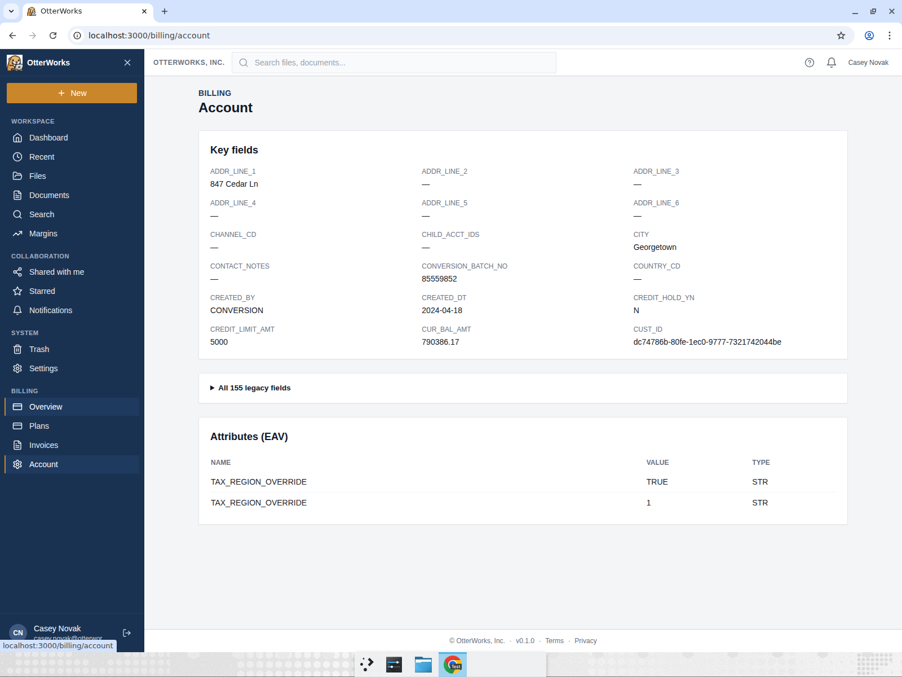
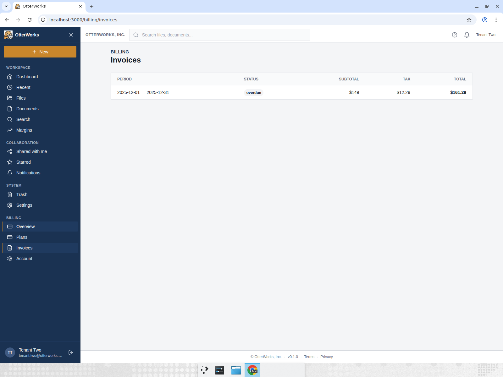
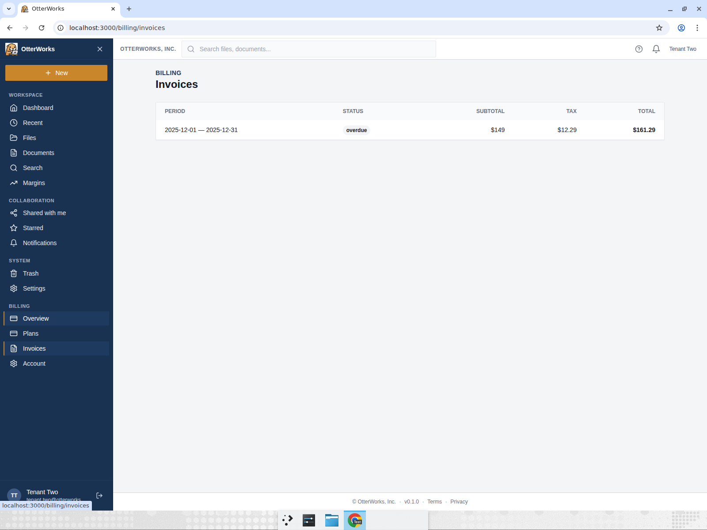
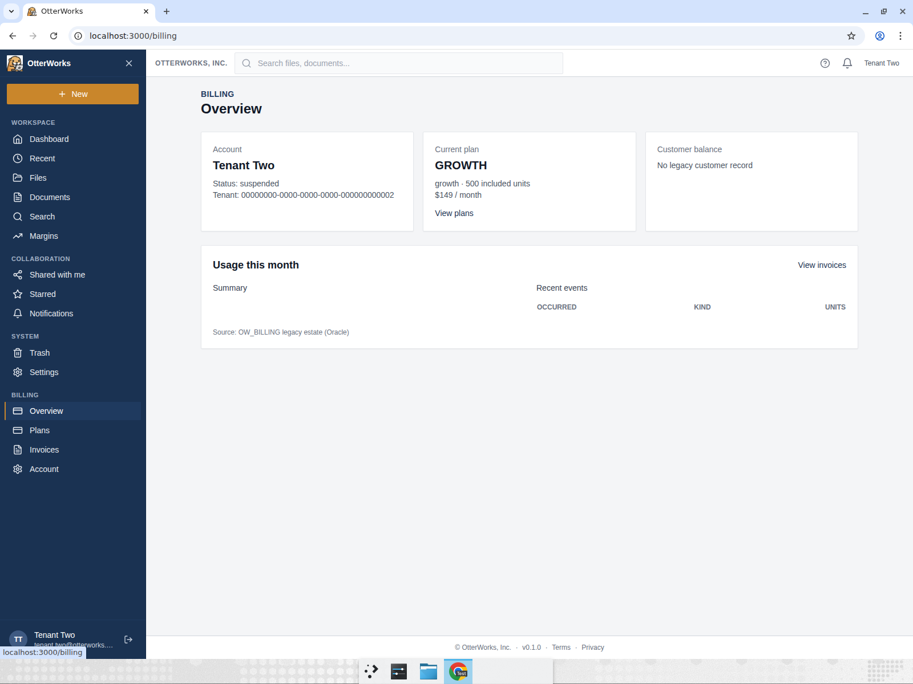
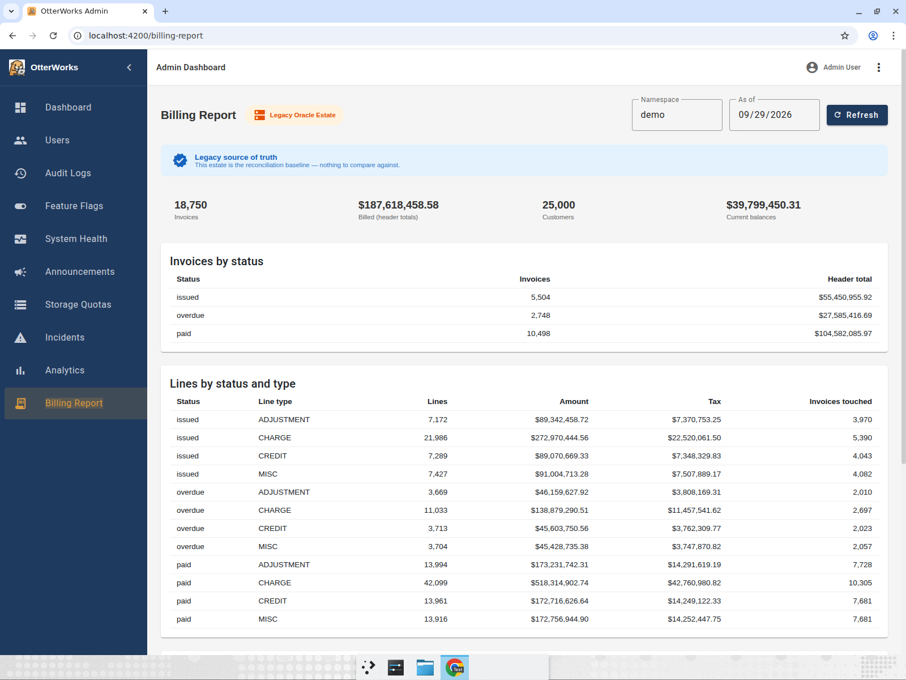
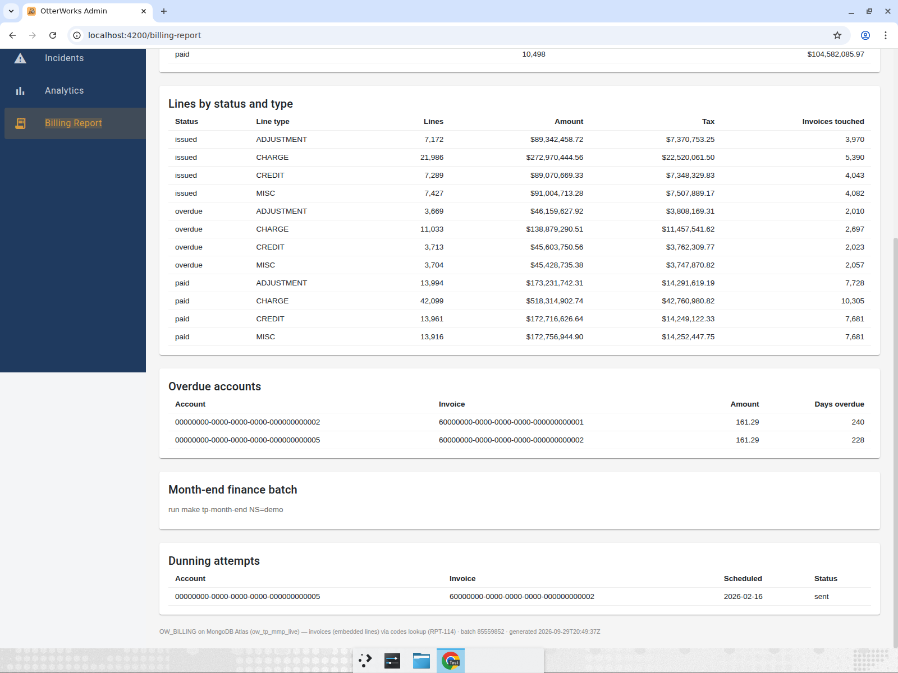

# Billing: Oracle to MongoDB Atlas

Run branch: `tp-run/mongodb-20260929T160602Z` (created with `make tp-run-branch TRACK=mongodb`).
Source: Oracle `OW_BILLING` on `ow-tp-oracle` (FREEPDB1), read-only through `OW_TP_ORACLE_RO_DSN`.
Target: database `ow_tp_mmp_live` on Atlas cluster `otterworks-demo`, through `OW_TP_MMP_TARGET_URI`
(principal scoped to `readWrite@ow_tp_mmp_live` only). Secret values never appear in this repo.

Status: migrated and verified up to STOP C. The production repoint is customer-held and has
**not** been executed; see `.migration/cutover/runbook.md`. `ow_tp_mmp_live` stays in place.

## What was done

| Step | Result | Record |
|---|---|---|
| Baseline | 20 tables counted: 25,000 customers, 18,750 invoices, 150,000 invoice lines, 37 orphan lines, 155 `CUSTOMER_MASTER` columns | `.migration/baseline/oracle_counts.json` |
| Before captures | App run against Oracle with `BILLING_READONLY=1` so no page could provision tenants (PR #1740) | captures below, D-002/D-003 |
| STOP A | Tolerances v1 (exact at source scale, full diff up to 200,000 rows, NULL = empty = missing), policy `online`, target principal rescoped | D-008..D-010 in `.migration/05_decisions.md` |
| STOP B | Model map-1; plan revised to waves 0/1/2 (D-015, supersedes D-011) | `.migration/03_mapping_spec.json`, `.migration/inventory/model.md` |
| Wave 0 | U0-reference: `codes`, `tenants`, `plans`, `sequences` | PR #1742 |
| Wave 1 | U1-customers (calibration unit) | PR #1743 |
| Wave 2 | U2-invoices + quarantine, U3-billing-core, U4 Mongo backend, via the migration-fanout workflow at width 3 | PRs #1744, #1745, #1746 |
| Cutover prep | Watermark recon (2026-09-29T20:14:55Z) + independent audit, PASS | `.migration/cutover/evidence_pack.md`, branch `recon/cutover-audit` @ 70a87880 |
| STOP C | Approved: cutover without parallel run, recommended rollback rule, executed by the billing team; PRs #1740-#1746 merged into the run branch | D-023 |

### Data model

- `customers`: one document per `CUSTOMER_MASTER` row with all mapped columns, plus an
  `attributes` array with one element per `ENTITY_ATTR_VALUE` row. Repeated attribute names stay
  repeated (187 duplicate groups, 379 rows, on both sides).
- `invoices`: one document per `INVOICE_HEADER` row with its `INVOICE_LINE` rows embedded in
  `lines`, keyed by `line_id`, ordered by line number.
- `quarantine_invoice_line`: the 37 lines whose invoice does not exist, every column kept. It is a
  collection inside `ow_tp_mmp_live`.
- `billing_invoices` (app invoices with embedded lines), `subscriptions`, `subscriptions_hist`,
  `usage_events`, rating, credit notes, dunning, notifications, `billing_audit_log`.
- Money is Decimal128 at source scale; dates are BSON dates truncated to milliseconds.

### Application

`services/legacy-billing` selects its backend with `BILLING_BACKEND`:

- `oracle` (default in `docker-compose.tp.yml`): unchanged.
- `mongo`: `app/backends/mongo.py`, reading and writing `BILLING_MONGO_DB` (default
  `ow_tp_mmp_live`) at `BILLING_MONGO_URI`. It reimplements the trigger rules the app depends on
  (no un-cancel, usage-event checks, subscription history, audit-log ids) and maps Mongo errors
  to the same HTTP 503 `UNAVAILABLE` body.
- Unset: the existing PostgreSQL behaviour.

CI stays self-contained: the `legacy-billing-mongo` job in `.github/workflows/tp-golden-smoke.yml`
starts the pinned `mongo:8.0.32` fixture container (`mongo-billing-fixture`, compose profile `mongo-fixture`, `127.0.0.1:57017`), seeds it with
`services/legacy-billing/migration/U4-app-backend/seed.py` (refuses any non-local host), and runs
`tests/test_mongo_parity.py`.

## Recon results per unit

All four data units ran live against the migration cluster; tier 1 = counts through the mapping,
tier 2 = per-field aggregates, tier 3 = keyed row diffs. Every unit's idempotency rerun produced
0 upserts and 0 deletes. Machine-readable reports: `docs/tech-partnerships/recon/*.live.recon.json`.

| Unit | Wave | Collections | Tier 1 | Tier 2 | Tier 3 keyed | Verdict |
|---|---|---|---|---|---|---|
| U0-reference | 0 | codes 32, tenants 69, plans 3, 5 sequences | 3/3 | 6/6 | 104/104 | PASS, merge-eligible |
| U1-customers | 1 | 25,000 customers, 8,333 attribute elements | 2/2 | 15/15 | 33,333/33,333 | PASS, merge-eligible |
| U2-invoices | 2 | 18,750 invoices, 149,963 embedded lines, 37 quarantined | pass | pass | 168,750 rows, 0 diffs | PASS, not merge-eligible (see note) |
| U3-billing-core | 2 | 10 collections | 11/11 | 28/28 | 901/901 | PASS, merge-eligible |
| U4-app-backend | 2 | app parity | live app queries 6/6, post-wave 7/7 | | | PASS, merge-eligible |

U2 note: the harness scopes the embedded-lines check, which makes it structurally not
merge-eligible. A full probe matched every invoice's line count and 149,963 + 37 = 150,000. The
merge was approved at STOP C (risk line 2).

Independent checks: a fresh session re-verified waves 0 and 1, the fan-out workflow's verifier
re-verified wave 2, and a separate audit session re-ran every U0-U4 gate at the watermark and
countersigned (`.migration/recon/cutover/audit.md` on `recon/cutover-audit`).

## Before and after captures

Before: legacy-billing on Oracle, 2026-09-29 16:37 UTC. After: legacy-billing rebuilt from the run
branch (all PRs merged, commit 075a870c) with `BILLING_BACKEND=mongo`, `BILLING_MONGO_DB=ow_tp_mmp_live`,
`BILLING_READONLY=1`, 2026-09-29 20:45 UTC. The same API payloads were captured both times and
compared field by field.

| Page | Value | Oracle (before) | Mongo (after) |
|---|---|---|---|
| Casey Novak, Account (DEMO-00000004) | Current balance `cur_bal_amt` | 790386.17 | 790386.17 |
| | Credit limit | 5000 | 5000 |
| | Attributes | TAX_REGION_OVERRIDE = TRUE, TAX_REGION_OVERRIDE = 1 | TAX_REGION_OVERRIDE = TRUE, TAX_REGION_OVERRIDE = 1 |
| | All 155 legacy fields | full payload | identical payload |
| Tenant Two, Invoices (60000000-...-0001) | Period / status | 2025-12-01 to 2025-12-31, overdue | 2025-12-01 to 2025-12-31, overdue |
| | Subtotal / tax / total | 149 / 12.29 / 161.29 | 149 / 12.29 / 161.29 |
| | Lines | 2 (GROWTH 149 plan, usage overage 12.29 usage) | 2 (identical) |
| | Plan (Overview) | GROWTH, 500 units, $149/month | GROWTH, 500 units, $149/month |
| Admin billing report | Invoices / header total | 18,750 / 187,618,458.58 | 18,750 / 187,618,458.58 |
| | Customers / current balances / past due | 25,000 / 39,799,450.31 / 7,330,214.66 | 25,000 / 39,799,450.31 / 7,330,214.66 |
| | Lines by status and type | 12 rows | 12 identical rows |
| | Overdue accounts, dunning attempts | 2 rows, 1 row | 2 rows, 1 row (identical) |

Payload comparison: `casey_customer`, `t2_invoices`, `t2_invoice_lines`, `admin_overdue` and
`admin_dunning` are byte-identical JSON. `admin_month_end` and `admin_reconciliation` differ only in
`generated_at` and `source`, which now names the Mongo engine:
`OW_BILLING on MongoDB Atlas (ow_tp_mmp_live) — invoices (embedded lines) via codes lookup (RPT-114)`.
The Plan comparison is from the after capture's Overview page; the Oracle plan and subscription
rows it reads were matched key by key in U0/U3 recon.

Screenshots:

| | Before (Oracle) | After (Mongo) |
|---|---|---|
| Casey account |  |  |
| Tenant Two invoice |  |  |
| Tenant Two overview (plan) | not captured |  |
| Admin report, top |  |  |
| Admin report, bottom |  |  |

Recordings (delivered with the engagement, not committed): `before-oracle-edited.mp4`,
`before-oracle-admin-edited.mp4`, `after-mongo-edited.mp4`.

### Known display differences

- Casey Novak's Overview page returns HTTP 500 on both backends in read-only mode. Casey's tenant
  has no `TENANTS` row in Oracle (none of the 50 customer tenant ids do), `BILLING_READONLY=1`
  skips auto-provisioning, and `/api/v1/billing/me` indexes an empty tenant profile. Oracle's
  `tenant_profile` and Mongo's return the same empty result, so this is pre-existing behaviour,
  not a migration difference. Without `BILLING_READONLY` the page provisions the tenant first.
- The client Overview page prints a hard-coded footer, `Source: OW_BILLING legacy estate (Oracle)`
  (`frontend/client-app/src/features/billing/overview-page.tsx`), under either backend.

## Source unchanged

Oracle was recounted after the Mongo after-captures (20:50 UTC) against the baseline: all 20
tables, 37 orphans and 155 columns equal, `diffs: []`. Earlier recounts after the before
captures, after each wave, and at the watermark also matched.

## How to verify

```bash
# compose renders both modes
docker compose -f docker-compose.yml -f docker-compose.tp.yml config legacy-billing
BILLING_BACKEND=mongo BILLING_MONGO_URI=mongodb://127.0.0.1:57017/?directConnection=true \
  docker compose -f docker-compose.yml -f docker-compose.tp.yml config legacy-billing

# gates
make tp-smoke            # includes legacy-billing Oracle-mode tests
make tp-validate-recon   # validates docs/tech-partnerships/recon/*.recon.json

# Mongo parity suite against the local fixture (same steps as CI job legacy-billing-mongo)
docker compose -f docker-compose.yml -f docker-compose.tp.yml --profile mongo-fixture up -d --wait mongo-billing-fixture
cd services/legacy-billing
export BILLING_MONGO_URI=mongodb://127.0.0.1:57017/?directConnection=true OW_TP_MMP_FIXTURE_URI=mongodb://127.0.0.1:57017/?directConnection=true
uv run --with pymongo==4.18.2 python migration/U4-app-backend/seed.py load
uv run --with pytest --with boto3==1.40.35 --with requests==2.32.5 --with flask==3.1.1 --with oracledb==2.5.1 \
  --with 'psycopg[binary]==3.2.9' --with pymongo==4.18.2 python -m pytest -q
cd ../.. && docker compose -f docker-compose.yml -f docker-compose.tp.yml --profile mongo-fixture down -v

# app against the migration database (read-only)
BILLING_BACKEND=mongo BILLING_MONGO_URI="$OW_TP_MMP_TARGET_URI" BILLING_MONGO_DB=ow_tp_mmp_live BILLING_READONLY=1 \
  docker compose -f docker-compose.yml -f docker-compose.tp.yml up -d --build --no-deps legacy-billing
curl -s 127.0.0.1:8096/health    # {"backend":"mongo",...}
```

Then open the Account page as Casey Novak, the Invoices page as Tenant Two, and the admin Billing
Report, and compare against the table above.

Results on the merged run branch: `make tp-smoke` passed (`tp-smoke: all checks passed`) and
`make tp-validate-recon` passed (6 recon files validated).

## Open items (customer-owned)

- Production repoint, freeze, and point of no return: `.migration/cutover/runbook.md`. Rollback:
  set `BILLING_BACKEND=oracle` and restart legacy-billing; Oracle stays frozen and available.
- DEP-2: `etl/legacy-extra/tools/oracle_custbill_extract.py` still reads Oracle
  (`.migration/07_dependency_register.md`).
- Accepted at STOP C: recon output redacted without `RECON_REDACT_SALT`; invoice tenant ids that do
  not resolve to `TENANTS` carried over as in Oracle; an empty `_connectivity_probe` collection
  remains in `ow_tp_mmp_live`.
- Oracle packages, triggers and jobs left in place are listed in `.migration/cutover/evidence_pack.md`.
