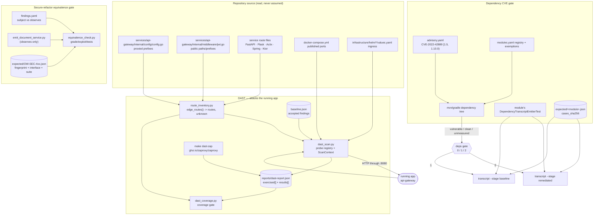

# Subsystem: Security Assurance & Verification

Everything under `security/`, the Makefile targets that drive it, and the GitHub
Actions workflows that run it. This document describes what the code in this
repository actually does today; claims are cited to the file that implements
them, and anything not read out of the source is marked **[inference]**.

Related, deliberately **not** duplicated here:

- `docs/EVENT_DRIVEN_SECURITY.md` — the Trivy/SonarCloud → Devin webhook
  auto-remediation pipeline (`.github/workflows/sast-auto-remediate.yml`).
- `docs/SDLC-COVERAGE.md` §7 — where security sits in the wider SDLC inventory
  (note that §7 predates `security/dast/` and still says "no DAST").
- `.agents/skills/{dast-remediation,dependency-cve-remediation,secure-refactor-equivalence}/SKILL.md`
  — agent-facing procedure for each loop.

---

## 1. Purpose & scope

This subsystem answers one question for three different classes of security
work: **is the claim that something is secure actually measured, or merely
untested?** Every gate here is built to fail closed — "nothing was tested" is
never allowed to render as a pass.

It owns three independent verification loops plus two pieces of static config:

| Loop | Question it answers | Evidence it produces |
|---|---|---|
| DAST (`security/dast/`) | Does the *running* app, attacked through the API gateway, exhibit the finding? And did the suite actually touch the whole edge surface? | `security/dast/reports/dast-report.{json,md}` |
| Dependency CVE (`security/deps/`) | Is the vulnerable artifact version still reachable from any JVM module's dependency tree, and did remediation change observable behavior? | `security/deps/reports/{inventory,gate,transcript-*,tests}.json` |
| Secure-refactor equivalence (`security/equivalence/`) | When a flaw is closed by rewriting a class, are the contract behaviors byte-identical and the attack behaviors closed? | `security/equivalence/reports/*.json` |

Plus:

- `security/scanning/trivy-config.yaml` — Trivy defaults for the local
  `make security-scan` convenience target.
- `security/policies/*.yaml` — three Kubernetes `NetworkPolicy` manifests.

### What this subsystem is NOT

- **Not the SAST/secret-scanning pipeline.** Trivy/Gitleaks/Semgrep gating lives
  in `.github/workflows/security-scan.yml`; the auto-remediation webhook lives in
  `.github/workflows/sast-auto-remediate.yml`. `security/` contributes only
  `trivy-config.yaml`, and the CI Trivy jobs do **not** use it — they pass
  `--severity CRITICAL,HIGH --skip-dirs services/report-service --ignorefile
  .trivyignore` on the command line instead (`security-scan.yml:36-40`).
- **Not a vulnerability *fixer*.** `main` is the golden app and deliberately
  ships planted vulnerabilities (`AGENTS.md`, "Golden app policy"). Every gate
  here is calibrated so the before-state is *recorded and reproducible*, not
  fixed.
- **Not application authorization code.** The gateway's JWT middleware
  (`services/api-gateway/internal/middleware/jwt.go`) is *read* by the harness;
  it is not part of this subsystem.
- **Not deployment enforcement.** `security/policies/` is not applied by
  `scripts/deploy-dev.sh` and is inert under default EKS VPC-CNI
  (`docs/SDLC-COVERAGE.md` §3.5, §7). Nothing in `security/` applies them.
- **Not container-image scanning, SBOM, or signing** — absent from the repo.
- **Not a crawler.** The DAST route inventory is parsed from service source, not
  discovered by following links (`security/dast/harness/route_inventory.py`).

---

## 2. Component map

| Path | Language / runtime | Entrypoint |
|---|---|---|
| `security/dast/` | Python ≥3.11 via `uv run` (PEP 723 inline deps: `httpx`, `pyyaml`, `tabulate`) | `security/dast/run.sh` → `harness/dast_scan.py` |
| `security/dast/harness/dast_scan.py` | Python | `main()`; CLI `--target/--only/--fail-on/--zap-report/--list` |
| `security/dast/harness/dast_coverage.py` | Python | `main()`; CLI `--report/--warn-only` |
| `security/dast/harness/route_inventory.py` | Python | `main()`; prints method/path/service/source |
| `security/dast/harness/probes/` | Python | `base.py` (`@probe` registry, `Verdict`, `Severity`), `context.py` (`ScanContext`), `access_control.py`, `injection.py`, `perimeter.py`, `transport.py` |
| `security/dast/harness/tests/` | pytest | `test_route_inventory.py`, `test_dast_coverage.py`, `test_dast_scan.py`, `test_perimeter.py` |
| `security/dast/attack-surface.yaml` | YAML config | target, public/protected prefixes, `coverage_exemptions`, `sweep_exclusions` |
| `security/dast/baseline.json` | JSON state | accepted findings (currently `"accepted": []`) |
| `security/dast/zap/zap-baseline.conf` | ZAP rule file | consumed by `zap-baseline.py -c` and by `dast_scan.py --zap-rules` |
| `security/deps/harness/deps_check.py` | Python via `uv run --with pyyaml==6.0.2 --with tabulate==0.10.0` | `main()`; subcommands `inventory\|gate\|tests\|transcript` |
| `security/deps/{advisory,modules}.yaml` | YAML config | the advisory under gate; the JVM module registry |
| `security/deps/cases/*.json` | JSON cases | `report-service`, `legacy-portal`, `notification-service` |
| `security/deps/expected/*.json` | JSON evidence | recorded transcripts + `cases_sha256` |
| in-module emitters | Java 11 / Java 17 / Kotlin | `services/{report-service,legacy-portal}/src/test/java/.../deps/DependencyTranscriptEmitterTest.java`, `services/notification-service/src/test/kotlin/.../deps/DependencyTranscriptEmitterTest.kt` |
| `security/equivalence/harness/equivalence_check.py` | Python via `uv run --with pyyaml --with tabulate --with defusedxml` | `main()`; commands `list\|record\|grade\|exploit\|tests` |
| `security/equivalence/harness/emit_document_service.py` | Python, run **inside** `services/document-service` under Poetry | `main()`; `--cases --seed --out` |
| `security/equivalence/{findings.yaml,seed/,cases/,expected/}` | YAML/JSON | registry, fixture seed, cases, recorded evidence |
| `security/scanning/trivy-config.yaml` | YAML config | `trivy fs --config` (used only by `make security-scan`) |
| `security/policies/` | Kubernetes manifests | `network-policy-default-deny.yaml`, `allow-dns.yaml`, `allow-namespace-egress.yaml` (namespace `decomposition-dev`) |

Reports directories (`security/{dast,deps,equivalence}/reports/`) are all
git-ignored (`.gitignore:91-95`) and uploaded as CI artifacts.

---

## 3. Architecture & control flow

### 3.1 The three loops



### 3.2 A DAST scan, end to end

1. `make dast-scan DAST_TARGET=<url>` → `uv run security/dast/harness/dast_scan.py
   --target <url>`. Target default is `OTTERWORKS_DAST_TARGET` or
   `http://localhost:8080` (`dast_scan.py:56`); the Makefile default is
   `DAST_TARGET ?= http://localhost:8080` (`Makefile:284`).
2. `ScanContext` waits for the target, then registers **three throwaway
   identities** per run — `dast-attacker-<run_id>@example.test`,
   `dast-victim-…`, `dast-burner-…` (`probes/context.py`). The burner exists so
   a target that correctly locks accounts after brute-force does not strand
   later probes that need the victim to log in. If identities cannot be seeded,
   the scan exits **2** rather than reporting "secure".
3. Each registered probe runs and returns a `Result` with a verdict from a
   closed set: `vulnerable | secure | inconclusive | skipped`
   (`probes/base.py`). Only `VULNERABLE` is a finding (`Result.is_finding`).
4. Every request the probes issue passes through `request_recorder()` and is
   appended to `exercised[]` in the report as
   `{method, path, authenticated, probe, status}`.
5. Findings are gated: `is_gating()` requires the result to be a finding, not
   present in `baseline.json`, and at or above `--fail-on` (default `medium`).
6. `dast_coverage.py` re-derives the inventory and compares it against
   `exercised[]` from the report on disk.

### 3.3 The route inventory

`route_inventory.edge_routes()` returns `(routes, unknown)`:

- **Proxied prefixes** come from the gateway's own config
  (`services/api-gateway/internal/config/config.go`), so the surface tracks the
  gateway rather than a hand-maintained list.
- **Routes** come from per-language extractors over each service's own route
  definitions. Verified live by `make dast-routes`: FastAPI
  (`services/document-service/app/api/*.py`, `services/search-service/app/api/*.py`),
  Actix-web (`services/file-service/src/main.rs`), Ktor
  (`services/notification-service/.../routes/Routes.kt`), Spring MVC
  (`services/report-service/.../ReportController.java`,
  `services/auth-service/.../SettingsController.java`). Flask is also a
  registered extractor.
- Path parameters are normalised to `{}` (`_normalize()`), so
  `/api/v1/documents/{document_id}` and `…/{id}` are one route key
  (`"<METHOD> <path>"`).
- Prefixes the gateway proxies but for which no extractor matched are returned
  as `unknown`, **not** as a clean surface. Observed today from `make
  dast-routes`:

  ```
  Proxied prefixes with no route extractor (coverage unmeasured):
    /api/v1/admin (admin-service)        /api/v1/analytics (analytics-service)
    /api/v1/audit (audit-service)        /api/v1/collab (collab-service)
    /socket.io (collab-service)
  ```

- `UNSAFE_METHODS = {POST, PUT, PATCH, DELETE}`; `may_sweep_unsafely()` is true
  only when `DAST_SWEEP_UNSAFE_METHODS` ∈ `{1, true, yes}`.

### 3.4 The coverage gate — three depths

`dast_coverage.coverage(routes, exercised)` returns four lists
(`reached, attacked, authenticated, missed`), defined as:

| Depth | Definition in code |
|---|---|
| **reached** | any recorded request matched the route and was *delivered* |
| **attacked** | delivered by a probe that is *not* the anonymous sweep (`probe != SWEEP`) |
| **authenticated** | delivered with `authenticated: true` (an `Authorization` header) |
| **missed** | nothing matched |

`delivered()` is deliberately narrow (`dast_coverage.py`):

```python
return status != 429 and not 300 <= status < 400 and status < 500
```

A 429, a 3xx or any 5xx does **not** count — the handler was never reached, so
nothing was measured.

Only `reached`/`missed` gates today. The lower depths are *reported*: routes
reached only by the anonymous sweep print as

> `N route(s) are only swept anonymously — no probe attacks them as an
> authenticated caller, so authorization and tenant isolation are unmeasured
> there`

Exemption sources, merged (later entries win on key collision):
`coverage_exemptions` and `sweep_exclusions` from `attack-surface.yaml`, plus —
when the report says `swept_unsafely: false` — a synthetic exemption for every
unsafe-method route. That last set is read **from the report, not the
environment**, so grading in a different shell cannot excuse a write route the
scan actually swept.

Special outcomes:

- **UNANSWERED** — the route was requested but the target answered without
  reaching a handler (e.g. 502 for a service this deployment does not run). Not
  covered, not gated.
- If *nothing* in the inventory was answered, the gate refuses to grade and
  exits **2**.
- If the inventory reads zero routes, exit **4** — "the gate measures nothing"
  is treated as worse than an uncovered route (and `dast-scan.yml:120-122`
  escalates it to `::error::`).
- A `partial` report (produced by `--only`, i.e. `dast-verify`) is rejected: one
  probe's requests can never be graded as full coverage.

### 3.5 The control request

Probes do not conclude "secure" from a denial alone — a 500 or a broken fixture
denies everything. Before judging the attacker, a probe establishes that the
legitimate caller *can* do the thing:

- `ScanContext.owner_can_read()` — the owner must get HTTP 200.
- `ScanContext.search_as()` — the owner must observe the expected results.
- `ScanContext.victim_document()` — plants a victim-owned marker
  (`otterworks-dast-marker-<run_id>`); probes that plant their own content use
  `plant_marker` instead, so the search probe cannot read its own plant back and
  call it a cross-tenant leak.
- In `DAST-GATEWAY-BYPASS-IDENTITY` the control is the *gateway* refusing the
  route: if the gateway serves it unauthenticated, reaching the backend directly
  proves nothing, and the probe records `inconclusive` rather than `secure`
  (`probes/perimeter.py`).

A 5xx or 429 on the control makes the probe `inconclusive`, never `secure`.

### 3.6 Fingerprints and staleness

Both evidence-based gates hash their inputs and refuse to grade against a
recording whose inputs moved. (The generic idea is "source SHA vs fixture SHA";
in this repo the concrete field names are below.)

**Equivalence** (`equivalence_check.fingerprint()`):

```python
{
  "cases_sha256":    sha256(finding.cases_path),
  "seed_sha256":     sha256(module.seed),
  "emitter_sha256":  sha256(module.emitter),
  "subject_sha256":  {path: sha256(path) for path in finding.subject},
  "observed_sha256": {path: sha256(path) for path in finding.observes},
}
```

- `load_recording()` marks evidence **stale** if `harness_version` (currently
  `2`) or any of `cases_sha256`, `seed_sha256`, `emitter_sha256` differ. Stale is
  inconclusive, never a pass.
- `subject_sha256` decides the *stage*: changed subject ⇒ grade as a refactor
  (`remediated`); unchanged ⇒ grade as `baseline`. `--stage auto` (what CI runs)
  picks per finding, so a run cannot choose the easier contract for itself.
- `observed_sha256` is provenance only. `findings.yaml` keeps `subject` and
  `observes` apart precisely so that editing the shared route module
  (`app/api/documents.py`) while closing one finding does not flip the other two
  into refactor grading.

**Dependency CVE**: `expected/<module>.json` carries `cases_sha256` over the
module's case file; `grade_module()` returns `stale` when it no longer matches,
telling the operator to re-record with `--record --reason '<why>'
--allow-rerecord`.

### 3.7 "unmeasured" and the other non-pass statuses

The word appears in both gates and always means *the harness declined to
measure*, which is distinct from both pass and fail.

`security/deps/harness/deps_check.py`:

```python
PASS, FAIL, MISSING, STALE, UNMEASURED, UNRECORDED = (
    "pass", "fail", "missing", "stale", "unmeasured", "unrecorded")
BLOCKING = {FAIL, MISSING}
INCONCLUSIVE = {STALE, UNMEASURED, UNRECORDED}
```

A module is `unmeasured` when the tooling to measure it is absent: none of its
`java_home` candidates exists, or none of its `tool` candidates can start
(`modules.yaml:7-16`). The JDK pinning is not cosmetic — the Maven modules'
recorded transcripts include a `${script:javascript:…}` lookup that only
resolves while the JVM ships Nashorn (JDK ≤ 14), so measuring them on JDK 17
would report a behavior change that never happened (`modules.yaml:18-21`).

Equivalence uses `ok | fail | missing | stale | unmeasured | unrecorded |
no-verdict`, and `worst()` orders inconclusive above failure so a run that could
not measure never reports as a clean fail-and-fix.

Exit-code convention shared by all three harnesses: **0** pass, **1** a real
failure, **2** inconclusive, **3** no verdict. `2` and `3` are never a pass.

---

## 4. Key interfaces & contracts

### 4.1 `security/dast/attack-surface.yaml`

Shared target spec. Keys observed: `target` (default `http://localhost:8080`,
entrypoint `api-gateway`), public auth routes and protected route prefixes,
per-area route expectations (auth, documents, files, search, admin, audit),
operational `/health` and `/metrics` expectations, global header/CORS/rate-limit
/error expectations, plus the two gate-facing lists:

- `coverage_exemptions:` — `{method, path, reason}`; a route the coverage gate
  may leave unattacked. Currently `[]`. Keyed as `"<METHOD> <path>"` with the
  method upper-cased (`load_exemptions()`).
- `sweep_exclusions:` — routes the anonymous sweep must not send because doing
  so would perform a tenant-wide operation. They surface in the coverage table
  as `EXEMPT` with the operator's own reason.

### 4.2 DAST report — `security/dast/reports/dast-report.json`

Written by `to_report()`; the coverage gate is its only in-repo consumer.

| Field | Meaning |
|---|---|
| `target`, `scanned_at` | scan target and timestamp |
| `partial` | true when `--only` was used; rejected by the coverage gate |
| `exercised[]` | `{method, path, authenticated, probe, status}` per request |
| `swept_unsafely` | whether unsafe methods were sent (read by the coverage gate) |
| `summary`, `gating`, `results[]` | per-probe verdicts, severity, evidence |

`Evidence.__post_init__()` redacts before evidence is written.
`dast-report.md` is the human/CI-summary rendering.

### 4.3 `security/dast/baseline.json`

```json
{"_comment": "...", "accepted": []}
```

An entry suppresses the gate for that finding ID; every entry needs a reason and
is "expected to be temporary". Regenerate with `make dast-baseline REASON="…"`.
Because it is empty on `main`, the PR DAST job is informational
(`dast-scan.yml:6-10`, `continue-on-error: true`).

### 4.4 DAST probe registry

19 probes registered (`make dast-list`, verified):

| Finding ID | Severity | Service |
|---|---|---|
| `DAST-BOLA-DOCUMENTS` | critical | document-service |
| `DAST-IDENTITY-HEADER-SPOOF` | critical | api-gateway |
| `DAST-MASS-ASSIGNMENT-OWNER` | critical | document-service |
| `DAST-UNSIGNED-JWT` | critical | api-gateway |
| `DAST-SQLI-ERROR-BASED` | critical | search-service, document-service |
| `DAST-PATH-TRAVERSAL-EXPORT` | critical | document-service |
| `DAST-GATEWAY-BYPASS-IDENTITY` | critical | infrastructure |
| `DAST-UNAUTHENTICATED-ADMIN` | high | api-gateway |
| `DAST-SEARCH-TENANT-LEAK` | high | search-service |
| `DAST-SHARE-TOKEN-FORGERY` | high | document-service |
| `DAST-STORED-XSS-DOCUMENTS` | high | document-service |
| `DAST-CREDENTIAL-BRUTE-FORCE` | high | auth-service |
| `DAST-ANONYMOUS-ROUTE-SWEEP` | high | api-gateway |
| `DAST-CORS-ORIGIN-REFLECTION` | high | api-gateway |
| `DAST-RATE-LIMIT-BYPASS` | high | api-gateway |
| `DAST-VERBOSE-ERRORS` | medium | all |
| `DAST-SENSITIVE-DATA-IN-RESPONSE` | medium | auth-service |
| `DAST-MISSING-SECURITY-HEADERS` | medium | api-gateway |
| `DAST-EXPOSED-TELEMETRY` | medium | api-gateway |

`Probe.requires_identity` defaults `True`; probes where the attack *is* the
absence of a token set it `False` (`DAST-UNAUTHENTICATED-ADMIN`,
`DAST-ANONYMOUS-ROUTE-SWEEP`, the transport probes).

### 4.5 DAST environment variables

| Variable | Default | Read at | Effect |
|---|---|---|---|
| `OTTERWORKS_DAST_TARGET` | `http://localhost:8080` | `dast_scan.py:56` | default `--target` |
| `DAST_TARGET` | `http://localhost:8080` | `Makefile:284` | make-level target |
| `DAST_SWEEP_UNSAFE_METHODS` | unset | `route_inventory.py:85` | `1/true/yes` lets the sweep send POST/PUT/PATCH/DELETE for real |
| `DAST_ALLOW_ORIGIN_HOSTS` | unset | `probes/perimeter.py:189` | comma-separated hosts the perimeter probe may attack outside the target host |
| `OTTERWORKS_DAST_RATE_LIMIT_BURST` | `1500` | `probes/context.py:62` | burst size for the rate-limit probe |
| `OTTERWORKS_DAST_RATE_LIMIT_WORKERS` | `64` | `probes/context.py:67` | concurrency for that burst |

CI-side: repository variables `DAST_SWEEP_TARGET` (scheduled sweep target — no
default, on purpose) and `DAST_SWEEP_UNSAFE_WRITES` (`dast-scan.yml:151-160`).

### 4.6 `security/deps/advisory.yaml`

```yaml
id: CVE-2022-42889
artifact: org.apache.commons:commons-text
vulnerable: {introduced: "1.5", fixed: "1.10.0"}   # introduced <= v < fixed
secure_candidates: ["1.10.0", "1.4"]               # each with an API caveat note
```

The gate reads this file only and never hard-codes a version — retargeting the
loop at another advisory is a data change.

### 4.7 `security/deps/modules.yaml`

Registry of every JVM module the gate measures. Discovery **cross-checks the
registry against the build files on disk**: a JVM build file that is neither
registered nor in `exempt` fails the gate, so a new service cannot be silently
omitted from the blast radius.

| Module | Build | JDK candidates | Tool candidates | Cases |
|---|---|---|---|---|
| `report-service` | maven | `$JAVA_HOME_11_X64`, `/usr/lib/jvm/java-11-openjdk-amd64` | `mvn` (PATH) | `cases/report-service.json` |
| `legacy-portal` | maven | same JDK 11 list | `./mvnw`, `mvn` | `cases/legacy-portal.json` |
| `notification-service` | gradle | `$JAVA_HOME_17_X64`, `/usr/lib/jvm/java-17-openjdk-amd64` | `gradle` (PATH) | `cases/notification-service.json` |
| `auth-service` | gradle | same JDK 17 list | `./gradlew`, `gradle` | `null` — tree only |

`exempt: frontend/client-app/mobile/android` — Capacitor Android shell, needs the
Android SDK the build image does not carry.

### 4.8 Dependency case & transcript format

`security/deps/cases/<module>.json` → `cases[]` of
`{id, policy, kind, template, vars?, attack_marker?}` where `policy` is
`contract` or `attack`, and `kind` selects the emitter path (`banner`,
`configured`, …).

The harness does not interpolate anything itself. `emit_transcript()` shells
into the module and runs **the module's own** `DependencyTranscriptEmitterTest`
with two system properties:

```
-Dow.deps.cases=<abs path to cases json>  -Dow.deps.observed=<abs path to write>
```

Maven: `<tool> -B test -Dtest=DependencyTranscriptEmitterTest -DfailIfNoTests=false …`
Gradle: `<tool> test --rerun-tasks --no-daemon --console=plain --tests '*DependencyTranscriptEmitterTest' …`
(`--rerun-tasks` because the `-D` properties are not Gradle task inputs, so an
`UP-TO-DATE :test` would leave the harness grading a previous run's output.)

`expected/<module>.json` records `{module, advisory, artifact, cases_sha256,
recorded_at, reason, cases[{id, outcome, value|error_type}]}`.

### 4.9 `security/equivalence/findings.yaml`

`harness_version: 2`. Per module: `path`, `seed`, `emitter`, `emit_command`,
`test_command` (document-service uses `poetry run …`, run from the module
directory, with `{emitter}/{cases}/{seed}/{out}/{junit}` substituted as absolute
paths). Per finding: `id, title, cwe, module, class, methods, subject[],
observes[], secure_pattern, dast_finding, dast_route`.

| Finding | CWE | Subject file | Linked DAST probe |
|---|---|---|---|
| `OW-SEC-401` | CWE-89 | `services/document-service/app/services/document_query_repository.py` | `DAST-SQLI-ERROR-BASED` |
| `OW-SEC-402` | CWE-22 | `services/document-service/app/services/export_archive.py` | `DAST-PATH-TRAVERSAL-EXPORT` |
| `OW-SEC-403` | CWE-328 | `services/document-service/app/services/share_link.py` | `DAST-SHARE-TOKEN-FORGERY` |

All three list `services/document-service/app/api/documents.py` under
`observes`.

### 4.10 Equivalence case & evidence format

`cases/OW-SEC-4xx.json` → `{finding, module, interface[], env?, cases[]}`, each
case `{id, policy: contract|attack, kind: call|http, target/method/args | request}`.
`interface[]` names dotted members (`app.services.export_archive:ExportArchive.read_export`)
whose signatures are captured with the evidence, so a renamed parameter or
changed default fails as interface drift.

`expected/OW-SEC-4xx.json` keys (verified):
`cases, finding, fingerprint, harness_version, interface, module, reason,
recorded_at, rerecorded_from, suite`.

The emitter **only observes** — it never decides pass/fail; `equivalence_check.py`
grades. Two emitter details matter for reproducibility: the fixture lives in a
fresh temp directory each run and its path is redacted to `<fixture>` (paths leak
into `FileNotFoundError` text), and SQLite is patched to store UUIDs hyphenated
the way Postgres renders them, or every owner-scoped case would silently record
an empty list.

### 4.11 `security/scanning/trivy-config.yaml`

`severity: [CRITICAL, HIGH]`, `vulnerability.type: [os, library]`,
`ignorefile: .trivyignore`, `timeout: 10m`, `format: table`. Consumed only by
`make security-scan` (`Makefile:266`).

### 4.12 `security/policies/`

Three `networking.k8s.io/v1` NetworkPolicies, all `namespace:
decomposition-dev`, all `podSelector: {}`:

- `network-policy-default-deny.yaml` — deny Ingress + Egress.
- `allow-dns.yaml` — egress UDP/TCP 53.
- `allow-namespace-egress.yaml` — egress to in-namespace pods on 8080–8090, plus
  5432 (Postgres), 6379 (Redis), 7700 (MeiliSearch) and 443.

Note the namespace (`decomposition-dev`) does not match the namespaces the
deploy scripts use (`otterworks`, `otterworks-<tenant>`), and nothing in the
repo applies these files.

---

## 5. Operational runbook

### 5.1 Prerequisites

- `uv` — every harness runs under `uv run`. `security/dast/harness/*.py` declare
  PEP 723 inline dependencies (no `--with` needed); the deps and equivalence
  harnesses pin theirs on the `uv run` line in the Makefile.
- Docker + Docker Compose — for the app stack and for `make dast-zap`.
- JDK 11 **and** JDK 17, plus `mvn` and `gradle` (8.6) — for `security/deps`.
- Poetry + `poetry install` in `services/document-service` — for
  `security/equivalence`.
- `trivy` on PATH — only for `make security-scan`.

### 5.2 Local stack

```bash
make up   # or, as the DAST CI job does, only what the scan needs:
docker compose -f docker-compose.infra.yml -f docker-compose.yml up -d --build \
  postgres redis localstack meilisearch \
  auth-service api-gateway document-service search-service file-service

# readiness (the CI wait loop, condensed)
curl -fsS http://localhost:8080/health
```

Ports (from `docker-compose*.yml`): api-gateway `8080`, auth-service `8081`,
file-service `8082`, document-service `8083`, collab-service `8084`,
Postgres `5432`, Redis `6379`, MeiliSearch `7700`. The gateway routes to
backends in-network on `8081`–`8091`. `JWT_SECRET` defaults to a local dev value
in `docker-compose.yml`; no cloud credentials are needed (LocalStack stands in
for AWS).

### 5.3 DAST

```bash
make dast-test                                   # unit-test the harness (offline)
make dast-routes                                 # inventory from source (offline)
make dast-list                                   # registered probes (offline)
make dast-scan  DAST_TARGET=http://localhost:8080
make dast-coverage                               # grades the last report on disk
make dast-verify FINDING=DAST-SQLI-ERROR-BASED   # one probe, baseline ignored
make dast-baseline REASON="..."                  # accept current findings
make dast-zap   DAST_TARGET=http://localhost:8080
```

`make dast-test`, `dast-routes` and `dast-list` need no running app — the first
three verified in this environment. `dast-scan`/`dast-verify`/`dast-coverage`
need the stack up (coverage needs a prior scan report on disk).

**Use `./security/dast/run.sh {scan|verify|coverage|routes}` when you need the
exit code.** `make` reports `2` for any failed recipe, which flattens the
harness's distinct codes:

| Code | `dast_scan.py` | `dast_coverage.py` |
|---|---|---|
| 0 | clean | every route attacked or exempt |
| 1 | findings at/above `--fail-on` (default `medium`) | a route was never attacked |
| 2 | target unreachable, or identities never registered | no usable report / nothing answered |
| 3 | a probe reached no verdict while verifying (`--only`) | — |
| 4 | — | the inventory read no routes |

`run.sh verify <ID>` expands to `--only <ID> --no-baseline --fail-on info`;
without an ID it exits 64.

`make dast-zap` needs Docker and pulls `ghcr.io/zaproxy/zaproxy:stable`
(**not offline**). It runs `--network host`, writes into a throwaway Docker
volume chowned to uid 1000 from inside a container (the image needs
`/home/zap`, which only exists for uid 1000, while a CI runner is 1001), mounts
`zap-baseline.conf` read-only, and reads the report back out through the volume.
The stale report is deleted first, so "a report exists" can only mean this run
produced one; if ZAP produces nothing, the probe suite still runs on its own.

### 5.4 Dependency CVE gate

```bash
make deps-inventory                        # blast radius from the real trees
make deps-gate                             # is the vulnerable range reachable?
make deps-tests            MODULE=<id>     # each module's own suite
make deps-transcript       MODULE=<id>     # grade behavior, remediated stage
make deps-transcript-baseline MODULE=<id>  # prove the before-state reproduces
make deps-record REASON="..." [ALLOW_RERECORD=1]
make deps-command                          # print the harness invocation
```

`MODULE` ∈ `report-service | legacy-portal | notification-service | auth-service`.
`make deps-command` exists so callers can invoke the harness directly and read
its real exit code — which is exactly what `deps-remediation.yml` does.

Requires Maven/Gradle **and network access** to resolve dependency trees; a
module whose JDK or tool candidates are absent is reported `unmeasured`, not
failed. `deps-inventory` itself returns 2 if any tree failed to resolve.

### 5.5 Equivalence gate

```bash
cd services/document-service && poetry install && cd -
make eq-list                        # verified: 3 findings, all "matches before-state"
make eq-gate                        # --stage auto
make eq-baseline   FINDING=OW-SEC-401
make eq-verify     FINDING=OW-SEC-401
make eq-exploit                     # do the attacks still fire? ignores the recording
make eq-exploit-refactored          # closed verdict required from every changed subject
make eq-tests                       # module suite vs. recorded pass list
make eq-record REASON="..." [ALLOW_RERECORD=1]
```

Observed `make eq-list` output on `main`: `OW-SEC-401` 13 contract / 4 attack,
`OW-SEC-402` 6/2, `OW-SEC-403` 3/1 — all three "matches before-state". Runs
fully offline once Poetry deps are installed (the fixture is SQLite + a temp
directory built from the seed).

### 5.6 Static scanning convenience target

```bash
make security-scan   # trivy fs (never fails: `|| true`), npm audit, pip-audit, bundle-audit
```

Every step is `|| true`; report-service is skipped as legacy. This is a local
convenience report, **not a gate**.

### 5.7 CI workflows

| Workflow | Trigger | Gates on |
|---|---|---|
| `.github/workflows/dast-scan.yml` job `dast-local` | PR touching `services/**`, `infrastructure/helm/**`, `security/dast/**`, the workflow; manual with empty target | `make dast-test` (hard), the scan (**informational**, `continue-on-error`), **route coverage (hard)** |
| `.github/workflows/dast-scan.yml` job `dast-deployed` | daily 07:00 UTC; manual with a target | informational only; no-ops when `vars.DAST_SWEEP_TARGET` is unset |
| `.github/workflows/deps-remediation.yml` | push/PR touching `security/deps/**`, the four JVM services, `Makefile` | ruff, `deps-inventory`, `deps-tests`, then advisory gate → transcript |
| `.github/workflows/equivalence-gate.yml` | push/PR touching `security/equivalence/**`, `services/document-service/**`, `Makefile` | ruff, `eq-list`, `eq-gate`, `eq-exploit-refactored`, `eq-tests` |
| `.github/workflows/security-scan.yml` | PR/push/weekly | Trivy/Gitleaks/Semgrep, diff-scoped on PRs |

Two CI patterns worth copying:

- `dast-local` calls `./security/dast/run.sh coverage` rather than `make`,
  precisely so exit 2 ("nothing to grade") can be annotated and passed while
  exit 1 (an unattacked route) fails the build, and exit 4 is escalated.
- `deps-remediation.yml` branches on the gate's own exit code: `0` → grade the
  *remediated* transcript, `1` → grade the *baseline* transcript (the documented
  before-state), anything else → refuse to grade and fail. Neither branch can be
  skipped.

`dast-local` sets `DAST_SWEEP_UNSAFE_METHODS: '1'` — legitimate only because
that stack was created by the previous step and dies with the runner.

### 5.8 Credentials / offline notes

- No secrets are needed for any of the three loops locally. The DAST scan
  registers its own accounts against the target.
- Needs network: `make dast-zap` (image pull), `deps-*` (dependency resolution),
  `security-scan` (Trivy DB), the first `uv run` of each harness (dependency
  download; cached afterwards).
- Fully offline once warm: `dast-test`, `dast-routes`, `dast-list`, `eq-*`.
- `DAST_SWEEP_TARGET` must be a **disposable** tenant — a scan registers
  accounts and writes documents that live in the target's database until it is
  reaped. `t-main` is never reaped and must never be scanned (`AGENTS.md`,
  `dast-scan.yml:11-17,151-160`).

---

## 6. Failure modes & gotchas

1. **`make` flattens exit codes.** Any failed recipe is `make`'s own exit 2, so
   `make dast-scan` cannot be distinguished from "nothing was tested". Call
   `./security/dast/run.sh …`, `$(make -s deps-command) gate`, or the harness
   directly whenever you branch on the result.
2. **An empty `baseline.json` makes the PR DAST job informational.** `main`
   ships planted vulnerabilities, so the scan step is `continue-on-error: true`.
   The only hard DAST gate on a PR today is route coverage. Populating the
   baseline and dropping `continue-on-error` is the documented way to turn it
   into a real regression gate.
3. **Coverage measures breadth, not depth.** A route hit only by the anonymous
   sweep counts as `reached` and passes the gate while authorization and tenant
   isolation there are explicitly unmeasured. Read the "only swept anonymously"
   list, not just the exit code.
4. **The sweep cannot credit itself.** Requests whose `probe` is the sweep are
   excluded from `attacked` — the sweep walks the same inventory the gate reads,
   so counting them would measure nothing but itself. An older report with no
   probe attribution claims only the lower depth.
5. **5xx / 429 / 3xx are not coverage.** A throttled or broken target can look
   "reached" to a naive reader; `delivered()` excludes all three. If nothing was
   answered at all, coverage refuses to grade (exit 2).
6. **Five proxied prefixes are unmeasurable today** (`/api/v1/admin`,
   `/api/v1/analytics`, `/api/v1/audit`, `/api/v1/collab`, `/socket.io`) — no
   route extractor matches admin-service (Ruby), analytics-service (Scala),
   audit-service (C#) or collab-service (Node). They are reported as "unknown
   coverage", which does not fail the gate.
7. **`DAST_SWEEP_UNSAFE_METHODS=1` performs real writes and deletes.** The sweep
   sends each route's *real* method against a random UUID. Only set it for a
   stack you own and will destroy. When it is off, the coverage gate
   auto-exempts unsafe routes (from the report's `swept_unsafely` field), so
   coverage looks better than it is.
8. **Rate-limit probe tuning trades signal for load.** Lowering
   `OTTERWORKS_DAST_RATE_LIMIT_BURST` below the documented calibration (1500 →
   ~40% served) makes the probe report `inconclusive`, because the burst no
   longer separates a bypass from the limiter's allowance.
9. **ZAP failures are absorbed.** `make dast-zap` runs the container with
   `|| true` and falls back to the probe suite alone with a `::warning::`. A
   green `dast-zap` does not prove the passive sweep ran — check for
   `security/dast/reports/zap-report.json`.
10. **ZAP rules that duplicate a probe are set to `WARN`** in
    `zap/zap-baseline.conf` on purpose, so a finding is gated in exactly one
    place. Flipping one to `FAIL` double-gates it.
11. **Trivy config drift.** `security/scanning/trivy-config.yaml` is used only by
    `make security-scan`; CI passes its own flags. Editing the YAML does not
    change CI behavior.
12. **Wrong-JDK measurement is prevented, and reads as `unmeasured`.** Without
    JDK 11 the Maven modules cannot be measured at all (the `${script:javascript:…}`
    case needs Nashorn). An `unmeasured` gate exits 2, and
    `deps-remediation.yml` refuses to grade either contract from it.
13. **Gradle UP-TO-DATE would silently re-grade stale output.** The harness
    passes `--rerun-tasks` because the `-Dow.deps.*` properties are not task
    inputs. A local run that drops it can grade the previous run's transcript.
14. **`notification-service` ships no Gradle wrapper** and `auth-service`'s
    wrapper has no `gradle-wrapper.jar`, so both fall back to the `gradle` on
    PATH; CI pins 8.6 via `setup-gradle`. A different local Gradle measures a
    different toolchain than CI. (This repo checkout currently has untracked
    `services/notification-service/gradlew*` files — not part of `main`.)
15. **Editing cases/seed/emitter invalidates evidence.** Both gates go `stale`
    (inconclusive, exit 2) rather than pass. Re-recording requires
    `--reason` and `ALLOW_RERECORD=1`, and the previous fingerprint is stored in
    the recording — re-recording to get green leaves an audit trail.
16. **You cannot record a fixed tree as the before-state.** `eq-record` refuses
    outright if an attack case does not reproduce.
17. **Stage selection is not the caller's choice.** `eq-baseline` refuses if the
    subject changed; `eq-verify` refuses if it did not; CI runs `--stage auto`.
18. **`observes` vs `subject` is load-bearing.** All three findings observe
    `app/api/documents.py`. If it were listed as a subject, closing one finding
    would flip the other two into refactor grading and fail them for still being
    exploitable.
19. **Contract comparison is order-sensitive and un-canonicalised.** Ordering is
    a business rule (newest first, caller-chosen sort), so a refactor that
    changes list order is a contract failure even if the set matches.
20. **Deleting a test cannot buy a green run.** The module suite is compared to
    the pass list recorded with the evidence; a vanished test is inconclusive.
21. **`security/policies/` is inert.** Wrong namespace for the current deploy
    path, not applied by any script, and unenforced under default EKS VPC-CNI
    (`docs/SDLC-COVERAGE.md` §3.5). Treat as reference manifests.
22. **Report directories are git-ignored.** `security/*/reports/` exists only in
    the working tree and as CI artifacts; nothing is committed.
23. **`docs/SDLC-COVERAGE.md` §7 is out of date** on this subsystem — it still
    states "no DAST" and does not mention `security/deps` or
    `security/equivalence`.

---

## 7. Open questions & gaps

1. **When does the DAST scan become a hard gate?** `dast-scan.yml` documents the
   procedure (populate `baseline.json`, drop `continue-on-error`) but no owner or
   trigger is recorded. Unanswered in-repo.
2. **`vars.DAST_SWEEP_TARGET` appears unset** — the scheduled job's only
   observable behavior would then be the "no scan target" warning. Repository
   variables are not visible from the source; unverified here.
3. **No coverage gate on the authenticated depth.** The harness computes
   `attacked` and `authenticated` and prints them, but only `reached` gates.
   Whether raising the gate is intended is not stated anywhere I read.
4. **Four services have no route extractor** (Ruby/Scala/C#/Node). No issue,
   TODO or plan for them exists in `security/dast/`.
5. **`coverage_exemptions` is empty** while `sweep_exclusions` carries the real
   entries. Whether the two lists are meant to converge is not documented.
6. **Only `document-service` is registered with the equivalence harness.**
   `findings.yaml` has a `modules:` map that could hold more, but no other
   module defines `emit_command`/`test_command`, and no emitter exists for
   another language. **[inference]** adding one means writing a per-module
   emitter, since `emit_document_service.py` is FastAPI/SQLAlchemy-specific.
7. **`security/policies/` namespace mismatch** (`decomposition-dev` vs
   `otterworks*`) is unexplained — stale artifact or a different target
   environment, not determinable from the repo.
8. **No `.trivyignore` semantics documented here.** `trivy-config.yaml`
   references it; the file's entries and their justifications live outside this
   subsystem.
9. **Two different `HARNESS_VERSION` constants.** `equivalence_check.py` is `2`
   and validates both `findings.yaml` (`load_registry()`) and each recording
   (`load_recording()`) against it; `emit_document_service.py` declares `1` and
   stamps it into its observation payload, which I did not find being compared
   anywhere. Whether the emitter's constant is dead or independently versioned
   is not documented.
10. **`security-scan.yml`'s `full-scan-baseline` job records exit codes into step
    outputs** that nothing subsequently consumes — no gate, no artifact upload.
    Intent unknown.
11. **No documented retention/rotation for DAST-created accounts** on a deployed
    tenant beyond "the tenant is reaped" (`AGENTS.md`). A scanned tenant that is
    never reaped accumulates `dast-*@example.test` users and documents.
