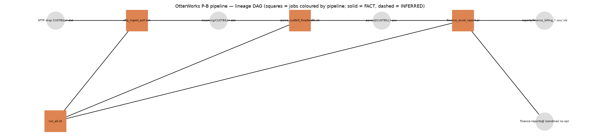

# CUSTBILL (P-B) — pipeline analysis

**Phase:** `!dbx_pipeline_analysis` · **Pipeline:** P-B, chosen by the user at STOP B
(https://cogpartners.slack.com/archives/C0BQP3P965V/p1788297325513999, reply `approved`).
**Boundary (pinned):** J6 `sftp_ingest_poll.ksh` → J7 `parse_custbill_fixedwidth.sh` →
J8 `finance_excel_report.pl`, plus J9 `run_all.sh` (orchestration). **Exclusions:** none.
Analysis only — no plan decisions, no conversion code, no contracts, no child sessions.
Cites are `path:line` on branch `tp-run/databricks-20260901T205308Z` (legacy source identical to
`tech-partnerships`). Every edge is marked FACT (read in source) or INFERRED.

Inputs consumed: `OtterWorks_ETL_inventory.md` (shared-object map, coverage), `.migration/00_context.md`,
`.migration/03_recon_tolerances.md` v1, `OtterWorks_ETL_target_state.md` (CORE, PIPELINE, ORCHESTRATION,
CONSUMER, DATA/DEPENDENCY — all present; SQL/ML-SCORING N/A per D-007).

---

## 1. Pinned scope, traced from source

| Hop | Object | Reads | Writes | Cite | Mark |
|---|---|---|---|---|---|
| entry feed | mainframe job CB77340 (MVSPROD) drops `CUSTBILL*.dat` on SFTP | – | `$SFTP_DROP/CUSTBILL*.dat` | `sftp_ingest_poll.ksh:5-6,47` | FACT (source: header comment; the mainframe side is outside the export) |
| 1 | J6 `sftp_ingest_poll.ksh` | `$SFTP_DROP/CUSTBILL*.dat` | `$ROOT/incoming/<b>`, `$ROOT/archive/<b>.<YYYYmmddHHMMSS>`; deletes source; `/tmp/sftp_ingest.lock` | `:47-60, :29,36` | FACT |
| 2 | J7 `parse_custbill_fixedwidth.sh` | `$ROOT/incoming/CUSTBILL*.dat` | `$ROOT/parsed/<b>.psv`; renames input `<f>.done`; `/tmp/cb_body.$$`; `/tmp/parse_custbill.lock` | `:112-115, :120, :137, :147, :100` | FACT |
| 3 | J8 `finance_excel_report.pl` | every `$ROOT/parsed/CUSTBILL*.psv` (all-time, no date filter) | `$ROOT/reports/finance_billing_<YYYYMMDD>.csv` and byte-identical `.xls`; sendmail to `$MAILTO` if `/usr/sbin/sendmail` exists | `:43-58, :60-75, :83-88` | FACT |
| terminal | finance team | `reports/*.xls` "from the shared drive" | – | `:79-81` | INFERRED consumer path (comment only; no mount/share definition in the export) |
| orchestration | J9 `run_all.sh` | – | invokes J6, `sleep $SLEEP`, J7, `sleep $SLEEP`, J8; `RUN_ALL_SLEEP` default 600 | `run_all.sh:106-116` | FACT |
| scheduler | `etl/legacy-extra/crontab` | – | J6 `*/15`, J7 `5-59/15`, J8 `10 2 * * *`, J9 `0 6 * * 0` | crontab (see inventory §2) | FACT |

Environment resolution (all three jobs): hostname `otterworks-etl-prod-01` → `/data/otterworks` (+
`/sftp/mainframe/upload`), `otterworks-etl-uat` → `/data2/otterworks_uat`, else
`$OTTERWORKS_LEGACY_ROOT` default `/tmp/otterworks-legacy` (`ksh:15-25`, `sh:90-96`, `pl:15-25`). The
prod/UAT hosts are not in the export; the analysis and every recon run use the fallback root under the
deterministic wrapper. Nothing in scope is unreachable or absent; the mainframe producer itself is not
part of the estate and is handled as external hand-off D7-1.

Objects touched but **not** migrated by P-B (shared, from inventory §5): `etl/legacy-extra/crontab` (P-A..P-E
lines coexist in one file — P-B owns only its four lines), `docker-compose.sftp.yml` and `gen_sample_data.pl`
(fixture/seed tooling, parent-owned), `ops/RESTART_PROCEDURE.doc.txt` (runbook, superseded at cutover).

## 2. Unit inventory

| Unit | Source | Workload type | Reads → Writes | Complexity | Shared? | Risk flags (dialect: cron/ksh/bash/perl) |
|---|---|---|---|---|---|---|
| U6 | `etl/legacy-extra/jobs/sftp_ingest_poll.ksh` (70 LOC) | PIPELINE (ingest) | SFTP drop → `incoming/`, `archive/` | low code / high protocol risk | no (produces bronze for P-B only) | no completion protocol — size compared twice 1 s apart (`:50-57`); 3 passes with `sleep 2` (`:45-66`); lock never removed (`:31-36,69`); `rm` of source after `cp` with `\|\| true` (`:58-60`) → a failed copy silently loses the file; archive name embeds wall-clock (`:59`); ksh glob `CUSTBILL*.dat` guarded by `[ -f ]` (`:48`) |
| U7 | `etl/legacy-extra/jobs/parse_custbill_fixedwidth.sh` (81 LOC) | PIPELINE (parse/typing) | `incoming/*.dat` → `parsed/*.psv`, `*.dat.done` | medium | no | byte-offset `cut -c` (LC_ALL-dependent for non-ASCII, `:123-128`); `sed '/^HDR/d;/^TRL/d'` drops **any** line starting HDR/TRL, not just first/last (`:120`); `awk $4+0` coerces non-numeric amounts to `0.00` silently (`:133`); date reformat with no validity check (`:135`); trailer count parsed (`:144`) but never reconciled; bash-only process substitution; whole pipeline `\|\| true` + `2>/dev/null` (`:137`); PID temp file (`:120,139`); output `.psv` overwritten if the same basename arrives twice |
| U8 | `etl/legacy-extra/jobs/finance_excel_report.pl` (91 LOC) | PIPELINE (aggregate) + CONSUMER (report artifact/distribution) | all `parsed/CUSTBILL*.psv` → `reports/finance_billing_<stamp>.csv` + `.xls` copy; sendmail | low | no | all-time cumulative aggregate, no date window (`:43-58`); float accumulation `$tot{$key} += $amt` then `%.2f` (`:54,70`); `next if $cust eq ""` is the only row filter (`:52`) — extra `\|` fields silently ignored, missing fields → `$amt` undef → 0 with a warning-free add; `%d` of count; `UNKNOWN($rt)` label for rec types ≠ 01/02 (`:69`); filename stamp from `localtime` (TZ-dependent, `:60-63`); `open(F) \|\| next` skips unreadable files silently (`:48`); recipients hardcoded, `jake@` bounces (`:18-24`); sendmail branch is a no-op on current hosts (`:79-88`) |
| U9 | `etl/legacy-extra/run_all.sh` (27 LOC) + P-B lines of `etl/legacy-extra/crontab` | ORCHESTRATION | – | low | crontab file is shared (D2-2) | `sleep 600` as dependency (`:106,111,114`); every stage `2>/dev/null \|\| true` (`:110-116`); Sunday 06:00 run overlaps the 15-min U6/U7 cron and each 15-min U6 run overlaps itself (3 passes × ~3 s is fine, but no lock) |

Nothing else executes inside the boundary. `gen_sample_data.pl` / `docker-compose.sftp.yml` stand in for the
mainframe and SFTP host and are fixture tooling (`ETL_UPGRADE_GUIDE_ADDENDUM.md:19-22`), not units.

## 3. Lineage DAG

Rendered by `tools/render_etl_dag.py CUSTBILL_dag.png P-B` (same edge list as the estate DAG; solid =
FACT, dashed = INFERRED; there are no INFERRED edges inside P-B — the only INFERRED item is the terminal
shared-drive consumer, which has no edge in the export and is carried as D4-4).

## 4. Field / type dictionary

### 4.1 Silver: `ow_tp.silver.custbill_records` (replaces `parsed/*.psv`) — one row per body record

Layout FACT from copybook CBCUST01 as transcribed in `parse_custbill_fixedwidth.sh:79-84`; transforms FACT
from `:129-136`. Target Delta types are PROPOSED (target-state Data profile) unless marked.

| # | Legacy field (pos) | Legacy transform (FACT) | PSV col | Target column | Delta type | Mark / risk |
|---|---|---|---|---|---|---|
| 1 | CUST-ID 1-10 `PIC X(10)` | `cut -c1-10`, trailing spaces trimmed | 1 | `cust_id` | `STRING` NOT NULL | FACT trim; leading spaces kept |
| 2 | CUST-NAME 11-40 `PIC X(30)` | `cut -c11-40`, trailing spaces trimmed | 2 | `cust_name` | `STRING` | FACT; internal double spaces kept |
| 3 | BILL-DATE 41-48 `PIC 9(8)` YYYYMMDD | `substr` → `YYYY-MM-DD`, **no validity check** | 3 | `bill_date` | `DATE` | INFERRED type: legacy keeps invalid dates as strings (e.g. `2024-13-40`); target must quarantine (T3). Fixture history seed plants `invalid_calendar_date` (`gen_history_data.pl:107-109`) |
| 4 | BILL-AMT 49-60 `PIC 9(10)V99` implied decimal | `awk $4+0; sprintf("%.2f", amt/100)` | 4 | `bill_amt` | `DECIMAL(12,2)` | INFERRED type: legacy `$4+0` turns any non-digit field into `0.00` **silently**; target must quarantine (`bad implied decimal`, planted by history seed `:110`). Max legal value 9,999,999,999.99 fits DECIMAL(12,2) |
| 5 | CURRENCY 61-63 `PIC X(3)` | `cut`, trailing spaces trimmed | 5 | `currency` | `STRING` | FACT; no ISO-4217 validation in legacy (not added — would change gold keys) |
| 6 | REC-TYPE 64-65 `PIC X(2)` 01/02 | `cut`, **not** trimmed | 6 | `rec_type` | `STRING` | FACT; values other than `01`/`02` pass through (gold labels them `UNKNOWN(xx)`) |
| – | – | – | – | `ns` | `STRING` | namespace column (convention) |
| – | file basename | – | – | `source_file` | `STRING` | metadata (T11) |
| – | body line ordinal | – | – | `line_no` | `INT` | metadata; needed as row-diff tiebreaker (PSV has no unique key: same `cust_id` can recur across rows/files) |
| – | – | – | – | `ingested_at` | `TIMESTAMP` | metadata, excluded from parity (T11) |

Record-length facts: body records are 65 bytes + `\n` (`gen_sample_data.pl:57-58`); lines shorter than 65
bytes produce short/empty fields in legacy (`cut` pads nothing). HDR/TRL: any line starting `HDR`/`TRL` is
deleted wherever it appears (`sh:120`); trailer count = bytes 4-13 of the TRL line, leading zeros
stripped (`sh:144`) and **only logged** (`:145`). Encoding: legacy `cut -c` under the deterministic
wrapper (`LC_ALL=C`) is byte-wise; the export contains ASCII only. Whether the production mainframe
transfer delivers ASCII (translated by the SFTP layer) or EBCDIC is **not determinable from the export** →
D7-1 contract item; fixtures are ASCII (FACT for fixtures, INFERRED for production).

### 4.2 Silver quarantine: `ow_tp.silver.custbill_quarantine` (new; legacy has no equivalent)

`ns`, `source_file`, `line_no`, `raw_record STRING`, `reason STRING` (`invalid_calendar_date`,
`bad_implied_decimal`, `short_record`, `trailer_count_mismatch` (file-level, `line_no` 0),
`extra_fields`), `ingested_at`. Reasons mirror the planted-anomaly kinds in `gen_history_data.pl:107-137`
so T8 set comparison is name-for-name. Population rule PROPOSED (target-state Data profile row
"Reject-row handling").

### 4.3 Gold: `ow_tp.gold.finance_billing` (replaces `finance_billing_*.csv`)

| CSV header (`pl:66`) | Legacy derivation (FACT) | Target column | Delta type | Mark |
|---|---|---|---|---|
| `Currency` | `$ccy` from PSV col 5 | `currency` | `STRING` | FACT |
| `RecordType` | `01→INVOICE`, `02→CREDIT`, else `UNKNOWN(<rt>)` (`:69`) | `record_type` | `STRING` | FACT |
| `RecordCount` | `%d` of `$cnt{$key}` | `record_count` | `BIGINT` | FACT |
| `TotalAmount` | `%.2f` of float sum of PSV col 4 | `total_amount` | `DECIMAL(18,2)` | INFERRED equivalence: legacy accumulates dollars as doubles then rounds with `%.2f`; the accumulated rounding error stays far below half a cent at estate sizes (≤10^4 rows, totals <10^9), so an exact DECIMAL sum matches. Determinism rule: target sums DECIMAL and compares to legacy `%.2f`; any residual difference is a legacy float artefact to be reported, never absorbed by a tolerance |
| – | rows sorted by `"$ccy\|$rt"` string key (`:67`) | – | – | FACT ordering; target export sorts identically (T10) |
| – | – | `ns`, `computed_at` | `STRING`, `TIMESTAMP` | metadata (T11) |

Rows included: PSV rows with non-empty col 1 (`:52`); rows are counted whether or not `$amt` parses. Scope
of the aggregate: **every** PSV ever parsed under `$ROOT/parsed` (no date window). Export artifacts:
`reports/<ns>/finance_billing_<stamp>.csv` (byte-identical to legacy CSV after T6 canonicalisation) plus
the `.xls`/real-`.xlsx` question, which is a plan decision under D4-1.

### 4.4 Bronze: `ow_tp.bronze.custbill_raw` (replaces `incoming/` + `archive/`)

`ns`, `source_file`, `line_no`, `raw_line STRING` (bytes as received, no trimming), `file_size_bytes`,
`file_sha256`, `ingested_at`; plus the landed file itself under `/Volumes/ow_tp/bronze/landing/<ns>/`
(the archive role). PROPOSED; no legacy schema exists for this layer (legacy keeps whole files).

## 5. Dependency register entries (D2–D10 sweep, register mode — all UNDECIDED / OPEN)

Full rows are appended to `.migration/04_dependency_register.md`; the table is reproduced here so the
pipeline's true cost is visible in one document. Decisions belong to the plan stop (STOP C).

| ID | Class | Unit(s) | Contract / description | Owner | Status | Lead-time exposure |
|---|---|---|---|---|---|---|
| D1-1 | intra lineage | 6→7 | Silver reads bronze `ow_tp.bronze.custbill_raw` (`ns`, `source_file`, `line_no`, `raw_line`) instead of `incoming/*.dat`; contract = §4.4 shape + "one file = one batch" | parent | UNDECIDED | none if wave 0 lands the DDL; otherwise U7 waits for U6 to merge |
| D1-2 | intra lineage | 7→8 | Gold reads `ow_tp.silver.custbill_records` (§4.1) instead of `parsed/*.psv`; all-time aggregate per `ns` | parent | UNDECIDED | same as D1-1 for U8 |
| D2-1 | shared object | 6,7,8,9 (+ P-A..E later) | Catalog `ow_tp`, schemas, volume `/Volumes/ow_tp/bronze/landing`, secret scope `ow_tp`, `dbx.py`, contract/recon validators, dialect notes — inherited by every pipeline | parent | OPEN (= D10-1/D10-2) | wave 0, serial, before any child |
| D2-2 | shared object | 9 | `etl/legacy-extra/crontab` carries P-B's four lines next to `etl/crontab`'s P-A..E lines; U9 replaces only P-B's lines; legacy file untouched until STOP E | parent | UNDECIDED | none for the run; cutover-time only |
| D3-3 | upstream feed | 6,7 | CUSTBILL file contract: fixed 65-byte records, HDR/TRL lines, trailer count at bytes 4-13, one or more files per drop, basename `CUSTBILL*.dat`; **encoding (ASCII vs EBCDIC), record terminator (`\n` vs `\r\n`), and whether HDR/TRL may appear mid-file are not fixed by the export** | customer (mainframe team) | UNDECIDED | contract must state the four ambiguity classes (encoding, malformed-record, empty-input, batch granularity) before U7's contract is written; default from fixtures: ASCII, `\n`, HDR first/TRL last, empty body = valid 0-row file |
| D4-1 | consumer | 8 | `finance-reports@otterworks.dev` distribution; sendmail relay retired 2020 (`ops/RESTART_PROCEDURE.doc.txt`); `jake@` bounces | customer | OPEN (asked STOP A, unanswered) | blocks only the delivery half of U8; gold table + CSV export proceed regardless |
| D4-4 | consumer | 8 | Finance also collects `reports/*.xls` "from the shared drive" (`pl:79-81`) — **INFERRED**: no share/mount definition in the export; path, host and consumer unknown | customer | UNDECIDED | if real, coexistence needs the export copied to that share (or the consumer repointed at the volume) at STOP E |
| D5-1 | scheduler | 6,7 | `*/15` ingest vs `5-59/15` parse: parse can read a half-written `incoming/` file | parent | OPEN | plan decision: one Workflow, parse task depends on ingest task |
| D5-2 | scheduler | 1,8 | 02:00 `analytics_daily` vs 02:10 finance — no shared write in P-B, so P-B needs only "finance after parse" | parent | OPEN | P-B-side decision at STOP C; P-A side later |
| D5-3 | scheduler | 9 | Sunday 06:00 `run_all` re-runs 6→7→8 over the live 15-min jobs with `sleep 600` | parent | OPEN | plan decision: same DAG, `max_concurrent_runs=1`, `run_all` retired as separate code |
| D6 | shared table | – | **none** for P-B: no legacy table has a non-migrated writer (file-based estate) | – | N/A | – |
| D7-1 | external hand-off | 6 | Mainframe job CB77340 SFTP drop → landing volume / S3 Transfer Family; owner unnamed; no rename-into-place protocol exists (`ksh:42-44`) | customer | OPEN (asked STOP A; re-asked STOP B) | gates only the **live** producer path; run proceeds on the fixture SFTP host (`docker-compose.sftp.yml`, localhost:52222) and seeded drops |
| D8-3 | governance | 6 | SFTP credential for the fixture host is a compose-file placeholder (`docker-compose.sftp.yml`, user `mainframe`); target holds it as `ow_tp/sftp_password` in the secret scope by name only; production SFTP/Transfer Family credential is customer-issued | parent (fixture) / customer (prod) | UNDECIDED | none for fixtures |
| D9 | ML consumer | – | N/A (D-007) | – | N/A | – |
| D10-6 | environment | 6 | Serverless notebook tasks cannot open outbound SFTP to a laptop-bound fixture; live ingest into the volume needs either an S3/Transfer Family landing or a parent-side push of files into `/Volumes/ow_tp/bronze/landing` | parent | UNDECIDED | shapes U6's live recon path; fixture path unaffected |

Existing rows D10-1, D10-2, D10-3, D10-4 (environment) and D8-1/D8-2 apply to P-B unchanged.

## 6. Waves and fan-out batches

Lineage forces bronze → silver → gold; orchestration last. Every INFERRED item (D4-4) is a terminal
consumer with no write target, so it costs no width. No two same-wave batches share a write target.

| Wave | Batch | Units | Write targets | Depends on | Width | Notes |
|---|---|---|---|---|---|---|
| 0 | parent | shared objects (D2-1): catalog/schemas/volume/scope via Terraform, `dbx.py`, contract + recon validators, dialect notes, **table DDL for §4.1–4.4** | `ow_tp.*` DDL only, no data | STOP C | serial | parent-owned; DDL owned here so no child ever runs DDL on a shared table |
| 1 | B1 | U6 ingest | `ow_tp.bronze.custbill_raw` (ns slice), `/Volumes/ow_tp/bronze/landing/<ns>/` | wave 0 | 1 | pilot |
| 2 | B2 | U7 parse | `ow_tp.silver.custbill_records`, `ow_tp.silver.custbill_quarantine` (ns slice) | U6 merged (D1-1) | 1 | |
| 3 | B3 | U8 finance | `ow_tp.gold.finance_billing` (ns slice), `/Volumes/ow_tp/bronze/landing/reports/<ns>/` exports | U7 merged (D1-2) | 1 | |
| 4 | B4 | U9 orchestration | Workflow `ow_tp_custbill` (tasks ingest→parse→finance, `max_concurrent_runs=1`, schedules PAUSED) | U6–U8 merged | 1 | no table writes |

Serial floor: **4 child hops** (3 with U9 folded into the parent's rollup). Max width: **1** under the
conservative lineage ordering. Alternative for the plan stop (not decided here): because wave 0 owns all
DDL and the fixture layer can seed bronze/silver from the deterministic `.dat`/`.psv` outputs, U6/U7/U8
could run as three parallel batches in one wave (width 3, serial floor 2) with contracts pinning the
interfaces of §4 — this trades the "child blocked on unlanded sibling STOPS" rule for parent-authored
interface fixtures. Concurrency vs D10 limits: either shape is ≤3 concurrent children, one shared PAT,
one live window per wave — within the demo-workspace limits recorded in `07_access_checklist.md`.

## 7. Recon plan per unit (tolerance record v1; full row diff — estate ≤10^4 rows/ns)

Dual-run source for every unit: the legacy chain re-executed from the deterministic seed for the same `ns`
under `scripts/tp-run-deterministic.sh` (D-003); no federated engine, legacy-query concurrency cap N/A.
Legacy-side cost per recon: `make legacy-etl-gen-data` + `make legacy-etl-run JOB=run_all` ≈ 6 s
(`runbook-databricks.md` §1c); negligible, no wave-level load concern.

| Unit | Recon queries | Keys / determinism rule | Tolerances | Fixture vs live |
|---|---|---|---|---|
| U6 | (a) file count and byte size per `source_file` vs `archive/`/`incoming/` copies; (b) `sha256(raw file)` vs seed file; (c) `count(*)` of `custbill_raw` per file vs `wc -l`; (d) idempotency rerun: same counts/hashes | key `(ns, source_file, line_no)`; archive timestamp suffix excluded (T11) | T1, T6 (byte-identical raw), T9, T11 | fixture: local SFTP compose host → child's own root; live: parent pushes NS=demo drops into the landing volume (D10-6) |
| U7 | (a) row count silver vs `wc -l parsed/*.psv` (100 for NS=demo); (b) full row diff on all 6 fields after canonical ordering; (c) quarantine count = 0 on clean seed; (d) planted-anomaly set diff against `gen_history_data.pl` manifest (`missing = ∅`, `unexpected = ∅`); (e) trailer count == body row count per file; (f) rerun idempotent (`MERGE`) | key `(ns, source_file, line_no)`; compare `cust_id, cust_name, bill_date::ISO, bill_amt::%.2f, currency, rec_type` | T1, T2, T3, T4, T7, T8, T9 | fixture: seeded `.dat` copied into a fixture bronze table; live: parent window after U6 live |
| U8 | (a) gold rows vs `finance_billing_*.csv` (6 rows NS=demo): exact key set, exact count, exact total to the cent; (b) exported CSV byte-identical to legacy after T6 canonicalisation (`\n`, header, sort by `currency,rec_type`); (c) independent awk recompute from PSV (`runbook-databricks.md` Beat 4 §1) as a third leg; (d) rerun idempotent (`INSERT OVERWRITE WHERE ns=?`) | key `(ns, currency, record_type)`; legacy sorts by `"$ccy\|$rt"` — target export sorts the same way (T10); float-vs-decimal rule §4.3 | T2, T5, T6, T9, T11 (filename stamp) | fixture: seeded PSV → fixture silver; live: parent window after U7 live |
| U9 | (a) Workflow run for NS=demo produces the same U6/U7/U8 recon verdicts end-to-end; (b) task dependency graph == ingest→parse→finance; (c) `max_concurrent_runs=1` and PAUSED schedules asserted via Jobs API; (d) rerun of the whole Workflow idempotent | – | T9, T12; no data tolerance of its own | fixture: Jobs JSON validated + dry-run; live: single parent Workflow run in the wave-4 window |

Unverified paths to be declared in every recon report: production SFTP/EBCDIC path (D3-3/D7-1), finance
e-mail delivery (D4-1), shared-drive hand-off (D4-4), prod/UAT hostname branches (hosts not in export).

## 8. Risk list (priced from the INFERRED rows and dialect flags)

1. **Encoding / record terminator of the real mainframe feed unknown (D3-3)** — silver would either mis-slice
   every column (EBCDIC) or leave a trailing `\r` in `rec_type`. Mitigation: contract fixes ASCII+`\n` from
   fixtures, declares production encoding an explicit coverage gap until the mainframe owner answers.
2. **Silent coercions become quarantines** — legacy passes invalid dates and non-numeric amounts (as `0.00`);
   the target rejects them. On the clean NS=demo seed both agree (T7 = 0), but on any real drop the gold totals
   will legitimately differ from legacy by the coerced rows. Recon must report quarantined rows as a named
   delta, not a red diff.
3. **All-time aggregate semantics** — gold must aggregate every parsed file for the `ns`, not the latest batch;
   an incremental gold would diverge from `finance_billing_*.csv` on the second run.
4. **No unique business key in PSV** — row diff needs `(source_file, line_no)`; duplicate `cust_id`s are normal.
5. **HDR/TRL anywhere** — legacy deletes any line starting HDR/TRL; a customer whose `cust_id` begins `HDR`
   would be dropped by legacy and kept by a positional parser. Contract must choose (default: mirror legacy for
   parity, flag as `malformed-record` class).
6. **Ingest loses files silently** on copy failure (`cp ... \|\| true; rm ...`); target needs copy-verify-then-delete
   (or never delete; producer-side retention is D7-1).
7. **Wall-clock in artifacts** — archive suffix and report stamp; excluded by T11, but the export filename
   for the finance team (D4-4) must keep the `finance_billing_<YYYYMMDD>` pattern.
8. **Serverless has no route to a laptop SFTP fixture (D10-6)** — live ingest path differs from fixture path;
   the contract must name both and the recon report must state which ran.
9. **`.xls` that is a CSV** — a real `.xlsx` changes the artifact bytes finance receives; D4-1 decision.
10. **Overlap-by-design in cron** — two U6 instances and a U7 can run concurrently today; a single Workflow with
    `max_concurrent_runs=1` removes the class, but coexistence (legacy cron still live until STOP E) means the
    legacy side keeps its overlap until cutover — recon compares outputs, not run timing.

## 9. Validation of this analysis

1. Every object reachable in the pinned scope is inventoried (U6–U9; fixtures and crontab classified) — §1–2.
2. Wave order 0→1→2→3→4 is a valid topological sort of §3 — §6.
3. No two same-wave batches share a write target (one batch per wave) — §6.
4. Every claim cites `file:line` or is marked INFERRED/PROPOSED — throughout.
5. Every D2–D10 crossing is in §5 with a contract or an explicit unresolved flag (D3-3, D4-4, D10-6 new).
6. Every unit has a recon row — §7.
