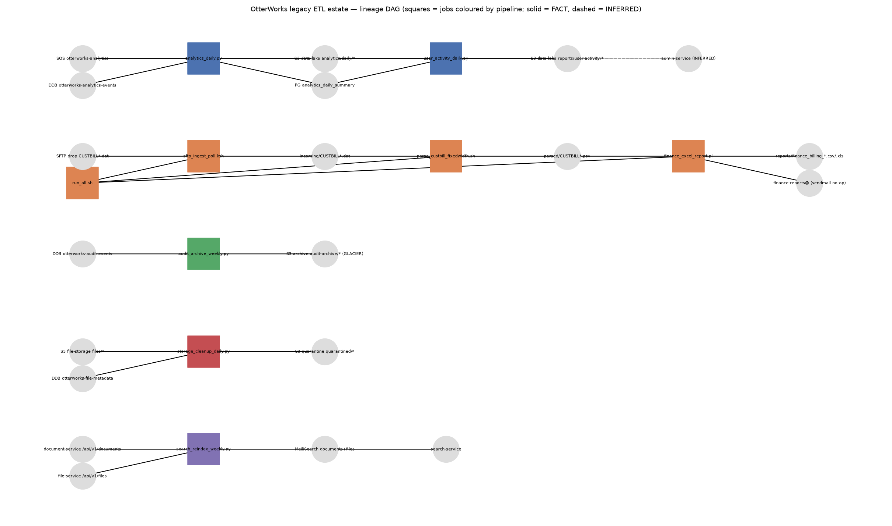

# OtterWorks ETL estate — inventory (`!dbx_estate_inventory`)

Version 1.0-draft, 2026-09-01. Breadth census of the legacy batch estate on `otterworks-etl-prod-01`
(`etl/` + `etl/legacy-extra/` on branch `tech-partnerships`). No conversion analysis here; that is
`!dbx_pipeline_analysis` after STOP B. Every claim is FACT with a `path:line` cite or marked INFERRED.
Line-level extraction notes live in the working file `.migration/scratch/census.md` (not committed).

Re-render: `python3 docs/tech-partnerships/tools/render_etl_dag.py docs/tech-partnerships/OtterWorks_ETL_dag.png`.

## 1. Census

Unit of enumeration: one scheduled job = one object (there is no ETL tool; the scheduler is one crontab).

| # | Object | Type / runtime | LOC | Schedule (`etl/legacy-extra/crontab`) | Reads | Writes | Cite |
|---|---|---|---|---|---|---|---|
| J1 | `etl/scripts/analytics_daily.py` | Python 3 (2.7 port 2021), pandas | 452 | `0 2 * * *` daily 02:00 (l.10) | SQS `otterworks-analytics` (hardcoded URL), DynamoDB `otterworks-analytics-events`, `config.ini` `[aws][database][s3]` | S3 `<data_lake_bucket>/analytics/daily/year=/month=/day=/{summary.json.gz,hourly_breakdown.json.gz,top_users.jsonl.gz}`; PG `analytics_daily_summary` upsert; S3 `reports/analytics/daily/<ds>/report.json`; deletes consumed SQS messages | py:28-58, 68-140, 296-437 |
| J2 | `etl/scripts/audit_archive_weekly.py` | Python 3 | 224 | `0 3 * * 0` Sun 03:00 (l.11) | DynamoDB `otterworks-audit-events` full scan, `timestamp < today-90d` | S3 `<archive_bucket>/audit-archive/year=/week=<ds>/audit_events.jsonl.gz` (GLACIER); deletes archived DDB rows; S3 `reports/compliance/audit-archive/<ds>/report.json` | py:36-84, 95-216 |
| J3 | `etl/scripts/search_reindex_weekly.py` | Python 3, requests | 319 | `0 4 * * 0` Sun 04:00 (l.12) | REST `document_service_url/api/v1/documents`, `file_service_url/api/v1/files` (paginated); MeiliSearch tasks/stats | MeiliSearch: drop + recreate + settings + bulk load indexes `documents`, `files` | py:24-94, 150-309 |
| J4 | `etl/scripts/storage_cleanup_daily.py` | Python 3 | 217 | `30 2 * * *` daily 02:30 (l.13) | S3 `<file_storage_bucket>/files/*`; DynamoDB `otterworks-file-metadata` (`s3_key`) | copy unreferenced objects to `<quarantine_bucket>/quarantined/<ds>/<key>` then delete source; S3 `reports/storage-cleanup/<ds>/report.json` | py:23-62, 71-151, 160-209 |
| J5 | `etl/scripts/user_activity_daily.py` | Python 3 | 255 | `0 5 * * *` daily 05:00 (l.14) | PG `analytics_daily_summary` (30-day window); S3 `analytics/daily/.../top_users.jsonl.gz` per day | S3 `reports/user-activity/<ds>/activity_report.json`, `reports/user-activity/latest/activity_report.json`, `reports/user-activity/<ds>/user_summaries.jsonl` | py:25-84, 124-147, 204-239 |
| J6 | `etl/legacy-extra/jobs/sftp_ingest_poll.ksh` | ksh93 (1998 origin, 2014 port) | 70 | `*/15 * * * *` (l.20) | SFTP drop `CUSTBILL*.dat` (`/sftp/mainframe/upload`, host-branched) | `$ROOT/incoming/<file>`, `$ROOT/archive/<file>.<ts>`; deletes drop file; `/tmp/sftp_ingest.lock` (never removed) | ksh:14-38, 45-69 |
| J7 | `etl/legacy-extra/jobs/parse_custbill_fixedwidth.sh` | bash + sed/cut/paste/awk | 81 | `5-59/15 * * * *` (l.24) | `$ROOT/incoming/CUSTBILL*.dat` (fixed-width 65 cols, HDR/TRL) | `$ROOT/parsed/<file>.psv` (6 pipe-delimited fields); renames input to `.dat.done`; `/tmp/cb_body.$$`; `/tmp/parse_custbill.lock` | sh:5-18, 28-77 |
| J8 | `etl/legacy-extra/jobs/finance_excel_report.pl` | Perl 5 no modules | 91 | `10 2 * * *` daily 02:10 (l.28) | `$ROOT/parsed/CUSTBILL*.psv` | `$ROOT/reports/finance_billing_<YYYYMMDD>.csv` + byte-copy `.xls`; sendmail to `finance-reports@otterworks.dev` (no-op since relay retired); `/tmp/finance_report.lock` | pl:15-37, 41-87 |
| J9 | `etl/legacy-extra/run_all.sh` | bash | 28 | `0 6 * * 0` Sun 06:00 (l.32) | – (invokes J6, J7, J8 with `sleep 600` between) | none of its own; always exits 0 | run_all.sh:14-28 |

Support objects (not jobs, census-accounted below): `etl/run.sh` (Python launcher, sources `/opt/etl/.env`), `etl/config.ini` (shared config, plaintext credentials), `etl/crontab` (5-entry subset, duplicate of l.9-14 of the full crontab), `etl/legacy-extra/crontab` (authoritative 9-entry scheduler), `etl/requirements.txt` (boto3, psycopg2-binary, pandas, requests), `etl/legacy-extra/docker-compose.sftp.yml` (local SFTP stand-in for the mainframe drop), `etl/legacy-extra/tools/gen_sample_data.pl` + `gen_history_data.pl` (deterministic CUSTBILL feed generators used for baselines), `etl/legacy-extra/ops/RESTART_PROCEDURE.doc.txt` (operator runbook), `etl/ETL_UPGRADE_GUIDE.md`, `etl/legacy-extra/ETL_UPGRADE_GUIDE_ADDENDUM.md`.

Last-run evidence: none in the repository (logs are host paths `/var/log/etl/*.log`, cited per row). Query history: N/A, no warehouse. Scope cutting on run evidence is therefore UNVERIFIABLE; nothing is proposed unused (§4).

## 2. Lineage edges

FACT unless marked. Producer/consumer cites are in the census rows above.

| Edge | Class | Mark |
|---|---|---|
| SQS `otterworks-analytics` → J1; DynamoDB `otterworks-analytics-events` → J1 | D3 upstream | FACT (py:50-140) |
| J1 → S3 `analytics/daily/*/top_users.jsonl.gz` → J5 | D1 intra-pipeline | FACT (J1 py:325-336; J5 py:139-171) |
| J1 → PG `analytics_daily_summary` → J5 | D1 | FACT (J1 py:355-394; J5 py:64-84) |
| J5 → S3 `reports/user-activity/<ds>/activity_report.json` → admin-service | D4 consumer | **INFERRED** — intake names admin-service as reader; repo grep of `services/` finds no reader of that path. Must be confirmed with the customer before it is treated as a cutover consumer. |
| mainframe SFTP drop → J6 → `incoming/` → J7 → `parsed/*.psv` → J8 → `reports/finance_billing_*.{csv,xls}` | D7 upstream hand-off, D1 ×2, D4 (finance) | FACT (ksh:47-60; sh:28-77; pl:41-77) |
| J9 → J6, J7, J8 (sequential, sleep-as-dependency) | D5 scheduler | FACT (run_all.sh:19-25) |
| DynamoDB `otterworks-audit-events` → J2 → S3 `audit-archive/*` (GLACIER) | D3 / D6 (J2 deletes from a table the audit-service also writes; `services/audit-service/src/Config/AwsSettings.cs:8` uses the same archive bucket with a different key layout) | FACT |
| S3 `files/*` + DynamoDB `otterworks-file-metadata` (written by file-service, `services/file-service/src/config.rs:64`) → J4 → S3 `quarantined/*` | D6 shared table (read-only here) | FACT |
| document-service, file-service REST → J3 → MeiliSearch `documents`,`files` → search-service (`services/search-service/app/config.py:8-17`) | D3 upstream, D4 consumer | FACT |

Scheduler edges (`etl/legacy-extra/crontab`): 02:00 J1 / 02:10 J8 / 02:30 J4 share the nightly window with J6 (:00,:15,:30,:45) and J7 (:05,:20,:35,:50) running continuously; Sundays add J2 03:00, J3 04:00 and J9 06:00, which re-runs J6-J8 on top of their own cron entries (crontab:16-32, documented incidents 2016-03-12). No cross-job locking exists; the three per-job lock files are checked but never removed (ksh:31-36, sh:30-36, pl:29-35).

## 3. Pipeline catalog

Partition follows the estate's own structure: the Python "analytics" estate vs the CUSTBILL batch chain, then the three independent housekeeping jobs.

| Pipeline | Objects | LOC | Depth | Upstream / downstream edges | Difficulty | Workload surfaces |
|---|---|---|---|---|---|---|
| **P-A Analytics & user activity** | J1, J5 | 707 | 2 (J1 → J5) | in: SQS, DynamoDB; out: admin-service (INFERRED), PG table | High — pandas aggregation, three sinks, hardcoded queue URL, silent hour-00 timestamp fallback (py:169-180), PG failure does not fail job (py:395-404) | ingest (stream + KV), transform, SQL table, report consumer, daily schedule |
| **P-B CUSTBILL billing chain** | J6, J7, J8, J9 | 270 | 3 (J6 → J7 → J8) + orchestrator | in: mainframe SFTP (D7-1); out: finance recipients (D4-1) | Medium — small code, but fixed-width/encoding semantics, half-written-file race, unreconciled trailer counts (sh:71-75), `.xls` that is a CSV (pl:74-75), sleep-based orchestration | file landing, fixed-width parse, aggregation, file artifact, e-mail consumer, 15-min + daily + weekly schedules |
| **P-C Audit archive** | J2 | 224 | 1 | in: DynamoDB `otterworks-audit-events` (shared with audit-service, D6); out: none found | Medium — destructive delete after archive, swallowed batch-delete errors (py:146-165), full scan | ingest, retention/delete, GLACIER artifact, weekly |
| **P-D Storage cleanup** | J4 | 217 | 1 | in: file-service bucket + metadata table (D6); out: none found | Medium — destructive quarantine-and-delete, no dry-run (py:8-10) | object-store housekeeping, daily |
| **P-E Search reindex** | J3 | 319 | 1 | in: document-/file-service REST (D3-1); out: search-service via MeiliSearch | Low/odd-fit — no table output; drop-and-rebuild of live indexes | REST ingest, search sink, weekly |

Parallelism profile (fixture-first children, one PR per unit): P-A width 1 at depth 1 and 1 at depth 2 (J5 blocked on J1); P-B width 1-1-1 then J9 rollup, serial floor = 3 units; P-C, P-D, P-E each width 1, fully independent of everything else and of each other. Across the estate the honest maximum concurrent width is **5** (J1, J6, J2, J4, J3), the serial floor is **3 hops** (P-B chain). Wave 0 (parent) = shared objects below.

## 4. Coverage arithmetic

Census N = 20 files under `etl/` (`find etl -type f`: 9 jobs + 11 support objects; nothing else present).

`20 = 9 (assigned to exactly one pipeline: P-A 2, P-B 4, P-C 1, P-D 1, P-E 1) + 11 (shared/support set, §5) + 0 (PROPOSED-unused) + 0 (user-confirmed exclusions)`.

PROPOSED-unused: **none** — every job has an active cron line (crontab:10-32); with no run logs in scope there is no evidence to propose removing anything. Candidates the user may still want to cut are flagged, not proposed: `etl/crontab` (redundant 5-line subset of the authoritative crontab) and the sendmail branch of J8 (dead since 2020 per `ops/RESTART_PROCEDURE.doc.txt`).

Completeness triangulation:

| Cross-check | Result |
|---|---|
| Scheduler entries vs census jobs | 9 vs 9 — MATCH (crontab:10,11,12,13,14,20,24,28,32) |
| `etl/crontab` (5) ⊂ `etl/legacy-extra/crontab` (9) | MATCH, identical lines |
| Script files (`*.py *.sh *.ksh *.pl`) vs jobs | 12 vs 9; the 3 non-jobs are `run.sh` and the two `tools/gen_*.pl` generators — accounted in support set |
| Documentation inventories | `etl/ETL_UPGRADE_GUIDE.md:28-32` lists exactly J1-J5; `etl/legacy-extra/ETL_UPGRADE_GUIDE_ADDENDUM.md:12-17` lists exactly J6-J9 — MATCH |
| Host-level crontab of `otterworks-etl-prod-01`, `/opt/etl` contents, `/var/log/etl` | **UNVERIFIABLE** — no host access in scope; the repo tree is the source of truth by engagement definition (`.migration/00_context.md`). |

## 5. Shared-object map

| Shared object | Used by | Proposed owner (first to need it) | Target |
|---|---|---|---|
| `etl/config.ini` (`[aws]`, `[database]`, `[services]`, `[s3]`) | J1-J5 | parent, wave 0 | Databricks secret scope `ow_tp` + job parameters; plaintext values retired (D8-1) |
| `etl/run.sh` + `/opt/etl/.env` | J1-J5 | parent, wave 0 | Job task wrapper / `ns` parameter convention |
| `etl/legacy-extra/crontab` (+ `etl/crontab`) | all 9 | parent, wave 0 register; per-unit schedule in each unit; J9 unit owns the Sunday chain | Databricks Workflows schedules (paused until STOP E) |
| PG `analytics_daily_summary` | J1 (write), J5 (read) | J1 unit | `ow_tp.gold.analytics_daily_summary` |
| S3 `analytics/daily/*` partitions | J1 (write), J5 (read) | J1 unit | `ow_tp.silver.analytics_*` |
| `$ROOT/incoming`, `parsed`, `reports`, `archive` dirs | J6, J7, J8, J9 | J6 unit (landing), then J7, J8 | `/Volumes/ow_tp/bronze/landing/<ns>/...` |
| lock files `/tmp/*.lock` | J6, J7, J8 | retired (no owner) | Workflows concurrency = 1 |
| Deterministic generators `tools/gen_*.pl`, `docker-compose.sftp.yml` | baselines for P-B | parent (golden baselines) | fixture layer, unchanged |
| DynamoDB `otterworks-audit-events`, `otterworks-file-metadata`, S3 `files/*`, `audit-archive/*` | J2 / J4 and the audit-/file-services (writers outside the estate) | not migrated — D6 legacy-remains-writer, read via ingestion | bronze ingest only |
| Docs (`ETL_UPGRADE_GUIDE*.md`, `RESTART_PROCEDURE.doc.txt`) | reference | parent | superseded by runbook at cutover |

No two pipelines write the same object; the only cross-pipeline touch points are the shared config/launcher (wave 0) and external tables owned by services (not migrated). Fan-out is therefore collision-free once wave 0 lands.

## 6. Governance inventory

See `.migration/08_governance_inventory.md` (12 FACT rows: 4 credential keys, 4 endpoint keys, SFTP fixture principal, sendmail recipients, file modes, lock/temp paths). No grants, roles, row filters or masks exist in the source estate — governance is entirely "who can read `config.ini`".

## 7. First-pass dependency sweep (register mode)

Appended to `.migration/04_dependency_register.md` as UNDECIDED: D3-2 (SQS/DynamoDB analytics feeds), D6-1 (J2 deletes from the audit-service table), D6-2 (J4 deletes from the file-service bucket), D4-3 (search-service consumes rebuilt indexes). D4-2 downgraded to INFERRED pending confirmation. D5-1..D5-5 (scheduler overlaps), D7-1, D4-1, D3-1, D8-1 carried from setup/intake; D10-3, D9-1, D9-2 closed by STOP A.

## 8. Recommendation for STOP B

Recommend **P-B CUSTBILL billing chain (J6, J7, J8, J9)** as the first pipeline: it is the smallest slice that exercises every target surface we need tuned before the wide fan-out — file landing to the volume (Auto Loader pattern), a byte-sensitive fixed-width bronze→silver parse with quarantine, a gold aggregate with an exact money baseline, a file artifact consumer, and the scheduler replacement for the 15-min/daily/Sunday overlap. It also carries the two unresolved external contracts (D7-1 mainframe hand-off, D4-1 finance recipients) that the customer must own, so surfacing them first shortens the critical path. Deterministic golden baselines already exist for it (100 `.psv` rows, six-row finance report — `docs/tech-partnerships/runbook-databricks.md:81-98`).

Alternatives: P-A is the largest and most valuable but has an INFERRED consumer and stream/KV sources that need fixture design first; P-C/P-D/P-E are single-job, low-lineage and best used to widen wave 1 once P-B has tuned the contract/recon pattern.

The user picks at STOP B; this document does not.
