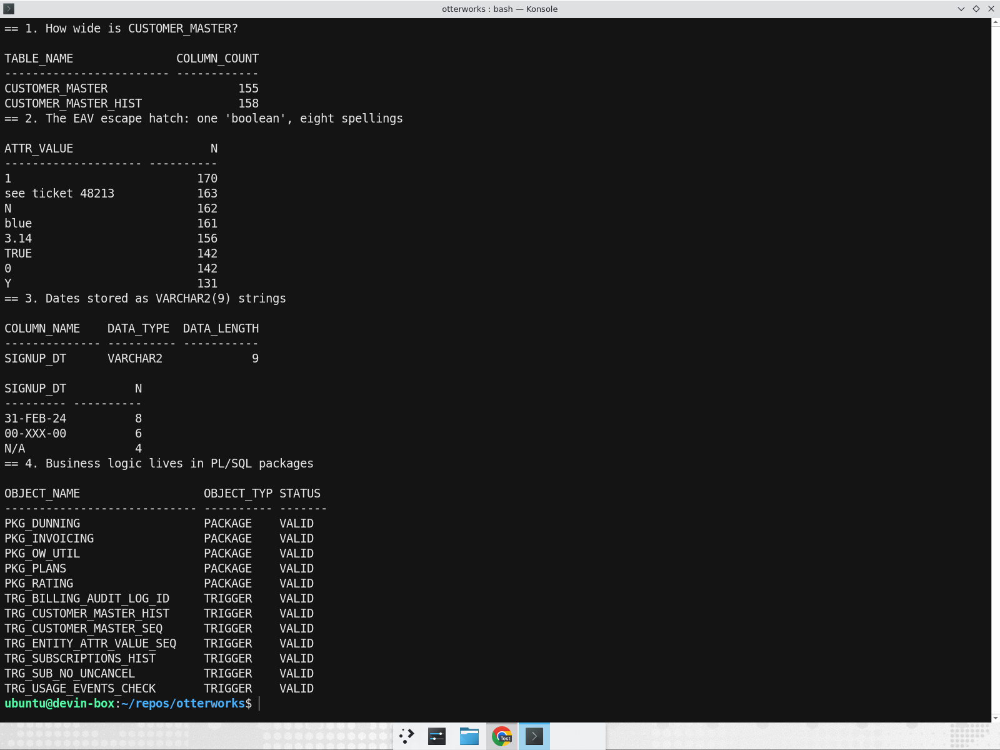
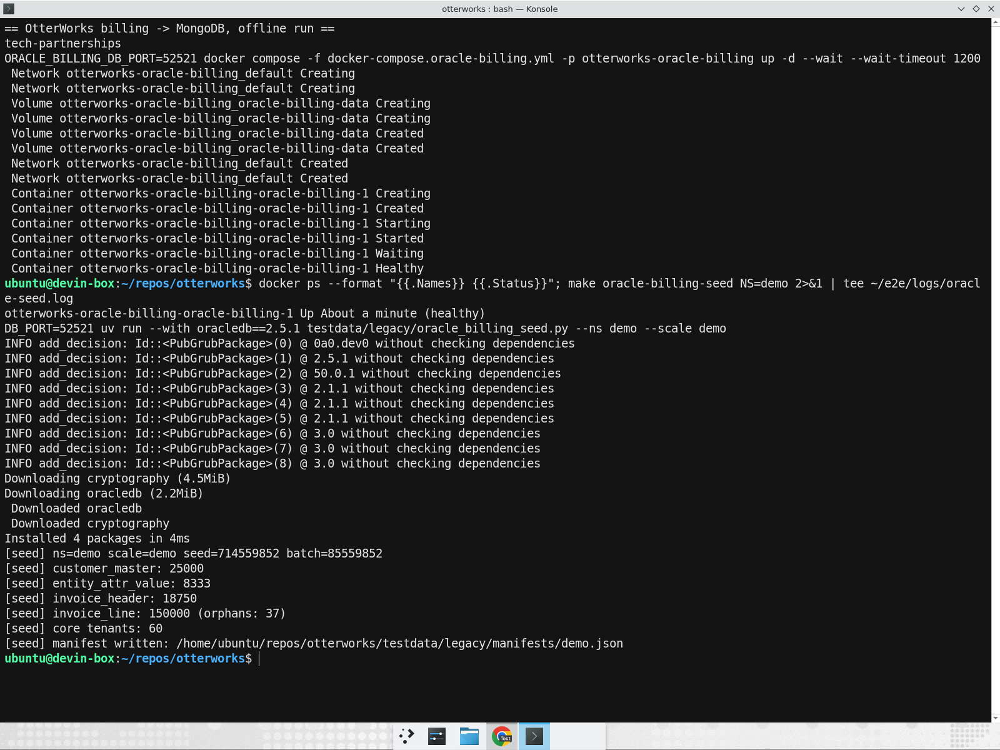
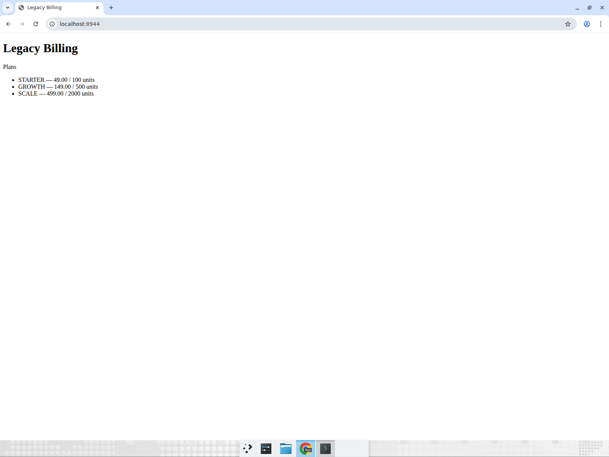
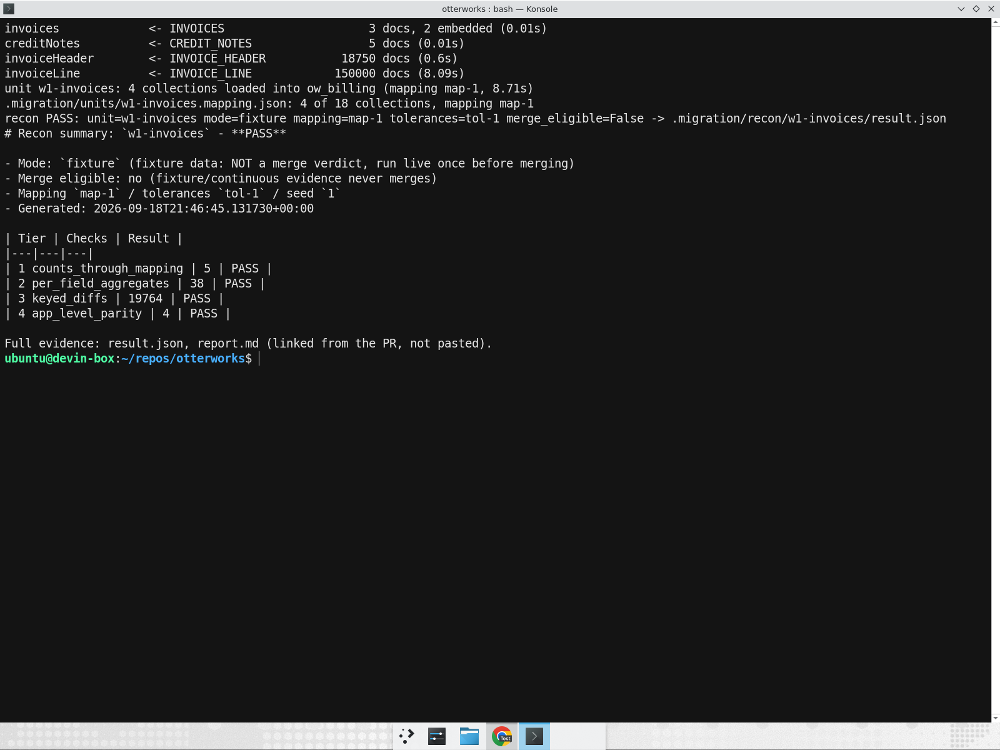
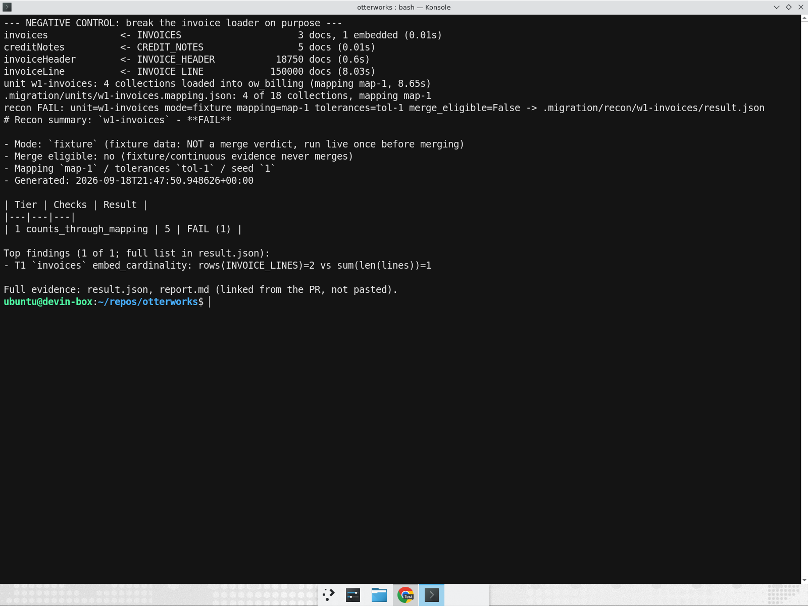
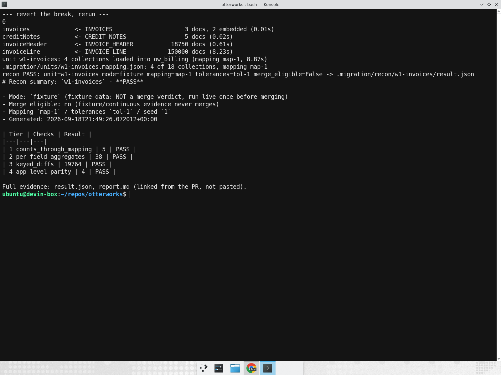
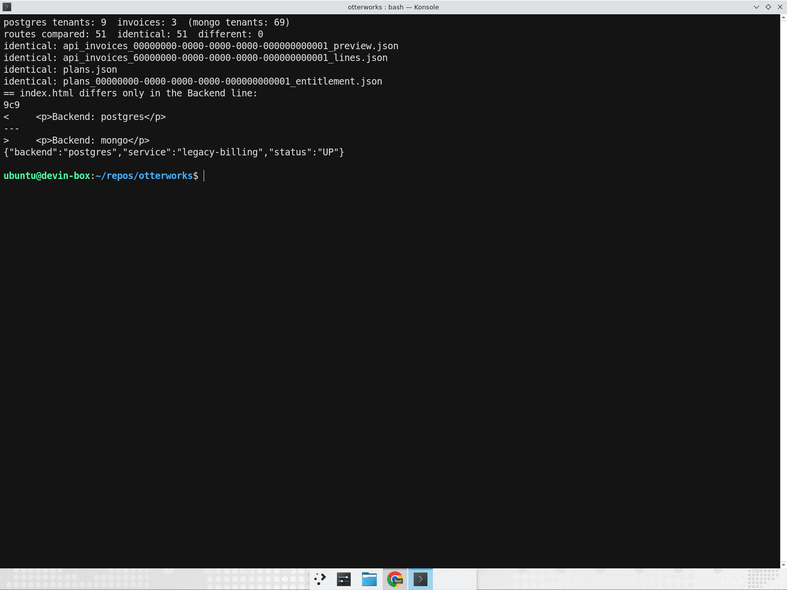
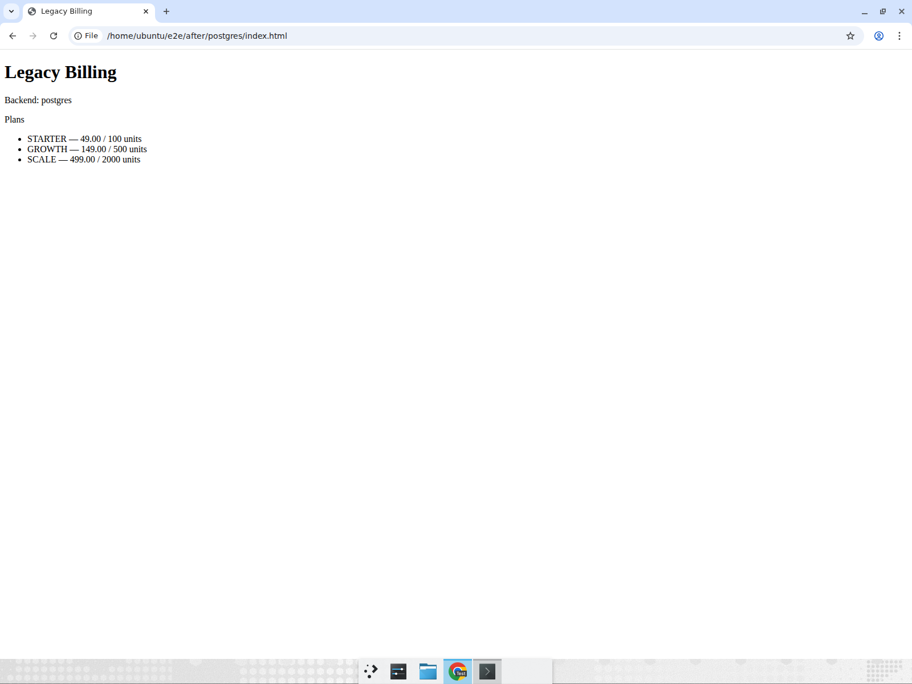
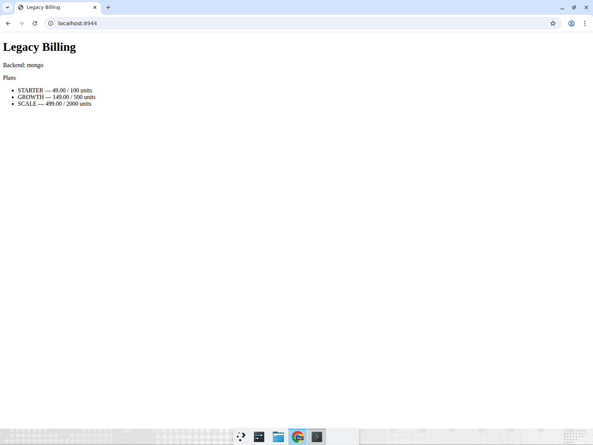
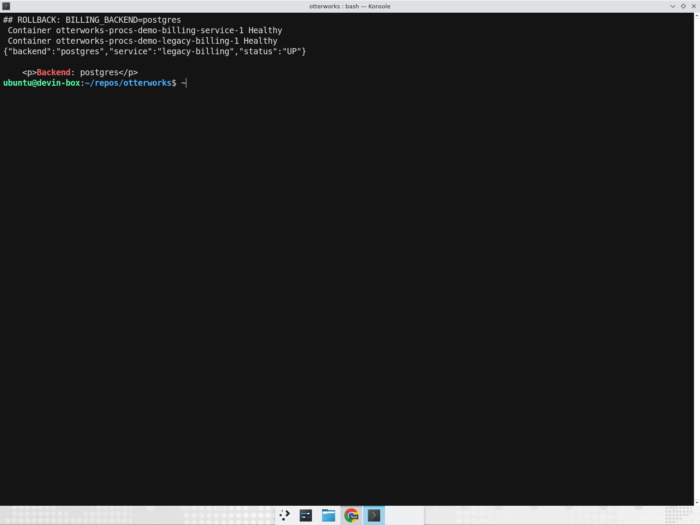

# OtterWorks billing: Oracle to MongoDB, offline, end to end

This is the record of one run of the mongo-migration plugin (`offline` branch) against the
OtterWorks Oracle billing estate, from DDL to the billing app serving its pages from MongoDB.
Everything ran on one machine: Oracle, PostgreSQL and MongoDB in Docker, no Atlas, no MCP.
Work branch: `tp-run/mongodb-20260918T212022Z`. Screenshots are in
`offline-mongo-walkthrough/`; raw JSON and logs came from `~/e2e/` on the run machine.

If you only read one line: the four migration units load and reconcile clean against the
local Oracle (54,534 checks, 0 failures), the billing app now serves its read routes from
MongoDB with byte-identical JSON (87 of 87 requests), and production cutover is still open
because no live reconciliation and no customer cutover principal exist in this mode.

## 1. The problem, in one screen

The billing schema `OW_BILLING` is 19 tables, 431 columns, 13 foreign keys, 7 triggers and
10 PL/SQL units. Every change hurts for four concrete reasons, all visible in one sqlplus
session (`~/e2e/pain.sql`):

```
CUSTOMER_MASTER          155 columns
CUSTOMER_MASTER_HIST     158 columns  (full-row copy on every update, via trigger)

ENTITY_ATTR_VALUE, one boolean attribute, eight spellings:
  1, "see ticket 48213", N, blue, 3.14, TRUE, 0, Y

SIGNUP_DT  VARCHAR2(9): 31-FEB-24 (8 rows), 00-XXX-00 (6), N/A (4)

PKG_DUNNING, PKG_INVOICING, PKG_PLANS, PKG_RATING: the billing rules live in PL/SQL
TRG_CUSTOMER_MASTER_HIST, TRG_SUBSCRIPTIONS_HIST, TRG_SUB_NO_UNCANCEL ...: 7 triggers
```



A 155-column row means every new customer field is a table change plus a history-table
change plus a trigger change. The EAV table (`ENTITY_ATTR_VALUE`, one row per attribute per
entity) was the escape hatch for that, and it has no types, so a boolean has eight spellings.
Dates in `VARCHAR2(9)` accept `31-FEB-24`. And because the rules are in packages and
triggers, nothing about billing can be tested outside the database.

## 2. Why a document model

A billing document holds the things that change together. An invoice and its lines are
written together (`pkg_invoicing` rewrites every line of an invoice in one call) and read
together (only ever by `invoice_id`). In a document they are one write and one read, with no
join and no orphan possible.

Attributes that vary per customer belong on the customer document, not in a side table. The
attribute pattern keeps them queryable without a 155-column row.

History stays out of the hot document. The `_HIST` tables become archive collections the
application writes, so the trigger goes away and the write path is visible in code.

Not everything embeds. The finance feed tables `INVOICE_HEADER` and `INVOICE_LINE` stay as
two referenced collections. `INVOICE_LINE` has 37 rows whose header does not exist, and
report RPT-114 drops them on purpose through its header-to-line join. Embedding would either
lose those 37 rows silently or invent headers for them. Keeping the reference keeps the
count and lets the recon prove it (`orphan-count` op, expected 37 on both sides).

## 3. The run, step by step

Each step: the command, what it proved, what it did not.

### 3.0 Before state

```
make oracle-billing-up            # Oracle Free, PDB FREEPDB1, schema OW_BILLING
make oracle-billing-seed NS=demo
make procs-up NS=demo             # PostgreSQL-backed billing app on :8944
```



Saved for the parity check (`~/e2e/before/`): `/`, `/plans`,
`/plans/<tenant>/entitlement`, `/api/invoices/<tenant>/preview`, `/api/dunning/overdue`.



Proves: the legacy estate and the current app are up and produce a known answer.
Does not: say anything about production data; this Oracle is the local copy.

### 3.1 Setup and STOP A (playbook 1)

```
python skills/mongo-migration/scripts/offline_guard.py          # passed
cd skills/mongo-recon-harness && pip install -e "harness[all]" && recon selftest   # 9 rules ok
docker compose -f skills/schema-modeling/docker-compose.local.yml up -d   # mongo:7 on :27017
```

Written: `.migration/01_conventions.md`, `02_tolerances.md` (tol-1: exact match, tolerance 0,
dates to UTC ms, Oracle empty string as missing, `CHAR` right-trimmed, unparseable date
strings kept in `<field>_raw`), `allowed_targets.json` (local database `ow_billing` only).
Source and target access probes: NOT APPLICABLE, recorded with the reason (offline mode).

STOP A: approved as written (`05_decisions.md`).

Proves: the harness works and the only write target is one local database.
Does not: prove any credential; there are none in this mode.

### 3.2 Census, model, STOP B (playbook 2)

```
ddl_census.py schema/*.sql setup/01_users.sql packages/*.sql   -> census.json
ddl_census.py ow_billing_metadata.sql                          -> census_metadata.json
model_proposal.py -> 03_mapping_spec.json ; model_patch.py 05_decisions.json
```

Script census: 19 tables, 431 columns, 13 FKs, 7 triggers, 10 PL/SQL units, 42 traps,
2 unparsed statements (the `CREATE USER` and `GRANT`). The `DBMS_METADATA.GET_DDL` dump from
the running Oracle agrees on every table, column and FK; its one extra table
(`FIXTURE_META`) is a container bootstrap marker, not billing schema.

Model map-1: 18 collections, 1 embed, 0 unresolved, 11 decisions with citations. Re-running
census, proposal and patch produced the same `03_mapping_spec.json`
(sha256 `513833c0...68c6a8f`).

STOP B: approved, with the request that this document explain the orphan rows (section 2).

Proves: the model is derived from the DDL and packages, and the decisions replay.
Does not: prove data shape; that is what recon is for.

### 3.3 Unit migration (playbook 3)

Four units, each a loader under `services/legacy-billing/migration/` (pymongo plus oracledb,
`SET TRANSACTION READ ONLY` on Oracle, writes only `ow_billing`), a fixture manifest, and a
fixture recon:

| unit | collections | PR | recon |
|---|---|---|---|
| w1-customers | customerMaster, entityAttrValue, customerMasterHist | [#1652](https://github.com/Cognition-Partner-Workshops/otterworks/pull/1652) | PASS |
| w1-invoices | invoices (lines embedded), creditNotes, invoiceHeader, invoiceLine | [#1653](https://github.com/Cognition-Partner-Workshops/otterworks/pull/1653) | PASS |
| w1-plans-rating | tenants, plans, subscriptions, subscriptionsHist, usageEvents, ratingPeriods, ratingResults, codes | [#1654](https://github.com/Cognition-Partner-Workshops/otterworks/pull/1654) | PASS |
| w1-dunning | dunningAttempts, notifications, billingAuditLog | [#1655](https://github.com/Cognition-Partner-Workshops/otterworks/pull/1655) | PASS |



Negative control, once, on camera: the invoices loader was broken on purpose
(`~/e2e/break_loader.patch`), recon FAILed, the patch was reverted, recon PASSed again.




Each PR carries "live recon: not run, no source access" and was merged into the work branch
after `make tp-smoke`.

Proves: the loaders reproduce the local Oracle data exactly under tol-1, and the recon can
fail.
Does not: prove production data; the source here is the local Oracle copy.

### 3.4 Reconciliation wave (playbook 4)

`ow_billing` dropped, all four units reloaded, all four recons rerun from the spec
(`~/e2e/wave.sh`). 54,534 checks, 0 failures. The rerun artifacts are byte-identical to the
merged evidence once timestamp lines are removed. `merge_eligible` stays `false`, reason
"fixture evidence". Verdict: fixture PASS, live recon pending customer run.

Parallel-run comparison skipped: it compares live source reads over time, and there is no
live source in offline mode.

### 3.5 Cutover rehearsal and STOP C (playbook 5)

[PR #1656](https://github.com/Cognition-Partner-Workshops/otterworks/pull/1656) adds
`BILLING_BACKEND` (`postgres` or `mongo`) to the billing app with a MongoDB implementation of
the read routes: `/`, `/plans`, `/plans/<tenant>/entitlement`,
`/api/invoices/<tenant>/preview`, `/api/invoices/<invoice>/lines`, `/api/dunning/overdue`,
and the `/api/rating/preview` POST. `mongo:7` joins `docker-compose.procs.yml` behind a
`mongo` profile so `make procs-up` still boots self-contained.

The write routes (`/plans/<tenant>/change`, `/api/rating/finalize`,
`/api/invoices/<tenant>/issue`, `/api/dunning/schedule`, `/api/dunning/suspend`) were not
ported. They still run PostgreSQL procedures; on the mongo backend they answer HTTP 501:

```
{"error": "not implemented on the mongo backend",
 "detail": "/api/dunning/schedule writes through a PostgreSQL procedure; set BILLING_BACKEND=postgres"}
```

Parity (`~/e2e/parity_sweep.py`, saved to `~/e2e/after/`): the same 87 requests against both
backends, covering all 9 app tenants, 3 invoices, entitlement, preview and overdue at several
dates (including a month-end start and a date before any subscription), rating preview and
lines. 87 identical, 0 different. The index page differs only in its `Backend:` line.



STOP C: approved for the work branch only. Recorded in `05_decisions.md` next to it:
production STOP C stays open, no live recon, no cutover principal.

The rehearsal, in order: Postgres app writes stopped; final reload of all four units into
the app's mongo (fixture recon PASS x4); default flipped to `mongo` on the work branch
(`Makefile: BILLING_BACKEND ?= mongo`); app restarted, `/health` reports `backend: mongo`;
same page and four JSON routes checked against the saved Postgres answers (identical);
rollback with `make procs-up NS=demo BILLING_BACKEND=postgres`, `/health` reports
`backend: postgres`; flipped back to mongo; `make tp-smoke` green; PR merged into the work
branch.

Proves: the app can be moved to MongoDB and back with one environment variable, and the
read routes answer the same.
Does not: move any production traffic, and does not port the write routes.

## 4. Before and after: the same page

| Postgres | MongoDB |
|---|---|
|  |  |

Same plans, same prices, same order. Only the `Backend:` line changes. Rollback, then the
final state:

| Rollback to Postgres | Final state, MongoDB |
|---|---|
|  |  |

## 5. What a real customer run adds

This run de-risked the model, the loaders, the tolerances, the recon harness, the app's
read path and the rollback. It used a local copy of Oracle as the source, so every PASS is
labeled fixture evidence.

A customer run adds two things nobody here can substitute for:

1. In-network LIVE or SNAPSHOT recon against the customer's Oracle, with the read-only
   principal they issue. That is what turns `merge_eligible` true.
2. The customer-held cutover principal for the production repoint. Devin never holds or
   asks for it.

It would also need the write routes ported (or the procedures kept on PostgreSQL behind the
501s until they are), and the month-end reports in `reports.py`, which still read Oracle.

## 6. Numbers

| what | count |
|---|---|
| Oracle tables / columns / FKs / triggers / PL/SQL units | 19 / 431 / 13 / 7 / 10 |
| modeling traps found by census | 42 |
| collections / embeds / decisions | 18 / 1 / 11 |
| migration units / PRs (units + app) | 4 / 5 |
| recon checks in the wave (failures) | 54,534 (0) |
| app routes on mongo (read / write returning 501) | 7 / 5 |
| parity requests identical | 87 of 87 |
| orphan finance-feed lines preserved | 37 |
| wall time, Oracle boot to merged cutover PR | about 2h 15m (21:05Z to 23:19Z) |

Time per phase: before state 15 min; setup and STOP A 10 min; census, model and STOP B
12 min; units 60 min; wave 5 min; app backend, parity, STOP C and rehearsal 40 min.
